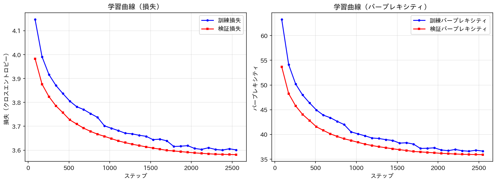

# 4.3 分散学習による事前学習

4.2 節では、データ並列、テンソル並列、パイプライン並列、3D 並列化、ZeRO といった分散学習の手法を解説しました。本節では、これらの知識を踏まえて、実際に分散学習を用いた大規模言語モデルの学習を実践します。

3 章では PyTorch を用いて GPT-2 相当のモデルをスクラッチで実装しました。しかし、4.2 節で解説したような分散学習を自力で正しく実装するのは困難です。そこで本節では、Hugging Face の transformers ライブラリが提供する Trainer を活用します。Trainer は、4.2 節で解説したデータ並列から ZeRO まで、多様な分散学習手法に対応しています。

本節では、まずデータ並列による分散学習を実施し、その後 DeepSpeed を用いた ZeRO による効率化についても触れます。

## 4.3.1 事前学習とファインチューニング

大規模言語モデルの学習は、一般的に2つのフェーズに分けられます。

**事前学習 (Pre-training)**
大量のテキストデータを用いて、「次の単語を予測する」タスクで言語モデルとしての知識を獲得するフェーズです。このフェーズでは、文法、語彙、世界知識など、言語に関する広範な知識を学習します。事前学習には膨大な計算リソースが必要で、数百〜数千の GPU を数週間〜数ヶ月稼働させることもあります。

**ファインチューニング (Fine-tuning)**
事前学習済みモデルを、特定のドメインやタスクに適応させるフェーズです。事前学習済みモデルの重みを初期値として、追加のデータで学習を継続します。事前学習に比べて少ないデータ・計算リソースで効果的な適応が可能です。

本節では、rinna 社が公開している日本語事前学習済み GPT-2 モデル (`rinna/japanese-gpt2-medium`) を用いて、青空文庫データでファインチューニングを行います。事前学習をゼロから実施するには数百 GPU・数週間の計算が必要ですが、ファインチューニングであれば数 GPU・数時間で分散学習の効果を体験できます。分散学習の仕組み自体は事前学習でもファインチューニングでも同じであり、本節で学ぶ手法はそのまま事前学習にも適用可能です。

## 4.3.2 Hugging Face Transformers

### 4.3.2.1 事前学習済みトークナイザの利用

本節では、rinna 社が公開している日本語 GPT-2 モデル (`rinna/japanese-gpt2-medium`) の事前学習済みトークナイザを利用します。transformers には AutoTokenizer というクラスが用意されており、このクラスは `from_pretrained` メソッドにより学習済みのトークナイザを読み込みます。クラス名からもわかるように、ユーザは裏で使われているトークナイザの種類 (BPE や SentencePiece など) を意識することなく利用することが可能です。

```python
from transformers import AutoTokenizer

# 事前学習済みトークナイザの読み込み
model_name = "rinna/japanese-gpt2-medium"
tokenizer = AutoTokenizer.from_pretrained(model_name, use_fast=False)

# pad_tokenが未設定の場合はeos_tokenを使用
if tokenizer.pad_token is None:
    tokenizer.pad_token = tokenizer.eos_token

print(f"語彙サイズ: {len(tokenizer)}")
print(f"BOS token: {tokenizer.bos_token}")
print(f"EOS token: {tokenizer.eos_token}")
print(f"PAD token: {tokenizer.pad_token}")
```

### 4.3.2.2 事前学習済みモデルの利用

次に、モデルの構築を行います。transformers では、モデルの詳細な構造を Config の形で定義します。事前学習済みモデルを利用する場合は、`from_pretrained` メソッドで Config とモデルの重みを同時に読み込むことができます。一般的な大規模言語モデルと同様の、文章の確率を与える様なモデルとしての GPT-2 を用いる場合、モデルクラスとしては GPT2LMHeadModel を用います。

```python
from transformers import GPT2Config, GPT2LMHeadModel

# 事前学習済みモデルとConfigをロード
config = GPT2Config.from_pretrained(model_name)
model = GPT2LMHeadModel.from_pretrained(model_name, config=config)

# pad_token_idを設定
model.config.pad_token_id = tokenizer.pad_token_id

print(f"モデル: {model_name}")
print(f"語彙サイズ: {config.vocab_size}")
print(f"最大シーケンス長: {config.n_positions}")
print(f"レイヤー数: {config.n_layer}")
print(f"隠れ層次元: {config.n_embd}")
```

Config には何が定義されているのでしょうか。確認してみましょう。

```python
print(config)
# GPT2Config {
#   "activation_function": "gelu_new",  # 活性化関数
#   "architectures": ["GPT2LMHeadModel"],
#   "bos_token_id": 1,
#   "eos_token_id": 2,
#   "n_ctx": 1024,
#   "n_embd": 1024,       # 埋め込みベクトルの次元
#   "n_head": 16,         # マルチヘッドアテンションのヘッド数
#   "n_layer": 24,        # レイヤー数
#   "n_positions": 1024,  # 最大シーケンス長
#   "vocab_size": 32000,
#   ...
# }
```

出力からわかる様に、以下のような内容が設定されています。

- どのアーキテクチャのための設定であるか
- 活性化関数には何を用いるか
- 埋め込みベクトルの次元はいくつか
- マルチヘッドアテンションのヘッド数はいくつか

GPT2LMHeadModel は、この設定で指定された数のヘッド数を用意したり、設定された次元の埋め込みベクトルを利用してモデルを初期化します。これは、第2章で Transformer モデルをインスタンス化する際に複数のハイパーパラメータを与えていたのと同様です。与えるべきハイパーパラメータが大量になってしまうため、Config という形にまとめていると考えましょう。

## 4.3.3 データセットの準備

4.1 節で作成した前処理済みのデータセットを読み込みます。HuggingFace Dataset 形式で保存されているため、`load_from_disk` で読み込むことができます。

```python
from datasets import load_from_disk

# 4.1節で作成した前処理済みデータを読み込み
dataset = load_from_disk("data/aozora_preprocessed")
print(f"読み込んだデータセット: {dataset}")
print(f"サンプル数: {len(dataset)}")

# train/eval に分割
eval_ratio = 0.01
split_ds = dataset.train_test_split(test_size=eval_ratio, seed=42)
train_dataset = split_ds['train']
eval_dataset = split_ds['test']

print(f"訓練データ: {len(train_dataset)} サンプル")
print(f"評価データ: {len(eval_dataset)} サンプル")
```

次に、データセットをトークン化します。datasets.Dataset クラスのインスタンスは、`map` を用いた要素の加工が可能です。`batched=True` を設定することでバッチ処理ができます。

```python
TEXT_COL = "text"
block_size = 512  # モデルの最大シーケンス長に合わせる

def tokenize_function(examples):
    return tokenizer(
        examples[TEXT_COL],
        truncation=True,
        max_length=block_size,
    )

tokenized_train = train_dataset.map(tokenize_function, batched=True, remove_columns=[TEXT_COL])
tokenized_eval = eval_dataset.map(tokenize_function, batched=True, remove_columns=[TEXT_COL])
```

## 4.3.4 Trainer を用いたデータ並列学習

transformers の Trainer は、複数 GPU が利用可能な環境では自動的にデータ並列を有効化します。4.2.2 項で解説したように、データ並列では各 GPU にモデルのコピーを配置し、グローバルバッチを分割して並列に計算することで学習を高速化します。

### 4.3.4.1 学習設定

まず、DataCollatorForLanguageModeling を作成します。このクラスの役割は2.5.3項で示した collate_fn と同じで、学習時にデータをロードする際のデータを加工することです。具体的には、教師データやマスクを作成します。`mlm` 引数は、masked language model の略で、BERT などエンコーダベースのモデルを学習する場合などに True にします。今回はデコーダベースのモデルを学習するため False を設定してください。

```python
from transformers import DataCollatorForLanguageModeling

data_collator = DataCollatorForLanguageModeling(tokenizer=tokenizer, mlm=False)
```

TrainingArguments には学習時に与える設定を記述します。ここでは、データ並列を意識した設定を行います。

```python
from transformers import Trainer, TrainingArguments

training_args = TrainingArguments(
    output_dir="./models/rinna-gpt2-aozora-finetuned",
    overwrite_output_dir=True,
    num_train_epochs=3,
    per_device_train_batch_size=16,  # GPU1台あたりのバッチサイズ（ローカルバッチ）
    per_device_eval_batch_size=16,
    gradient_accumulation_steps=8,   # 勾配蓄積ステップ数
    learning_rate=5e-5,
    weight_decay=0.1,
    warmup_steps=100,
    logging_steps=85,
    eval_strategy='steps',
    eval_steps=85,
    save_steps=85,
    save_total_limit=3,
    dataloader_num_workers=4,        # データローダのワーカー数
    ddp_find_unused_parameters=False,  # DDP最適化
)
```

`per_device_train_batch_size` は GPU 1台あたりのバッチサイズ（ローカルバッチ）を指定します。4.2.2 項で解説したように、データ並列では全体のバッチサイズ（グローバルバッチ）は次のように計算されます：

```
グローバルバッチサイズ = per_device_train_batch_size × GPU数 × gradient_accumulation_steps
```

例えば、4 GPU で `per_device_train_batch_size=16`、`gradient_accumulation_steps=8` の場合、グローバルバッチサイズは 16 × 4 × 8 = 512 となります。

### 4.3.4.2 学習の実行

Trainer を作成して学習を実行します。

```python
trainer = Trainer(
    model=model,
    args=training_args,
    train_dataset=tokenized_train,
    eval_dataset=tokenized_eval,
    data_collator=data_collator,
)

# 学習実行
trainer.train()

# モデルの保存
trainer.save_model("./models/rinna-gpt2-aozora-finetuned")
tokenizer.save_pretrained("./models/rinna-gpt2-aozora-finetuned")
```

### 4.3.4.3 分散学習の実行方法

複数 GPU でデータ並列学習を実行するには、`torchrun` コマンドを使用します。4.2.2 項で示した `mp.spawn` を使った実装と異なり、Trainer を使う場合は実行コマンドを変えるだけで分散学習が有効になります。

**単一 GPU での実行：**

```bash
python section03_train_gpt2.py
```

**4 GPU でのデータ並列実行：**

```bash
torchrun --nproc_per_node=4 section03_train_gpt2.py
```

`--nproc_per_node` は 4.2.3 項でも登場したオプションで、ノードあたりのプロセス数（= 使用する GPU 数）を指定します。

**複数ノードでの分散実行（例: 2ノード × 4 GPU = 8 GPU）：**

```bash
# ノード0（マスターノード）で実行
torchrun --nnodes=2 --nproc_per_node=4 --node_rank=0 \
    --master_addr=<マスターノードのIP> --master_port=29500 section03_train_gpt2.py

# ノード1で実行
torchrun --nnodes=2 --nproc_per_node=4 --node_rank=1 \
    --master_addr=<マスターノードのIP> --master_port=29500 section03_train_gpt2.py
```

Trainer は内部で PyTorch の DistributedDataParallel (DDP) を使用しており、4.2.2 項で解説したデータ並列の処理（勾配の集約、パラメータの同期など）を自動的に行います。

**使用する GPU の指定：**

特定の GPU のみを使用したい場合は、環境変数 `CUDA_VISIBLE_DEVICES` で指定します。

```bash
# GPU 1 のみ使用（単一GPU）
CUDA_VISIBLE_DEVICES=1 python section03_train_gpt2.py

# GPU 4,5,6,7 を使用（4GPUでデータ並列）
CUDA_VISIBLE_DEVICES=4,5,6,7 torchrun --nproc_per_node=4 section03_train_gpt2.py
```

この環境変数は PyTorch だけでなく、TensorFlow や JAX など多くの深層学習フレームワークで共通して使用できます。複数ユーザーで GPU を共有する環境では、この方法で使用する GPU を明示的に指定することが重要です。

## 4.3.5 DeepSpeed による ZeRO の活用

4.2.6 項で解説した ZeRO は、データ並列時のメモリ効率を大幅に改善する手法です。Trainer は DeepSpeed と統合されており、設定ファイルを追加するだけで ZeRO を有効化できます。

### 4.3.5.1 DeepSpeed 設定ファイル

ZeRO Stage 2 を使用する設定例を示します。Stage 2 ではオプティマイザ状態と勾配情報を GPU 間で分散して保持します。

```json
{
    "bf16": {
        "enabled": true
    },
    "zero_optimization": {
        "stage": 2,
        "offload_optimizer": {
            "device": "none"
        },
        "allgather_partitions": true,
        "allgather_bucket_size": 2e8,
        "reduce_scatter": true,
        "reduce_bucket_size": 2e8,
        "overlap_comm": true
    },
    "gradient_accumulation_steps": 8,
    "gradient_clipping": 1.0,
    "train_batch_size": "auto",
    "train_micro_batch_size_per_gpu": "auto"
}
```

この設定ファイルを `ds_config.json` として保存します。

### 4.3.5.2 DeepSpeed を有効化した学習

TrainingArguments に `deepspeed` 引数を追加するだけで、ZeRO が有効になります。

```python
training_args = TrainingArguments(
    output_dir="./models/rinna-gpt2-aozora-finetuned",
    overwrite_output_dir=True,
    num_train_epochs=3,
    per_device_train_batch_size=16,
    per_device_eval_batch_size=16,
    gradient_accumulation_steps=8,
    learning_rate=5e-5,
    weight_decay=0.1,
    warmup_steps=100,
    logging_steps=85,
    eval_strategy='steps',
    eval_steps=85,
    save_steps=85,
    save_total_limit=3,
    bf16=True,                      # BF16混合精度学習
    deepspeed="ds_config.json",     # DeepSpeed設定ファイル
)
```

**DeepSpeed を用いた実行：**

```bash
deepspeed --num_gpus=4 section03_train_gpt2.py --deepspeed ds_config.json
```

ZeRO Stage 2 を使用することで、通常のデータ並列と比較してメモリ使用量を大幅に削減でき、より大きなバッチサイズやモデルサイズを扱えるようになります。さらにメモリ効率を高めたい場合は、Stage 3（モデルパラメータも分散）を使用できます。

## 4.3.6 学習済みモデルを用いた推論

学習したモデルを用いた推論は以下のように行います。推論時の引数は以下のものを設定しています。

- **max_new_tokens**: 生成するトークン数の上限
- **do_sample**: サンプリングを行うか
- **temperature**: サンプリング時の温度パラメータ
- **top_p**: nucleus sampling のパラメータ
- **repetition_penalty**: 同じトークンが繰り返されることへのペナルティ

```python
from transformers import AutoTokenizer, AutoModelForCausalLM
import torch

# 学習済みモデルの読み込み
model_dir = "./models/rinna-gpt2-aozora-finetuned"
tokenizer = AutoTokenizer.from_pretrained(model_dir)
model = AutoModelForCausalLM.from_pretrained(model_dir)

# デバイスの設定
device = 'cuda' if torch.cuda.is_available() else 'cpu'
model = model.to(device).eval()

# 生成テスト
prompt = "吾輩は猫である。名前はまだ無い。"

inputs = tokenizer(prompt, return_tensors='pt', add_special_tokens=True)
inputs = {k: v.to(device) for k, v in inputs.items()}

with torch.no_grad():
    output = model.generate(
        **inputs,
        max_new_tokens=100,
        do_sample=True,
        temperature=0.8,
        top_p=0.9,
        repetition_penalty=1.2,
        pad_token_id=tokenizer.pad_token_id,
        eos_token_id=tokenizer.eos_token_id,
    )

generated_text = tokenizer.decode(output[0], skip_special_tokens=True)
print(generated_text)
```

入力テキストには文章の冒頭を与えましたが、その続きが生成されたのではないでしょうか。事前学習済みモデルは「次の単語を予測する」という学習を行っているため、文章の続きを生成します。第5章では、これに対してアラインメントを行うことで ChatGPT のような対話型の LLM を作成します。

## 4.3.7 学習結果

本節で紹介した手法を用いて、実際に学習を行った結果を示します。

### 4.3.7.1 学習時間の比較

NVIDIA RTX 6000 Ada Generation を用いて、単一 GPU、DDP（2 GPU 並列）、DeepSpeed ZeRO Stage 2（2 GPU）の学習時間を比較しました。

| 手法 | GPU数 | 総学習時間 | スピードアップ |
|------|------|-----------|---------------|
| Single GPU | 1 | 約357分（5時間57分） | - |
| DDP (torchrun) | 2 | 約228分（3時間48分） | 1.57倍 |
| DeepSpeed ZeRO2 | 2 | 約190分（3時間10分） | 1.88倍 |

すべて同じ学習設定（3エポック）で実行しています。2 GPU での DDP 並列化により約1.57倍の高速化が得られました。理論上の2倍に達しないのは、GPU 間の勾配集約などの通信オーバーヘッドが存在するためです。

DeepSpeed ZeRO Stage 2 を使用すると、DDP と比較してさらに約1.2倍（対 Single GPU では1.88倍）の高速化が得られました。ZeRO はオプティマイザ状態と勾配を GPU 間で分散して保持するため、通信パターンが最適化されています。今回の GPT-2 medium 規模でも効果が見られますが、より大きなモデルやバッチサイズを扱う場合に ZeRO の恩恵はさらに顕著になります。

### 4.3.7.2 損失とパープレキシティの推移

学習の進行に伴う損失とパープレキシティの変化を示します。

**パープレキシティ（Perplexity）とは**

パープレキシティは言語モデルの性能を測る代表的な指標です。直感的には「モデルが次の単語を予測する際に、平均的にいくつの候補で迷っているか」を表します。パープレキシティが低いほど、モデルは自信を持って次の単語を予測できており、性能が良いことを意味します。

数学的には、パープレキシティはクロスエントロピー損失の指数として定義されます：

$$
\text{Perplexity} = \exp(\text{Cross-Entropy Loss})
$$

例えば、損失が 3.6 の場合、パープレキシティは $\exp(3.6) \approx 36.6$ となります。これは「モデルが平均的に約37個の単語の中から次の単語を選んでいる」と解釈できます。語彙サイズが32,000であることを考えると、37個まで絞り込めているのは十分な学習ができている証拠です。

**学習曲線**

下図に、単一 GPU での学習における損失とパープレキシティの推移を示します。



左図は損失（クロスエントロピー）、右図はパープレキシティの推移です。青線が訓練データ、赤線が検証データに対する値を表しています。両方のグラフで値が減少しており、学習が順調に進んでいることがわかります。また、訓練データと検証データの値が近いことから、過学習が起きていないことも確認できます。

**数値結果**

| ステップ | train_loss | eval_loss | train_perplexity | eval_perplexity |
|---------|------------|-----------|------------------|-----------------|
| 85 | 4.15 | 3.98 | 63.2 | 53.7 |
| 425 | 3.84 | 3.76 | 46.4 | 42.8 |
| 850 | 3.74 | 3.67 | 42.0 | 39.1 |
| 1275 | 3.67 | 3.62 | 39.1 | 37.6 |
| 1700 | 3.64 | 3.60 | 38.0 | 36.6 |
| 2550 | 3.60 | 3.58 | 36.6 | 35.9 |

最終的に、検証損失は 3.98 から 3.58 へと減少し、検証パープレキシティは約 54 から約 36 へと改善しました。

### 4.3.7.3 生成サンプル

学習前後でモデルの生成がどのように変化したかを比較します（DDPによる2GPU並列学習の結果）。

**学習前後の比較**

| プロンプト | 学習前（step 0） | 学習後（step 1290） |
|-----------|-----------------|-------------------|
| 吾輩は猫である。名前はまだ無い。 | 僕を騙そうとしているのだろうか、それとも偽りかもしれない。ただ僕には猫ちゃんに恋をしているのかいないのかが分からないだけだ。「あ〜!どうもありがとうございましたっ♪これからも宜しくお願いします!!」... | 猫といふのが、まだ人間に馴れてゐないからであらう。何しろしいところへ来たものである。それ故、この一月ほどは、家にゐてつたことなんか一度もなかつたのだ... |
| 明治時代の | 洋風料理店「花月」が起源。花月(かづき)は、北海道小樽市の寿司屋である。「花月」という名前の由来は、創業者・小原文郎と妻・きぬに因んだもので... | 文学といふものが、文学であると共に芸術として存在するやうになつた。そのことを考へると此処では此の如く何れも其の根源からつてゐるのであらうか... |
| 先生は言った。「 | あなたがたのうちで、だれでも、わたしの言うことを信じなさい。」(ローマ4:1) イエスは弟子たちに言われました。「信じなさい。そうすれば...」 | あなたは、自分の子供を愛するのでしょうか?私は、そうだと思いますよ」と。この会話には、子供の幸福というものに対する強い意志が感じられた... |

学習前のモデルは、Web上のテキスト（絵文字を含むブログ風の文章、Wikipedia風の説明文、聖書の引用など）を生成しています。これは rinna/japanese-gpt2-medium が多様なWebテキストで事前学習されているためです。

学習後は、青空文庫の文体を反映した文学的な文章を生成するようになりました。特に以下の特徴が見られます：

- **旧仮名遣い**: 「ゐる」「つた」「であらう」など
- **文語調の表現**: 「何しろ」「それ故」「此の如く」など
- **小説的な語り口**: 対話や心情描写を含む物語調

ただし、プロンプトの意図を完全に捉えられていない場合もあります。これは事前学習（次の単語予測）の限界であり、第5章で扱うアラインメント（指示に従うための学習）によって改善されます。

## 4.3.8 分散学習ライブラリの選択

本節では Trainer を用いたデータ並列と ZeRO による分散学習を紹介しました。より大規模なモデル（数百億パラメータ以上）を学習する場合や、テンソル並列・パイプライン並列を組み合わせた 3D 並列化が必要な場合は、以下のライブラリの活用を検討してください。

1. **Megatron-LM**
NVIDIA から発表された並列化を駆使して開発された、パラメータ数が数十億スケールの LLM の名称です。現在は NVIDIA の管理するリポジトリとして存在しており、様々な Transformer ベースのモデルとその学習コードが管理されています。

2. **DeepSpeed**
Microsoft が管理する大規模な深層学習モデルの学習の実装を楽にするためのフレームワークです。3D 並列化や ZeRO による学習だけでなく、Mixture-of-Expert (MoE) と呼ばれる特殊なアーキテクチャや、推論の効率化、モデルサイズの圧縮など様々な機能が実装されています。

3. **Megatron-DeepSpeed**
Microsoft が Megatron-LM のコードをベースに DeepSpeed の機能を追加したリポジトリです。DeepSpeed を用いて効率的に学習するためのサンプルコードが管理されています。

4. **GPT-NeoX**
EleutherAI が管理する大規模言語モデルを学習するためのライブラリです。Megatron-DeepSpeed と同様に、Megatron-LM ベースのモデルを DeepSpeed を用いて学習できます。
