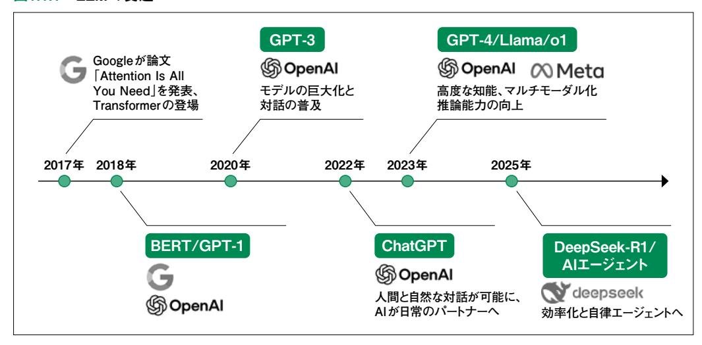

第1章

## 大規模言語モデルの 歴史と本書で 得られること

**エクセルでは、セル□に入力したデータが□入力した通りに表 示□ず、勝手に変換され□困ることがある。例●ば、「1/4」と 入□したいのに「1月4□日」となるケースだ□。また、桁の大き い□数値は、入力したま■まの表示では読みづ□らい。できれ ば、10□万5000円などと□万」を入れて表示し□たい。これら を実現●できるのが「表示形□」だ。入力したデー□タの見せ 方を自由自□に操れる(図1)。□同じ数値でも、表示■形式の 設定次第で、□さまざまな見せ方が□できる(図2)。さ□らに工 夫しだいで、□条件に合ったセルの●色を変えるといった□高 度なワザもある。□回は、その使い方を□習得しよう。セルを□**

## 大規模言語モデル(LLM)の変遷: 1.1 2017-2025

 本書で解説する LLMの隆盛は、一夜にして実現したものではありません。いくつかの重要なブレ イクスルーの積み重ねによって、今日の姿があります。ここでは、2017年から現在に至るまでの主要な 出来事を振り返ります。

#### 図1.1.1 LLMの変遷

### 2017年

 現代 AI の歴史において、2017年は「紀元前」と「紀元後」を分かつ決定的な年となりました。 Googleの研究チームが発表した「Attention Is All You Need」という論文が、それまでの常識を 根底から覆したのです。

 それまでの AIは、情報を端から順番に処理するしかありませんでした。そのため、長い文章になる と最初の方の内容を「忘れてしまう」という弱点があったのです。これに対し、新しく登場した Transformerは、文章全体をパッと一度に見渡し、単語同士のつながりを同時に計算する仕組みを 導入しました。これにより、膨大なデータを高速に、そして正確に学習する土台が完成したのです。

#### 2018〜2019年

 Transformerという強力なエンジンを手に入れた AIの世界は、ここで大きく2つの方向に進化し ます。

一つは、文章を深く読み解くのが得意な BERT (Google)です。検索エンジンなどの「文脈を理 解する | 能力を劇的に高め、私たちの日常の検索体験を裏側で支えるようになりました。もう一つは、 文章の続きを予測して作るのが得意な GPT-1 (OpenAI)です。特に 2019年の GPT-2は、あまりに 自然な文章を書くことができたため、「悪用されると危険だ」と公開が制限されるほどの騒ぎになりまし た。なお本書では、この GPT-2相当の LLMを実装した後、それ以降に登場した新しい技術にも取り 組んでいきます。

#### 2020~2022年

2020年、OpenAIが発表した GPT-3は、世界中に「AIのパワーは数(サイズ)で決まる という衝 撃を与えました。モデルを巨大にすればするほど、まるで人間のように言葉を操れるようになることが 証明されたのです(後述のスケーリング則を参照)。

そして 2022 年末、あの ChatGPT が登場します。これまでの AI はどこか無機質でしたが、 ChatGPTは「人間の意図を汲み取り、役に立つ返事をする」ための特別な訓練を受けていました。 この「対話できる」という親しみやすさが、AIを専門家の道具から、誰もが使える便利なパートナーへ と変えたのです。

#### 2023~2024年

2023年に登場した GPT-4は、文字だけでなく画像も理解できるようになり、司法試験で上位合格 するほどの知能を見せつけました。同時に、Metaが Llamaというモデルを公開したことで、世界中 の誰もが独自の AIを作れる「AIの民主化」が一気に進みました。

さらに 2024年、AIは「即答する」のをやめ、じっくり「考える」ようになります。 OpenAIの **o1** に代表 されるモデルは、答えを出す前に内部で試行錯誤を繰り返し、論理的に正しい結論を導き出す力を 手に入れました。これにより、数学やプログラミングといった、複雑な思考が必要な分野で飛躍的な進 化を遂げたのです。

#### 2025年~

そして現在、AI 開発の焦点は「いかに効率よく、賢くするか」に移っています。2025年初頭、中国 の DeepSeek-R1 が、従来の数十分の一という驚異的な低コストで、世界トップレベルの知能を実現 してみせました。

これにより、「巨大な資本を持つ企業しか AIを作れない |という時代は終わりを告げ、世界中で「考 える AI |が生まれています。 今や AIは、単に質問に答えるだけの存在ではありません。 私たちの指 示を受けて自ら計画を立て、複雑なタスクをこなす「AIエージェント」へと進化し、生活のあらゆる場 面に溶け込み始めています。

# 1.2 本書の構成

現在の LLMは、以下の要素が組み合わさることで高い性能を発揮しています。

- 1. Transformer:長い文章を処理できる革新的な構造
- 2. スケーリング則:データと計算量を増やすことで知能を高める法則
- 3. 学習の 3段階:事前学習、指示学習、人間の好みに合わせた調整(アライメント)
- 4. 推論の強化:答えを出す前に「段階的に考える」プロセス

 本書では、1.1節で振り返った各時代のブレイクスルーを、単なる知識としてだけでなく、実際にコー ドを書き、モデルを動かしながら習得していきます。

### 第2章 Transformer

第2章では、LLMの基盤となる Transformerアーキテクチャを徹底的に理解します。

 まず、RNNの限界とAttention-RNNを経て、Transformerが登場するまでの歴史的な流れを 説明します。その後、Transformerの心臓部であるアテンション機構を詳しく解説します。スケール化 内積アテンション(Scaled Dot-Product Attention)のスケーリングの理由、マルチヘッドアテンション (Multi-Head Attention)で複数の観点から関係性を捉える仕組みを、数式と実装コードで理解し ます。

 アテンション以外の重要な構成要素として、トークン埋め込み、位置エンコーディング、フィードフォ ワード層、スキップ接続、レイヤー正規化についても詳しく説明します。特に位置エンコーディングでは、 三角関数を使って位置情報を表現する巧妙な仕組みを理解します。

 最後に、これらの要素を組み合わせて、エンコーダとデコーダを実装し、完全な Transformerモデ ルを構築します。翻訳タスクでの学習と推論を通じて、Transformerが実際にどのように動作するか を体験できます。

#### 第3章 GPTモデル

第3章では、Transformerのデコーダのみを使用した GPTモデルについて学びます。

 まず、GPT(Generative Pre-trained Transformer)という名前の意味、GPT-1から GPT-5ま での変遷、そして多様な応用例を紹介します。

次に、テキストを数値に変換するトークナイザの仕組みを詳しく解説します。BPE( Byte Pair

Encoding)、WordPiece、SentencePieceといった主要なアルゴリズムを、実装コードとともに理解します。特にBPEについては、頻度に基づいてサブワードを生成するプロセスを段階的に実装し、どのように未知語に対応するかを学びます。

そして、Andrej Karpathy氏1が公開している nanoGPTを参考に、実際に GPTモデルを実装します。データセットの準備、モデルアーキテクチャの定義、学習ループの実装、そしてテキスト生成まで、一連のプロセスを体験できます。日本語での学習例として、夏目漱石の作品を使ったサンプルも用意されています。

最後に、GPT以外の主要なLLM(BERT、T5、LLaMAなど)についても簡単に紹介し、それぞれの特徴と用途を理解します。

#### 第4章 大規模言語モデルの学習

第4章では、GPT-3や GPT-4のような大規模モデルを学習するための技術について学びます。 まず、スケーリング則(Scaling Law)とチンチラ則(Chinchilla Law)を理解します。スケーリング 則は、モデルのパラメータ数、学習データ量、計算量を増やすことで性能が向上する法則です。チン チラ則は、限られた計算資源のもとでは、モデルを大きくするよりも十分なデータで学習させる方が効 果的であることを示しています。

次に、3種類のデータセットについて学びます。事前学習コーパス (Common Crawl、Wikipedia など)、インストラクションデータセット (指示と応答のペア)、そして嗜好データセット (人間の好みを示すデータ)です。

データの前処理についても、テキスト正規化、品質フィルタリング、重複除去、プライバシー保護という4つの重要な処理を、実装例とともに理解します。

また、LoRA (Low-Rank Adaptation) による学習の効率化についても学びます。LoRA は、モデルの一部のパラメータのみを更新することで、少ない計算資源でファインチューニングを可能にする技術です。

#### 第5章 アラインメント

第5章では、事前学習したモデルを人間の意図や好みに合わせるアラインメント技術について学びます。これは、ChatGPTのような実用的なLLMを作るために不可欠なプロセスです。

まず、インストラクションチューニング (Supervised Fine-Tuning:SFT) について学びます。事前 学習されたモデルは次のトークンを予測できますが、人間の指示に従うことはできません。インストラク ションチューニングでは、指示と応答のペアを使って、モデルに指示に従う能力を学習させます。 Googleの FLANや OpenAIの InstructGPT で用いられた手法を理解し、実際に GPT-2モデル

1 OpenAIの共同設立者で、最近では「バイブコーディング」という言葉を生み出したことでも著名です。

にインストラクションチューニングを行う実装を体験します。

 次に、人間のフィードバックからの学習について詳しく解説します。従来の RLHF(Reinforcement Learning from Human Feedback)とPPO(Proximal Policy Optimization)の仕組みを理 解した後、2023年に提案された DPO(Direct Preference Optimization)について学びます。 DPOは、報酬モデルの学習と強化学習という2段階を経ずに、嗜好データから直接LLMを最適化 できる画期的な手法です。RLHFよりも実装が簡単で学習が安定しているため、最近では広く採用さ れています。

#### 第6章 推論モデル

 第6章では、2024年以降に登場した推論強化モデルについて学びます。1.1節で紹介した OpenAI o1や DeepSeek-R1が、なぜ数学やコーディングで人間の専門家に匹敵する性能を発揮 できるのか、その技術的な仕組みを解説します。

 まず、推論モデルの基盤技術である Chain-of-Thought(CoT)を学びます。従来の LLMが答 えを直接出力するのに対し、CoTは「段階的に考える」ことで複雑な問題を解決します。Few-shot CoT(例を与えて推論を誘導)とZero-shot CoT(「段階的に考えてください」という指示だけで推 論を引き出す)の両方を理解します。

 次に、推論モデルの学習に使われる Process Reward Model(PRM)を解説します。従来の報 酬モデルが最終的な答えのみを評価するのに対し、PRMは推論プロセスの各ステップを評価しま す。これにより、モデルは「どこで間違えたか」を学習でき、正しい推論プロセスを獲得できます。

 最後に、主要な推論モデルの技術的特徴を比較します。OpenAI o1/o3の思考トークンと推論時 間の動的調整、DeepSeek-R1のオープンソース戦略と低コスト学習、Gemini 2.5 Proの Deep Thinkモード、Claude 3.7のハイブリッド推論とConstitutional AI 統合など、各社のアプローチの 違いを理解します。

### 実行環境について

本書で扱うすべてのソースコードは、以下の GitHubリポジトリで公開しています。

GitHubリポジトリ: https://github.com/elith-co-jp/book-llm-from-scratch

#### 実行環境について

本書のコードは、計算負荷に応じて以下の2つの環境を使い分けて実装・検証しています。読者の皆様も、学習のステップに合わせて環境を選択してください。

#### 表1.3.1 章別の実行環境一覧

| 章     |    | 使用環境                                            |
|-------|----|-------------------------------------------------|
| 第2章·第 | 3章 | Google Colab 無料版(T4 GPU)                        |
| 第4章·第 | 5章 | NVIDIA RTX 6000 Ada Generation (48GB VRAM) × 1枚 |

#### 環境に関する補足

#### Google Colabでの学習

基礎的な実装から小規模な実験までは、Google Colabの無料版(T4 GPU)で十分に動作することを確認済みです。まずは手軽なクラウド環境から学習を始めることを推奨します。

#### リソースが限られている場合

第4章以降の実装には本来大容量の GPUメモリ (VRAM) があることが望ましいですが、そうした実行環境がない読者のために、本書で扱うモデルの学習済み重みを Hugging Face Hubに公開しています。これを利用することで、学習プロセスをスキップして推論や実験から始めることが可能です。詳細は各章のノートブックを参照してください。

# 1.4 本書の読み方

 本書は、理論と実装を交互に繰り返しながら進みます。ご自身の目的や経験に合わせて、以下のス タイルで読み進めてください。

#### 推奨される読み方

・基本ルート(初めて学ぶ方):第1章から順番に読み進めることを強く推奨します。特に第2 章の Transformerは、それ以降のすべての章の基礎となるため、ここを確実に理解す ることが近道となります。

### スタイル別の活用法

- ・理論を深く理解したい方:各節に記載されている数式やアーキテクチャ図を中心に読み込 み、なぜその構造が必要なのかという理論的背景に注目してください。
- ・まず動かしてみたい方:解説を適宜読み飛ばし、コードの実行結果を先に確認してください。 モデルが動く様子を体験してから解説に戻ることで、理解が深まります。
- ・特定の技術だけ知りたい方:各章はある程度の独立性を持たせていますが、前提知識が必 要になった場合は適宜前の章に立ち返ってください。