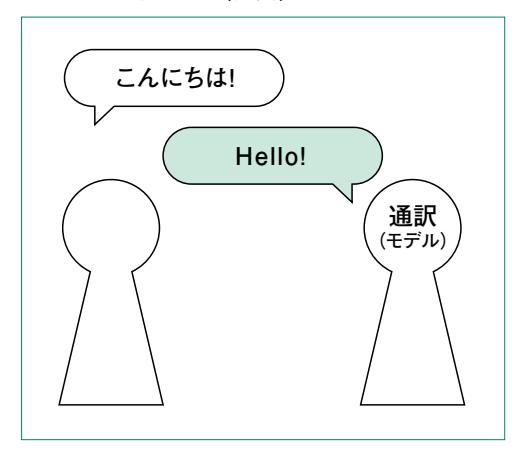
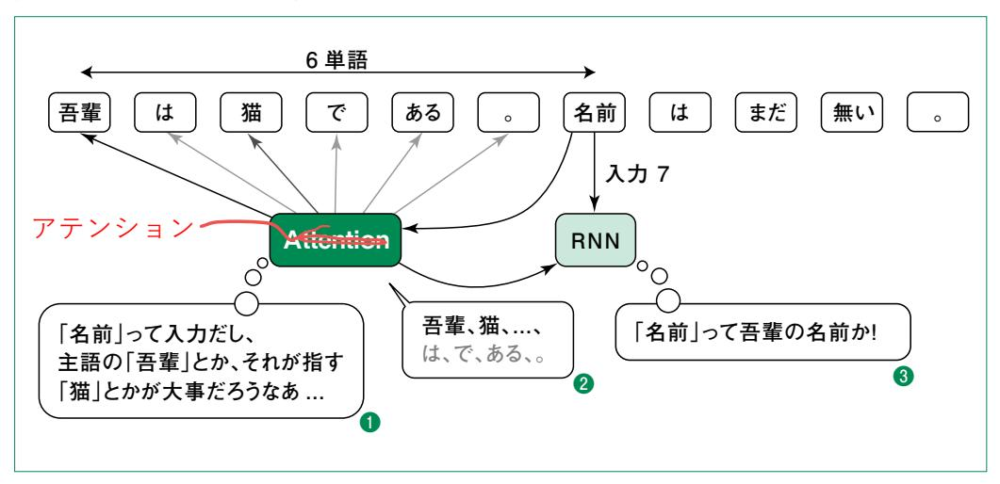
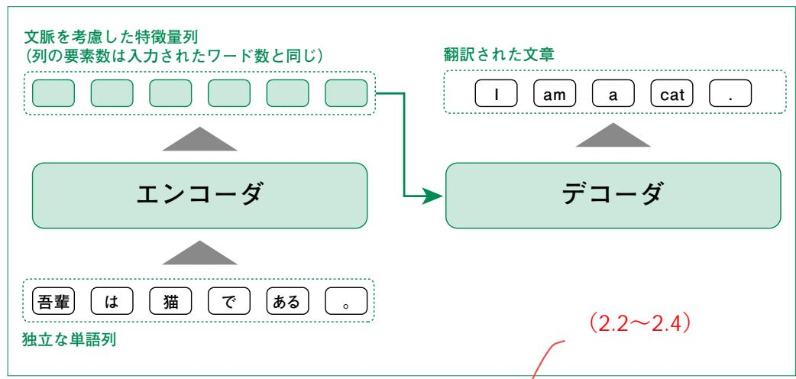
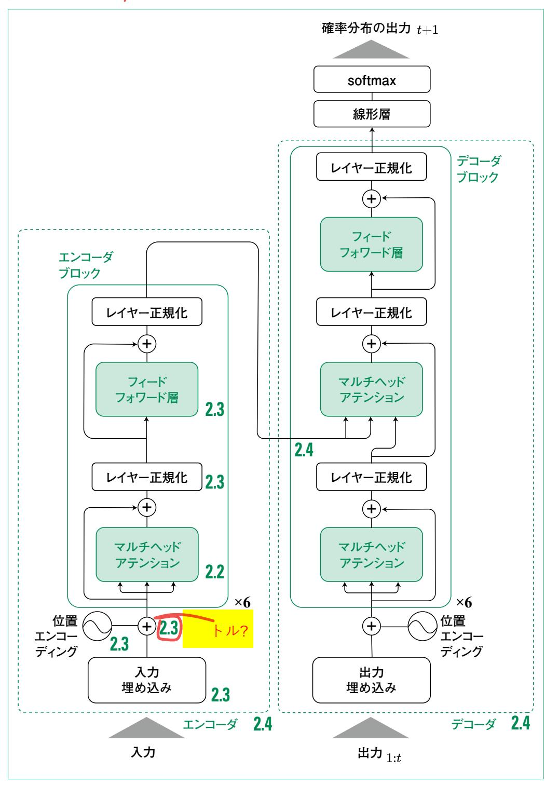

# 第2章

# Transformer

**本章では、大規模言語モデルの核となるモデルである 「Transformer」を構成する要素について 1つずつ説明した後、 各要素を組み合わせて Transformerを作成します。2.1節では Transformer以前のモデルと比べて、Transformerは何が違う のかをおおまかに説明します。2.2節では Transformerの最も 重要な部品である「アテンション機構」について丁寧に説明し、 2.3節でアテンション機構以外の構成要素を説明します。2.4節 で Transformer全体を作り上げ、最後の 2.5節で実データを用 い、翻訳タスクを学習します。**

# RNNから 2.1 Transformerまで

# 2.1.1 Recurrent Neural Network(RNN)

 Transformer 以前のニューラルネットワークによる言語モデルで、特に文章から文章に変換する 「Seq2Seq」と呼ばれるタスクでは、「再帰結合型ニューラルネット」(Recurrent Neural Network: RNN)を用いるのが主流でした。RNNとは、単語などの入力を順番に受け取り、メモリ(内部状態) を都度更新するようなモデルです。このようなモデルにとってのデータの見え方は、人間でいうと口頭 のコミュニケーションに似ています。例えば日本語を英語に翻訳するタスクでは、図2.1.1のように「こん にちは!」と言われてそれを「Hello!」に通訳するイメージです。では図2.1.2のような長文ではどうでしょ うか ? 口頭でこれを聞いて一度で通訳できる人は少ないと思います。

### 図2.1.1 通訳タスク(短文) 図2.1.2 通訳タスク(長文)

**こんにちは! 私をしてこの書物を諸賢に呈するに至らしめました理由は 極めて正当なものでありますし、諸賢もまた、私の企ての 動機を理解せられました場合、この書物を諸賢の保護のも とにおかれまするに極めて正当な理由を有せられるであろ うと確信いたしますので、ここにこの書物を諸賢にいわば 推薦いたしまするには、私がそのなかで追求しましたこと を簡単に申し述べるにしくはないと考える次第であります。 私はつねに、神についてと霊魂についてと、この二つの 問題は、神学によってよりもむしろ哲学によって論証せら れねばならぬ諸問題のうち主要なるものであると、思慮い たしました。と申しますのは、われわれ信ある者には、人 間の霊魂の肉体と共に滅びざること、また神の存在したま うことは、信仰によって信ずることで十分でありますとは いえ、たしかに、信なき者には、まず彼等にこの二つのこ とが自然的理性によって証明せられるのでなければ、いか なる宗教も、またほとんどいかなる道徳上の徳すらも ... Oh,my God! 通訳 (モデル)**

:

 このように RNNでは長い依存関係の処理が難しいという問題がありました。長短記憶( Long Short Term Memory: LSTM)やゲート付き再帰ユニット(Gated Recurrent Unit; GRU)といっ た派生系による工夫もされましたが、いずれの場合でも*n* 語離れた単語同士は、*n* ステップの入力を 経てしか結びつきません(図2.1.3)

図2.1.3 RNNの入力

# 2.1.2 Attention-RNN

 シンプルな RNNでは、離れた単語間の入力が時間的にも離れてしまうという問題があります。これ を解決する方法の 1つが「アテンション機構」(Attention Mechanism)です。アテンションとは注意 という意味で、今の入力に対して、他の入力の注意すべき部分を取り出す役割があります。

 図2.1.4が Attention-RNNの概念図です。図に示したように、「名前」という入力を受け取ると、ア テンション機構は入力の中で「名前」と関連しそうなところを探します。その後、アテンション機構は重 要な順に重み付けて足し合わせたような情報を RNNに教えます。これによって RNNは「名前」が 「吾輩(猫)」の名前であることを理解しやすくなります。Attention-RNNにとってのデータの見え方 は人間でいうと、本を読んでいるようなものです。ある単語を見て何を指しているかなど、わからないこ とがあれば、他の部分を確認して意味をとらえます。

★次ページへ移動

### 図2.1.4 Attention-RNNの入力

 アテンションを用いることにはデメリットもあります。それは入力が長くなるほど、アテンション機構の計 算量が大きくなるということです。アテンションは 1つの入力に対して、全単語の注目度を計算します。 つまり、文の長さが *n* の場合は *n* 個の単語の注目度を計算します。さらにそれを *n* 回の入力分行う ので、合計*n*2 の計算が必要になります。例えば英語の 1段落は 100~200単語程度なので、多くて 4万回計算が必要ということです。さらに、合計で 10段落あると400万回になります。このように計算 量が非常に大きくなる問題は、研究者や開発者も認識しており、現在ではこれを減らす工夫もされて います。

# 2.1.3 Transformerの登場

 Attention-RNNでは、アテンション機構というツールを使って RNNを強化しているという意味で、 主役はあくまで RNNでした。これに対して Transformerでは、RNN要素をなくすという大胆な変更 を行いました。つまり、内部状態を保持するのをやめてアテンションを主役にしたのです。

 このようにモデルとしては大幅な変更がありますが、解くタスクは変わらず文章から文章に変換する Seq2Seqです。本章を通して、説明には Seq2Seqタスクの 1つである日英翻訳タスクを用います。

 Transformerのおおまかな構造を図2.1.5に示します。図のように Transformerには翻訳元の 文章が単語ごとに分割されて入力されます。エンコーダは、このような独立した単語列を、周辺の単語 との関係性を考慮した特徴量の列に変換します。デコーダは変換された特徴量列を基に翻訳後の 文章を生成します。

図2.1.5 Transformer を抽象化したモデル

## ★「|を入れていってください

Transformerの詳細な構造を図2.1.6に示します。図中の数字はどの節で説明するかを表しています。最も重要なのは単語間の関係性を扱うマルチヘッドアテンション(Multi-Head Attention)で、2.2節で説明します。次に単語の位置情報を付与する位置エンコーディング(Positional Encoding)、各位置の特徴量に対する高度な変換を行うフィードフォワード層、学習の安定化などの役割を持つレイヤー正規化といった部品については2.3節で説明します。続く2.4節で、エンコーダブロックデコーダブロックを説明し、Transformer全体を完成させます。Transformerを用いた予測の方法や学習方法についてはその後の2.5節で説明します。

