# 2.2 アテンション機構

 アテンション機構は、「クエリ」と呼ばれる 1つの入力について、他の入力をどれだけ注意するべき かを示す「注意度」を計算します。そして、注意度に応じて足し合わせた結果を出力とします。

 図2.2.1と図2.2.2にその様子を示します。注意度を計算する際の他の入力のことを「キー」と呼び、 クエリとキーのペアに対して実数値の注意度が計算されます。次に、計算された注意度と他の入力を 掛け合わせ、その結果を合計したものがアテンションの出力になります。

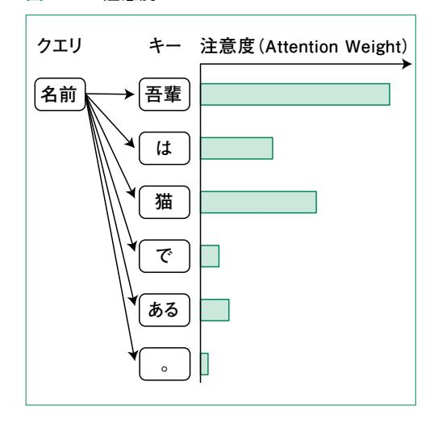

図2.2.1 注意度 図2.2.2 アテンション出力

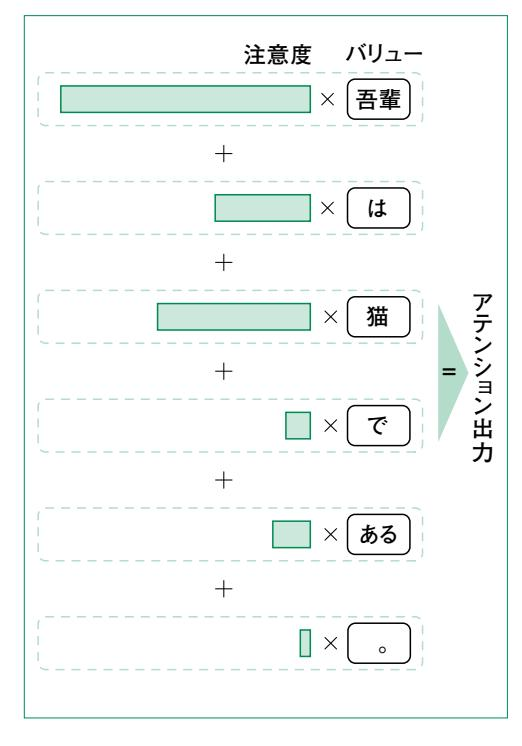

 図2.2.2にもあるように、アテンション出力を計算する際には、他の入力のことを「バリュー」と呼びま す。注意度の計算時とアテンション出力の計算時で他の入力をキーやバリューとして呼び分けるの は、キーとバリューに別の値を用いる場合もあるからです。ただし、本書では全体を通してキーとバ リューは同じものと考えて問題ありません。

ここで、クエリやキー、バリューは単語になっているのに、どのように掛け算や足し算をするのか気に

なった読者もいるでしょう。図中ではわかりやすさのために単語をそのまま載せていますが、実際には コンピュータにわかるような数値(ベクトル)として単語を扱います。このベクトルの作り方については 2.3節で簡単に触れ、第3章でより詳細に説明します。

クエリとキーから注意度を計算する方法は大きく分けて2つあります。1つめはニューラルネットワークを用いた方法で「加法アテンション」(Additive Attention)と呼びます。もう1つはベクトルの内積という計算を用いた方法で、「内積アテンション」(Dot-Product Attention)と呼びます。

以降では、まずこれらの2つについて説明し、現在主流となっている内積アテンションを実装します。その後にTransformerで用いられる「マルチヘッドアテンション」と呼ばれるアテンションの解説、実装をします。

## 2.2.1 加法アテンション

加法アテンションでは、図2.2.3のように注意度を計算するニューラルネットを用意します。このニューラルネットの入力はクエリベクトルとキーベクトルを結合したものです。例えば、クエリとキーのベクトルの次元がそれぞれ128次元であれば、結合した256次元のベクトルを入力し、1つの実数値である注意度を出力します。これを全てのクエリ・キーペアに対して行います。

 $\sigma$ 

図2.2.3 加法アテンション

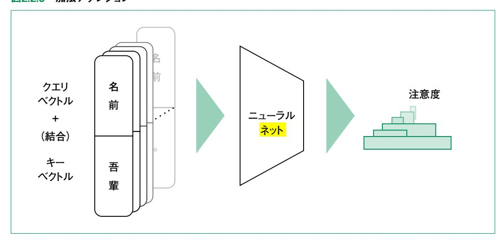

その後、図2.2.2に示したように、注意度で重みを付けてバリューを足し合わせます。加法アテンションでは注意度の計算時にクエリとキーを結合して入力できればよいので、各ベクトルの次元は違っていても大丈夫です。

## 2.2.2 内積アテンション

内積アテンションでは、クエリベクトルとキーベクトルの内積を用いて注意度を計算します。内積はベクトル同士の演算で結果がスカラー (ここでは実数)になります。この演算はベクトルの長さが同じであれば、ベクトルが近いほど値が大きくなります。例えば図2.2.4では a と b は内積が大きく、a と c は内積が小さくなります。

図2.2.4 ベクトルの内積

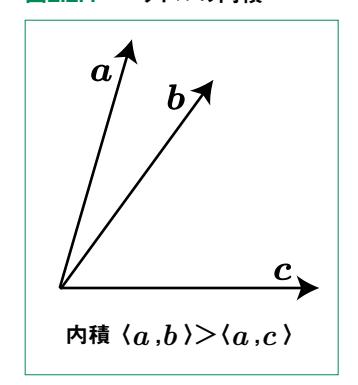

ベクトル

内積で計算される注意度を意味のあるものにするには、クエリベクトルとキーベクトルがランダムなベクトルではダメで、クエリに対して注目されるべきキーベクトルが近い必要があります。このようなベクトルの作り方については、後述のマルチヘッドアテンションや第3章で詳しく説明するトークン埋め込みが関係します。

アテンション

見

ここでは意味のあるベクトルが与えられるものとして、内積注意の具体的な計算方法をあていきましょう。クエリベクトルを  $\mathbf{q} = (q_1, q_2, \cdots, q_d)$ 、キーベクトルを  $\mathbf{k} = (k_1, k_2, \cdots, k_d)$  とすると内積  $\langle \mathbf{q}, \mathbf{k} \rangle$  は次のように計算できます。

$$\langle \boldsymbol{q}, \boldsymbol{k} \rangle = \sum_{i=1}^d q_i k_i$$

ただし d は各ベクトルの次元です。式からわかるように、q, k の次元は同じである必要があります。

## の内積計算

内積計算を1つのクエリに対して複数のキーがある場合について考えてみましょう。キーが合計でn 個あるとして、それらをまとめた行列 $K=(\boldsymbol{k}_1^{\mathrm{T}},\,\boldsymbol{k}_2^{\mathrm{T}},\,\cdots,\,\boldsymbol{k}_n^{\mathrm{T}})^{\mathbf{1}}$ を考えます。出力は各キーの注意度で、式で表すと次のようになります。

$$qK^{\mathrm{T}} = (a'_{1}, a'_{2}, ..., a'_{n})$$

図2.2.2はベクトルや行列の中身を表した図です。

#### 図2.2.2 複数キーに対する注意度の計算

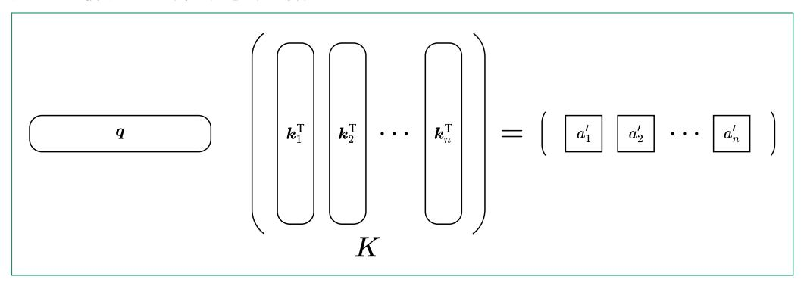

 $a'_i$  は、クエリq が入力された場合、i 番目のキー・バリューにどれだけ注目するかを表します。 ただし、このままでは以下の 2つの問題があります。

- 1. 値がマイナスの場合がある
- 2. クエリによって注意度の合計値が異なる

そこでアテンション機構では softmax 関数を用いて合計が 1で値が正になるようにします。 softmax 関数は数式で書くと次のようになります。

この変換の様子を図2.2.6に示します。

**<sup>1</sup>**  $k_{\perp}^{\mathrm{T}}$  はベクトル $k_{\perp}$  の転置を表しています。詳細については<mark>付録</mark>を参照してください。

図2.2.6 softmax による変換

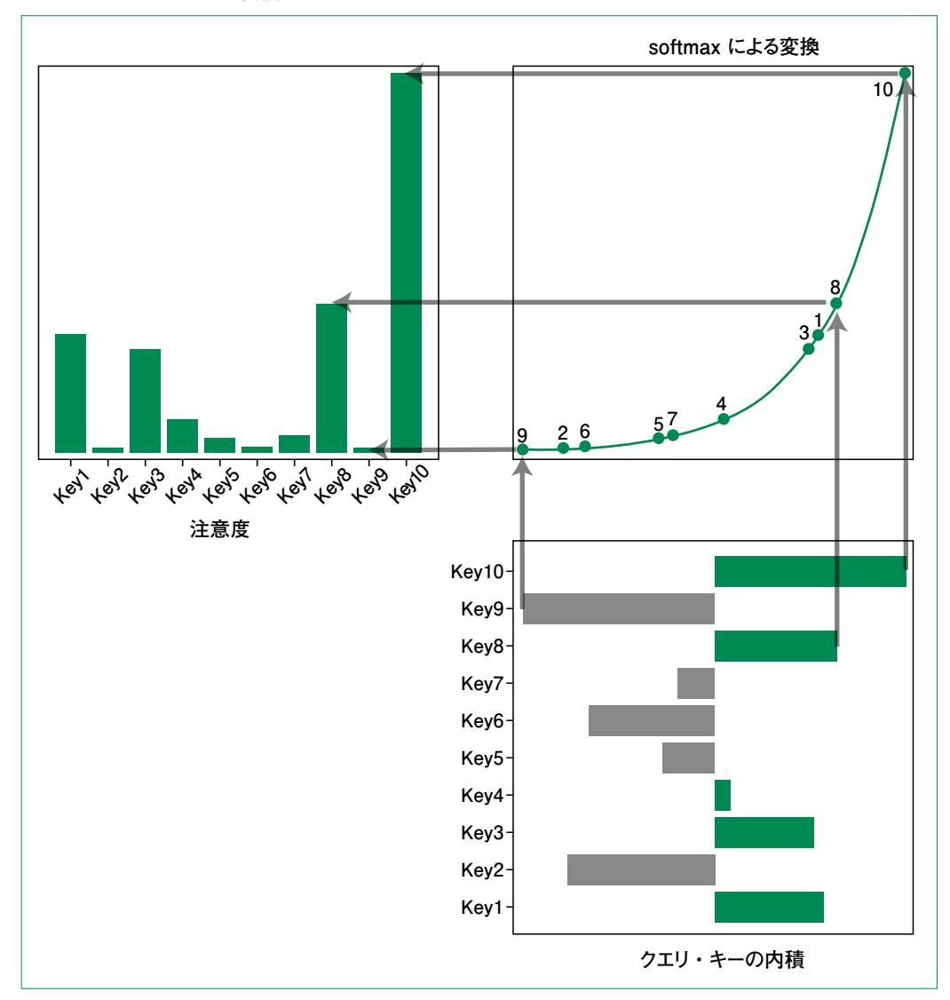

変換によって値の大小関係は変わっていないことがわかります。softmaxによる出力が注意度であり、i 番目の注意度を  $a_i$  と表します。

i 番目のバリューのベクトルを  $v_{i}$  として、注意度に応じた重み付けをして足し合わせたものがアテンション機構の出力o になります。式で表すと、

$$o = a_1 v_1 + a_2 v_2 + \cdots + a_n v_n$$

です。キーと同様にバリューも並べて行列Vとして表せば、図2.2.7のようにできます。

#### 図2.2.7 最終出力の計算

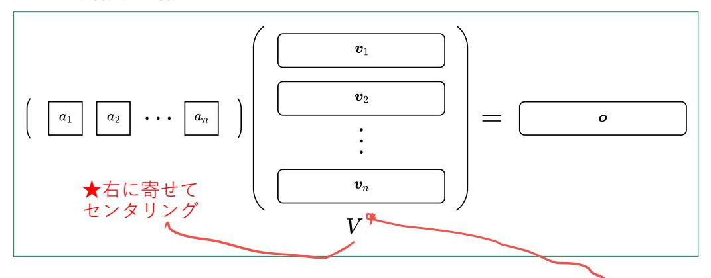

以上で説明したアテンションの計算全体を合わせると次式のようになります。

トル

$$o = \operatorname{softmax}(qK^{T})V$$

ではこれを実装してみましょう。コード2.2.1に softmax 関数の実装を示します。

#### コード2.2.1 softmax 関数

```
import numpy as np

def softmax(x):
    e_x = np.exp(x - np.max(x))
    return e_x / e_x.sum(axis=-1, keepdims=True)
```

ここでは入力の最大値を引いた値を用いて計算しています。これは softmax 関数の式で分子分母に  $\exp(b)$ を掛けることに対応しており 2、計算結果が変わらないことはわかると思います。一見無駄な計算に見えますが、指数関数は入力の値を非常に大きく変換し、 $\exp(50)$ で  $10^{21}$ を超えます。そのためこのように実装しないとすぐにオーバーフローしてしまいます。

**2** 以下のように計算できます。b には何が入ってもよいので、今回は  $a'_i$  の最大値を用います。

$$\frac{\exp(a_1')}{\sum_{i=1}^n \exp(a_i')} = \frac{\exp(a_1')}{\sum_{i=1}^n \exp(a_i')} \frac{\exp(b)}{\exp(\mathbf{b})} = \frac{\exp(a_1' + b)}{\sum_{i=1}^n \exp(a_i' + \mathbf{b})}$$

```
def attention(q, K, V):
 attention_weights = softmax(np.matmul(q, K.T))
 return np.matmul(attention_weights, V), attention_weights
```

ここでは可視化のために注意度も返していますが、それでも非常にシンプルです。

 では、正しく動くか確認してみましょう。キー・バリューとして用いるベクトルは、図2.2.8に示す長さが 1で、360°を 10分割した角度の 10個のベクトルとします。クエリとしては、長さが 1で角度が 45°のベ クトルを用います。

## 図2.2.8 ベクトルとクエリ

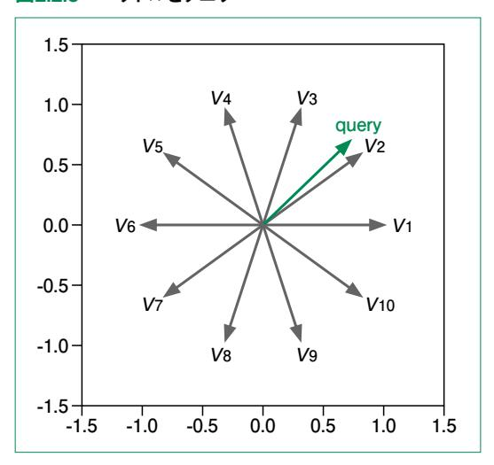

 コード2.2.3に実装を示します。実行してみて **output** が **[0.31564538 0.31564537]**、 **attention\_weights.shape**が **(10,)**、合計がほぼ 1になれば正しく動いています。

#### コード2.2.3 アテンションの動作確認

```
import math
                         (ラジアン)
n = 10
vectors = []
# 360°を n 等分した角度
theta = 2 * math.pi / n
for i in range(n):
   x = math.cos(theta * i)
   y = math.sin(theta * i)
   vectors.append([x, y])
vectors = np.arrav(vectors)
query = np.array([1 / math.sqrt(2), 1 / math.sqrt(2)])
output. attention weights = attention(query, vectors, vectors)
print("出力ベクトル:", output)
print("注意度の形:", attention_weights.shape)
print("注意度の和:", attention_weights.sum())
```

重みはどうなっているでしょうか。本書のサポートサイトに用意した 2.2.2節のノートブックにはこれを可視化するコードもついており、実行すると図2.2.9に示すようなプロットが表示されます。クエリと近いベクトルほど注意度も大きいことが分かります。

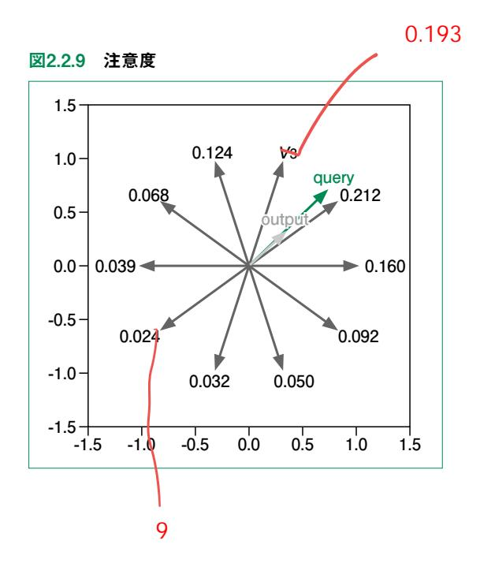

 最後に、1つだけ長いベクトルがある場合を見てみましょう。ノートブックでは *v* <sup>4</sup> の長さを 5倍にして います。このときの注意度は図2.2.10のようになります。図2.2.11に示した元の注意度と比べて *v* <sup>4</sup> の 注意度が非常に大きくなっています。また、元のベクトル自体も大きいため、出力のベクトルは *v* <sup>4</sup> に引 きずられたものになります。

図2.2.10 *v* <sup>4</sup> のみ長い場合の注意度

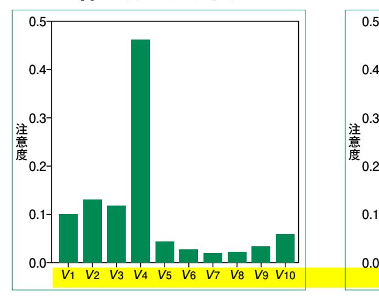

図2.2.11 全て同じ長さの場合の注意度

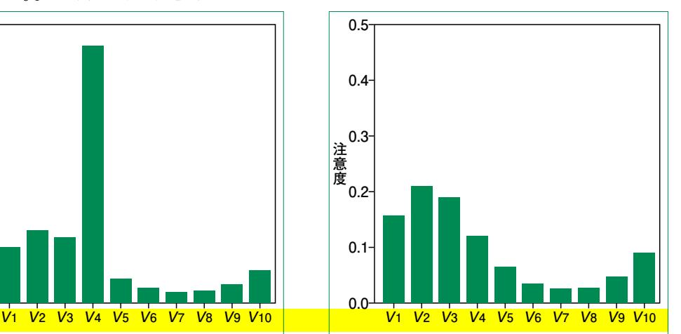

 ここまでで、アテンション機構が思った通りに動作していることが確認できました。Transformerに 限らず、アテンション機構を実際に用いる場合は複数のクエリについて同時に計算する場合が多い です。拡張方法は簡単で、図2.2.12におけるクエリをキー・バリューと同様に並べて *Q* として表し、*q* を置き換えるだけです。この場合、図2.2.13のように *QK* は各行が 1つのクエリに対する注意度ベ クトルである、*m* 行*n* 列の行列になります。

2

図2.2.12 複数クエリ・複数キーに対する注意度の計算

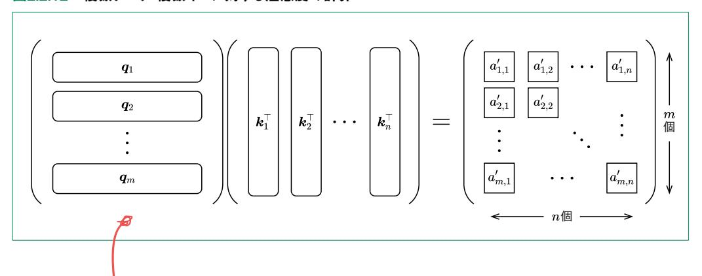

 前述の softmax 関数はこれを見越して実装しているため、アテンションの実装自体は変更する必 要がありません。クエリの数を 3つに増やして動かしてみましょう(コード2.2.4)。出力の形は **(3, 2)**、 注意度行列の形は **(3, 10)**(クエリの数, キーの数)、行ごとの和は全て 1になっていれば OKで す。

## コード2.2.4 クエリを増やした場合の動作

```
queries = np.array([[1 / math.sqrt(2), 1 / math.sqrt(2)], [1, 0], [0, 1]])
output, attention_weights = attention(queries, vectors, vectors)
print("出力の形:", output.shap e)
print("注意度行列の形:", attention_weights.shape)
print("注意度の行ごとの和:", attention_weights.sum(axis=1))
```

## 2.2.3 スケール化内積アテンション

 スケール化内積アテンション(Scaled Dot-Product Attention)は、名前の通り内積アテンション をスケーリングしたものです。具体的には、クエリとキーの内積をした後に、そのまま softmax 関数に 入力するのではなく、 *d*(*d* はベクトルの次元)で割ってから入力します。これを式で表すと次のよう になります。

Attention 
$$(Q, K, V) = \operatorname{softmax}(QK^{\mathrm{T}}/\sqrt{d}) V$$

 ここで、スケール化内積アテンション を Attentionとして表しました。以降でも特に断らない限りス ケールされたものを単に Attentionと書きます。

 なぜこのようなスケーリングが必要なのかは、*d* が大きくなった場合を考えるとわかりやすいです。*d* が大きくなると、2.2.2項で示した内積の式からわかるように足される要素の数が増え、値が大きくなり やすいです。その結果softmaxの出力がほとんど 0になり、注意度としての役目を果たせないのです **<sup>3</sup>**。

## の最初に

**<sup>3</sup>** スケーリングの分母が *d* である理由はクエリやキーがランダムなベクトルとして、各要素が独立な標準正規分布に 従うと考えると、内積の標準偏差が *d* になるからです。このこと自体は確率論の基礎的な内容で理解できますが、 ここでは立ち入りません。

 その様子を表したのが図2.2.13です。図の左側では、1つだけ出力が 1に近いものがありますが、 見やすさのため 0.10までで区切っています。このように、大きい値が含まれていると指数関数の性質 からそこの値が強調されてしまい、合計を 1.0にする都合で他の値がほとんど 0付近になってしまい ます。

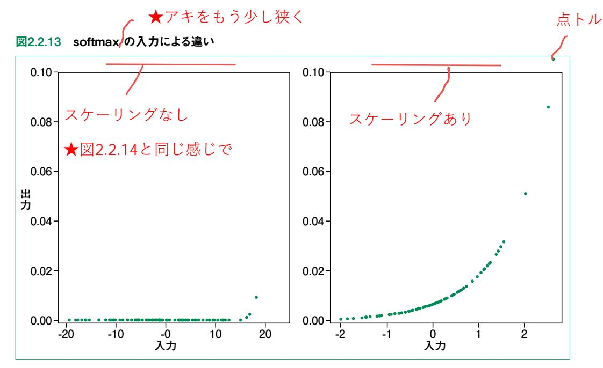

 スケーリングした場合としない場合を実装してみて、出力を確認してみましょう。2通りの次元数でク エリベクトルとキーベクトルを準備するコードをコード2.2.5に示します。

## コード2.2.5 異なる次元のクエリ・キーベクトル

```
dim1 = 1
dim2 = 100
n_keys = 20
q1 = np.random.randn(dim1)
q2 = np.random.randn(dim2)
k1 = np.random.randn(n_keys, dim1)
k2 = np.random.randn(n_keys, dim2)
```

サンプルコードでは 1次元と100次元にしています。

 用意したベクトルの内積を計算し、スケーリングがある場合とない場合で softmax 関数に入力しま す(**コード**2.2.6)。

明朝体で

## コード2.2.6 スケーリングあり・なし

```
dot1 = np.matmul(k1, q1)
s1_1 = softmax(dot1)
s1_2 = softmax(dot1 / np.sqrt(dim1))# s1_1 と同じ
dot2 = np.matmul(k2, q2)
s2_1 = softmax(dot2)
s2_2 = softmax(dot2 / np.sqrt(dim2))
```

 これで 4通りの注意度が計算できました。コード2.2.7を用いてこれらの結果を可視化した結果が 図2.2.14です。

## コード2.2.7 4通りの注意度を可視化

```
fig, ax = plt.subplots(2, 2, figsize=(12, 12))
max_1_2 = max(np.max(s1_2), np.max(s2_2))
ax[0, 0].scatter(dot1, s1_1, s=5)
ax[0, 0].set_title(f"{dim1} 次元, スケーリングなし")
ax[0, 0].set_ylim(-0.01, max_1_2 + 0.1)
ax[0, 1].scatter(dot1, s1_2, s=5)
ax[0, 1].set_title(f"{dim1} 次元, スケーリングあり")
ax[0, 1].set_ylim(-0.01, max_1_2 + 0.1)
ax[1, 0].scatter(dot2, s2_1, s=5)
ax[1, 0].set_title(f"{dim2} 次元, スケーリングなし")
ax[1, 1].scatter(dot2, s2_2, s=5)
ax[1, 1].set_title(f"{dim2} 次元, スケーリングあり")
ax[1, 1].set_ylim(-0.01, max_1_2 + 0.1)
fig.savefig("softmax_scaling.png", dpi=144)
```

図2.2.14 スケーリングがある場合とない場合の softmax 出力

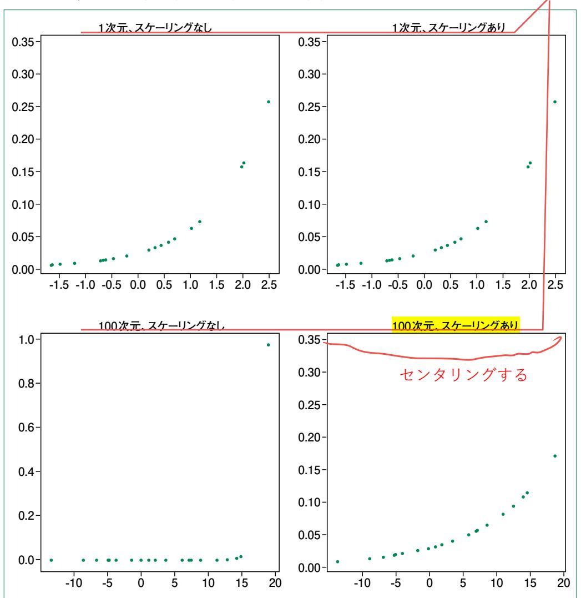

100次元の方はスケーリングがない場合は 0に張り付いているのに対して、スケーリングした場合は 差が見やすくなりました。もちろん、今回のようにベクトルをランダムな値で用意しなければ、このように 奇麗な結果にはなりません。また、入力ベクトルの要素も独立ではありませんが、実際このようにスケー リングすることで性能が向上します。

## 2.2.4 マルチヘッドアテンション

 マルチヘッドアテンションは Transformerの核ともいえる部品で、複数のヘッドから構成されます。 まずは図2.2.15の左に示した 1つのヘッドに注目してみます。

 ヘッドではクエリ・キー・バリューのベクトルを別々に線形変換し、変換結果をスケール化内積アテン ションに入力しています。線形変換(図中の線形層)をするのは、同じベクトルでも、クエリ・キー・バ リューのどこに現れるかで役割が異なるはずだからです。「吾輩は猫である。名前はまだない。」の例 でいうと、「名前」に注目している(クエリに現れる)場合は「吾輩」や「猫」という単語は重要になります。 一方で「吾輩」に注目している場合は「名前」の話が後で出てくることは、さして重要ではありません。 このような非対称性が線形変換をする理由の 1つです。この線形変換は学習対象で、異なる初期値 から始めるためヘッドごとに異なる変換を学習します。

図2.2.15 マルチヘッドアテンションの概要

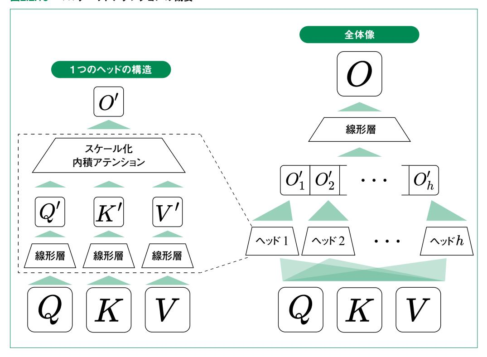

マルチヘッドアテンションでは図2.2.15の右に示すように、このようなヘッドを複数計算し、全ての出力を結合します。そして結合された出力をさらに変換したものをマルチヘッドアテンションの出力としています。

なぜ複数のヘッドを計算するのでしょうか。これは単語と単語の関係性が1通りではないからです。 例えば「名前」にとって、主題という意味では「吾輩」や「猫」が重要ですが、名前がどうなのかという 観点では「ない」が重要です。このようにさまざまな観点から関係性を表すために、複数のヘッドで 各々線形変換を計算し、アテンションに入力するのです。

最後の線形変換には以下の2つの役割があります。

次元の調整:各ヘッドの出力を結合しても、元の入力ベクトルの次元にならない場合があります。そのため最後に次元を調整します。

情報の統合:複数の観点からバラバラに計算された情報をまとめる役割を果たします。

ではこのモジュールを式で表してみましょう。

まず、i 番目のヘッドに注目します。このヘッドのクエリ・キー・バリューに対する線形変換をする行列をそれぞれ  $W_i^Q$ ,  $W_i^K$ ,  $W_i^V$ 4とします。次元数はそれぞれ  $d_{\mathrm{model}} \times d_q$ ,  $d_{\mathrm{model}} \times d_k$ ,  $d_{\mathrm{model}} \times d_v$ です。ただし  $d_{\mathrm{model}}$ はクエリ、キー、バリューの次元で  $d_q$ ,  $d_k$ ,  $d_v$  は変換後の次元です。変換後の次元はハイパーパラメータで理論上はどのようにも取れますが、実際はヘッドの数を h 個として  $d_{\mathrm{model}}/h$  とする場合が多いです 5

これらの行列で変換した結果をスケール化内積アテンションに入力するので、出力 $O_i'$ は次式のように表せます。

$$O_{i}^{'} = \text{Attention}(QW_{i}^{Q}, KW_{i}^{K}, VW_{i}^{V})$$

次に h 個のヘッドの出力を結合 (concatenate) し、最後の線形変換  $W^O$  をかけると、マルチヘッドアテンションの出力が得られます。

$$O = \operatorname{concat}(O_{1}^{'}, O_{2}^{'}, \dots , O_{h}^{'}) W^{O}$$

<sup>4</sup> 肩に Q、K、V と付いていますがこれは指数ではなく添え字です。それぞれ Query、Key、Value の頭文字をとっています。

<sup>5</sup>  $d_{\text{model}}/h$  が整数になるように  $d_{\text{model}} \geq d$  を設定します。

ここで結合というのは同じクエリに対する異なるヘッドの出力を並べるという意味です。つまり、クエリ1 に対してヘッド1、ヘッド2 の出力が  $o_1'$  =(1, 2, 3)と  $o_2'$  =(4, 5, 6)であれば

$$\mathrm{concat}(o_1^{'},o_2^{'}) = (1,2,3,4,5,6)$$

となります。これを複数のクエリについてまとめて表記したのが、上のマルチヘッドアテンションの出力です。

最後に以上の内容を実装していきます。スケール化内積アテンションまでは主に NumPyを用いて 実装していました。Transformerの実装や学習では PyTorchを用いるため、これまでの内容を PyTorchの形で作り直し、それらを用いてマルチヘッドアテンションを実装します。

内積アテンションの実装はコード2.2.8のようになります。

### コード2.2.8 PyTorchを用いた内積アテンションの実装

```
import torch
from torch import Tensor, nn
class DotProductAttention(nn.Module):
   def __init__(self):
       super().__init__()
    def forward(self, query: Tensor, key: Tensor, value: Tensor)-> Tensor:
       """内積アテンションの計算を行う.
       Args:
           query (Tensor): クエリ.shapeは(batch_size, query_len, d_model).
           key (Tensor): +-.shapeは(batch_size, key_len, d_model).
           value (Tensor): バリュー.shapeは(batch_size, value_len, d_model).
       # 1. query と key から, (batch_size, query_len, key_len)のスコアを計算
       score = torch.bmm(query, key.transpose(1, 2))
       # 2. 重みの和が 1 になるように softmaxを計算
       weight = torch.softmax(score, dim=-1)
       # 3. value の重み付き和を計算
       output = torch.bmm(weight, value)
       return output
```

 PyTorchではモデルの部品を **torch.nn.Module**を継承したクラスとして定義します。学習可 能なパラメータがある場合は **\_\_init\_\_** 関数内で定義し、そのパラメータを用いた推論時の計算 を **forward** 関数に記述します。バッチや Tensorがわからない場合やその他PyTorchに関する 詳細は付録を参照してください。

**torch.bmm**は batch matrix multiplicationの略で、行列積をバッチ用に拡張したものであ り、バッチの次元を無視して単に行列積を行うと考えて大丈夫です。キーのバッチ数を除いた 2つの 軸を転置したものとクエリの行列積で計算したスコアを先述の通りsoftmaxに入力して注意度を計 算します。PyTorchには softmax 関数が用意されているため、自分で実装する必要はありません。 最後に注意度とバリューをかけて最終出力を得ます。

 スケール化内積アテンション の実装はコード2.2.9のようになります。本書のリポジトリにあるコードで は **mask**という引数を用いていますが、それについては 2.5節で触れるためここでは無視してくださ い。

## コード2.2.9 PyTorchを用いたスケール化内積アテンションの実装

アキツメ

```
class ScaledDotProductAttention(nn.Module):
 def __init__(self):
 super().__init__()
 def forward(
 self, query: Tensor, key: Tensor, value: Tensor
 )-> Tensor:
 """スケール内積アテンションの計算を行う.
 Args:
 query (Tensor): クエリ.shapeは (batch_size, query_len, d_model).
 key (Tensor): キー.shapeは (batch_size, key_len, d_model).
 value (Tensor): バリュー.shapeは (batch_size, value_len, d_model).
 """
 # query の次元 (= キーの次元)でスケーリング
 d_k = query.size(-1)
 score = torch.bmm(query, key.transpose(1, 2))/ (d_k**0.5)
 # 注意度の計算
 weight = torch.softmax(score, dim=-1)
 # アテンション出力の計算
 output = torch.bmm(weight, value)
 return output
```

 計算自体は内積アテンションとほぼ同じで、softmax 関数に入力する前のスコアを *dk* でスケーリ ングしているだけです。

最後にマルチヘッドアテンションの実装をコード2.2.10に示します。

## コード2.2.10 マルチヘッドアテンションの実装

```
class AttentionHead(nn.Module):
 def __init__(self, d_k: int, d_v: int, d_model: int)-> None:
 """MultiHeadAttentionのヘッド.
 Args:
 d_k (int): クエリ, キーの次元数
 d_v (int): バリューの次元数
 d_model (int): モデルの埋め込み次元数
 """
 super().__init__()
 # クエリ, キー, バリューを部分空間に埋め込むための全結合層
 self.linear_q = nn.Linear(d_model, d_k)
 self.linear_k = nn.Linear(d_model, d_k)
 self.linear_v = nn.Linear(d_model, d_v)
 self.attention = ScaledDotProductAttention()
 def forward(
 self, query: Tensor, key: Tensor, value: Tensor
 )-> Tensor:
 """単一ヘッドのアテンションを計算する.
 Args:
 query (Tensor): クエリ.shapeは (batch_size, query_len, d_model).
 key (Tensor): キー.shapeは (batch_size, key_len, d_model).
 value (Tensor): バリュー.shapeは (batch_size, value_len, d_model).
 Returns:
 Tensor: 出力.shapeは (batch_size, query_len, d_v).
 """
 query = self.linear_q(query)
 key = self.linear_k(key)
 value = self.linear_v(value)
 output = self.attention(query, key, value)
 return output
class MultiHeadAttention(nn.Module):
 def __init__(self, n_heads: int, d_k: int, d_v: int, d_model: int)-> None:
 """マルチヘッドアテンション.
                                             線形
```

```
Aras:
      n heads (int): ヘッド数
       d k (int): クエリ, キーの次元数
       d v (int): バリューの次元数
       d model (int): モデルの埋め込み次元数
   super().__init__()
   self.heads = nn.ModuleList(
       [AttentionHead(d_k, d_v, d_model)for _ in range(n_heads)]
                          線形
   # 出力を変換する全結合原
   self.linear_o = nn.Linear(n_heads * d_model, d_model)
def forward(
   self, query: Tensor, key: Tensor, value: Tensor
)-> Tensor:
   """マルチヘッドアテンションを計算する.
   Aras:
       query (Tensor): クエリ.shapeは(batch_size, query_len, d_model).
       key (Tensor): +-.shapeは(batch_size, key_len, d_model).
       value (Tensor): バリュー.shapeは(batch_size, value_len, d_model).
   Returns:
       Tensor: 出力.shapeは(batch size, guery len, d model).
   # ヘッドごとにアテンションを計算
   head out = [head(query, key, value)for head in self.heads]
   # ヘッドを結合
   head_out = torch.cat(head_out, dim=-1)
   # 出力を変換
   output = self.linear_o(head_out)
   return output
```

本書ではヘッドを AttentionHead クラスとして実装し、それを用いて MultiHead Attention クラスを作成しています。AttentionHead にはクエリ・キー・バリューの線形変換という学習されるパラメータがあるため、これらを \_\_init\_\_ 関数内で定義しています。今回は全てのベクトルを d\_model 次元に変換するような行列として定義しました。また、スケール化内積アテンションクラスのインスタンスもここで作成します。forward 関数では、線形変換後とアテンションの計算を行います。

MultiHeadAttentionクラスでは n\_heads 個のヘッドと最終出力用の線形変換を定義します。 **z**forwardの計算では数式で示した通り、各ヘッドの出力を結合したものに線形変換をかけて出力します。

最後に MultiHeadAttentionクラスが正しく実装できたか確認します。学習するパラメータがある

トル

ため正確な出力結果は予測できませんが、出力のサイズは事前に計算できるため、確かめてみましょ う。各ベクトルの次元は 16、ヘッド数は 4、バッチサイズは 2とします。またクエリ・キー・バリューはそれ ぞれ 3、4、4個とします。

## コード2.2.11 マルチヘッドアテンションの出力確認

```
batch_size = 2
d_model = 16
n_heads = 4
d_k = d_model // n_heads
d_v = d_k
query_len, key_len, value_len = 3, 4, 4
multihead_attention = MultiHeadAttention(n_heads, d_k, d_v, d_model)
# 1. query と key から, (batch_size, query_len, key_len)のスコアを計算
query = torch.randn(batch_size, query_len, d_model)
key = torch.randn(batch_size, key_len, d_model)
value = torch.randn(batch_size, value_len, d_model)
output2 = multihead_attention(query, key, value)
print(output2.shape)# torch.Size([batch_size, query_len, dim])
```

**torch.Size([2, 3, 16])**と出力されていれば正しく実装できていそうです。より詳細な確 認は Transformerの学習で行います。