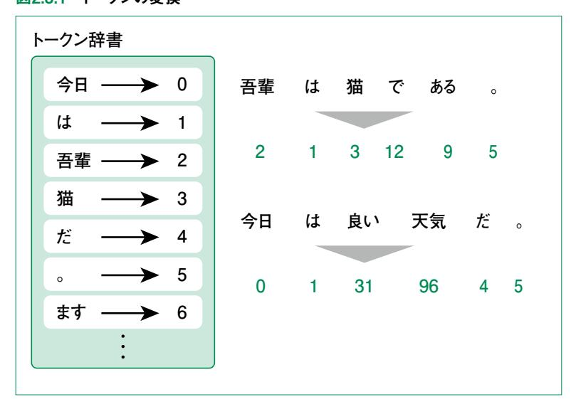
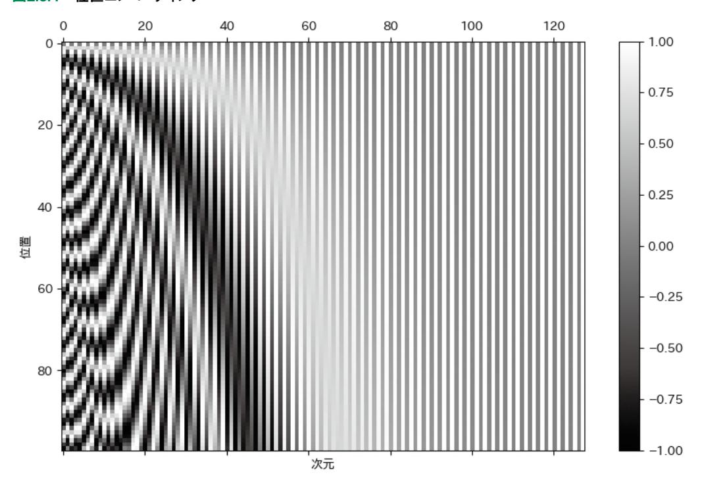
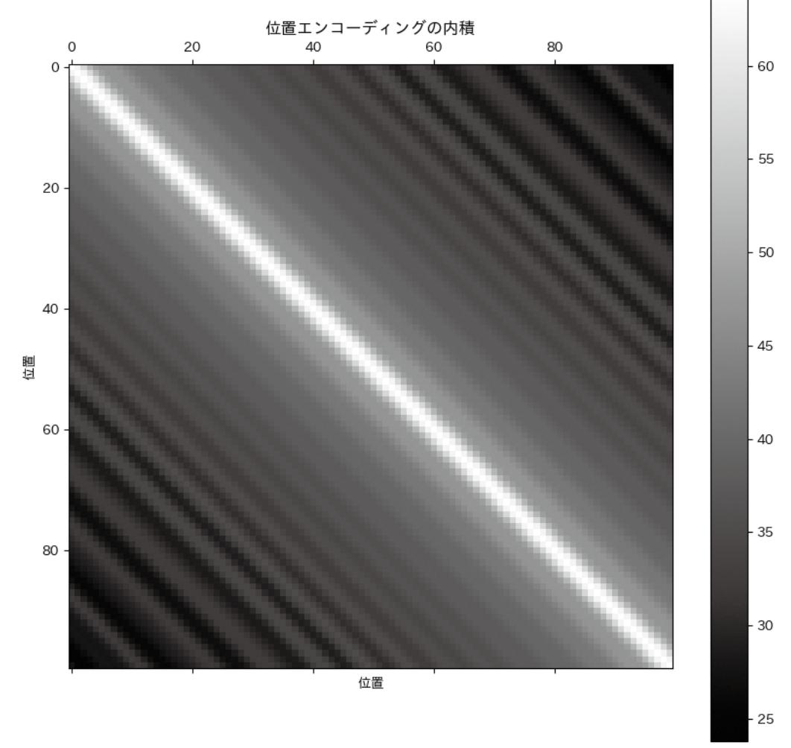
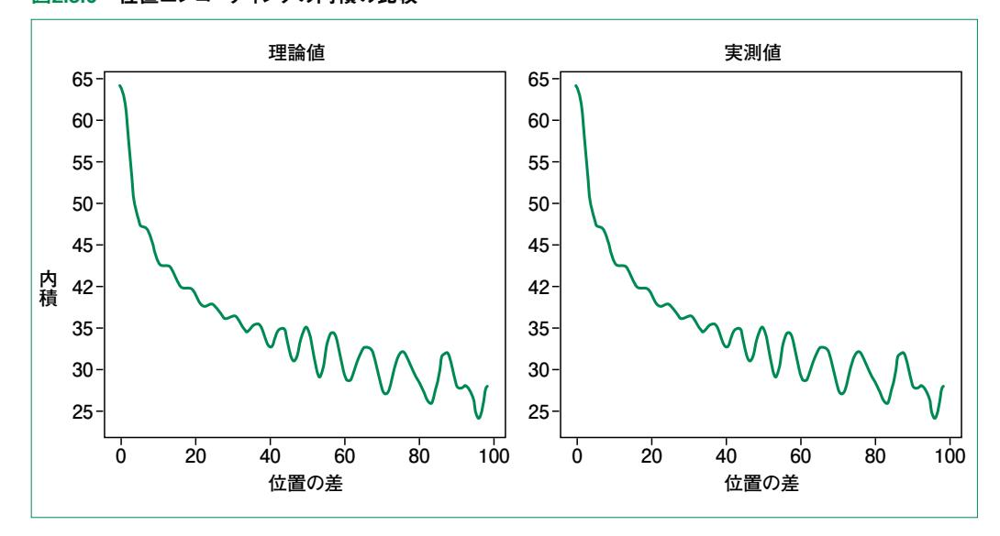
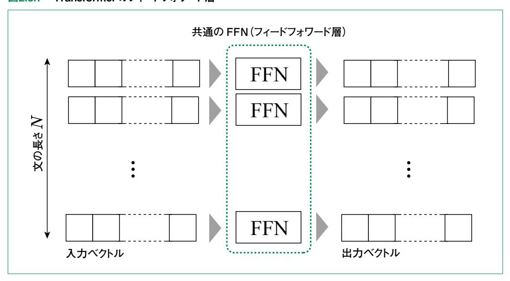
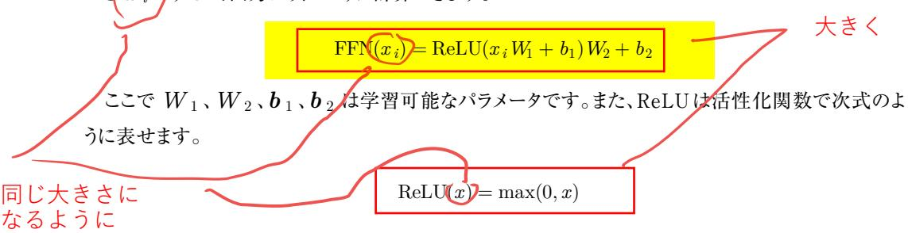
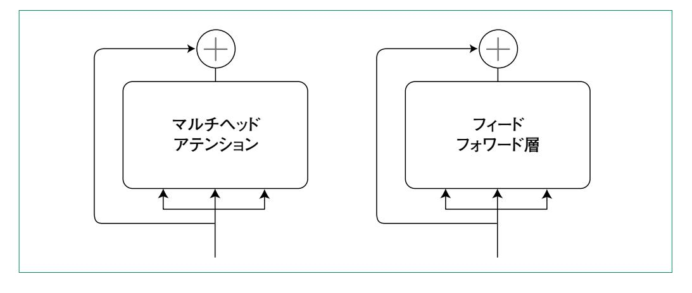
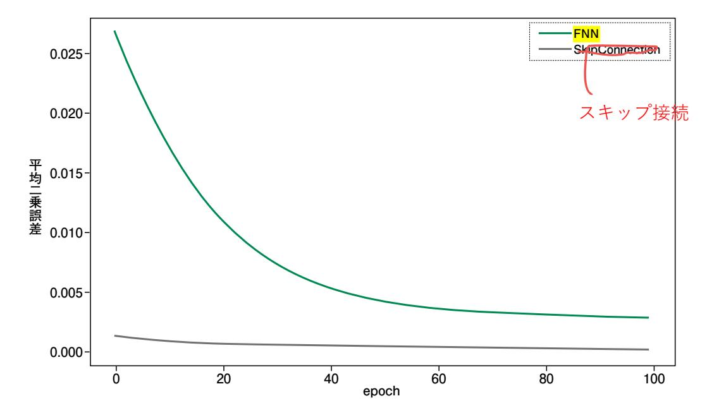
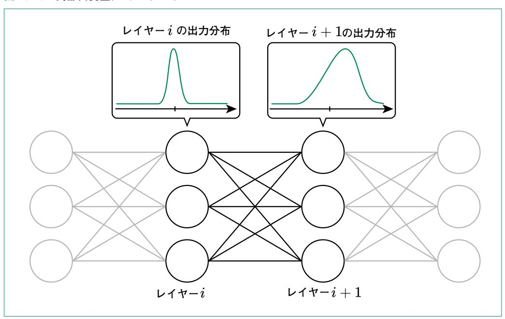
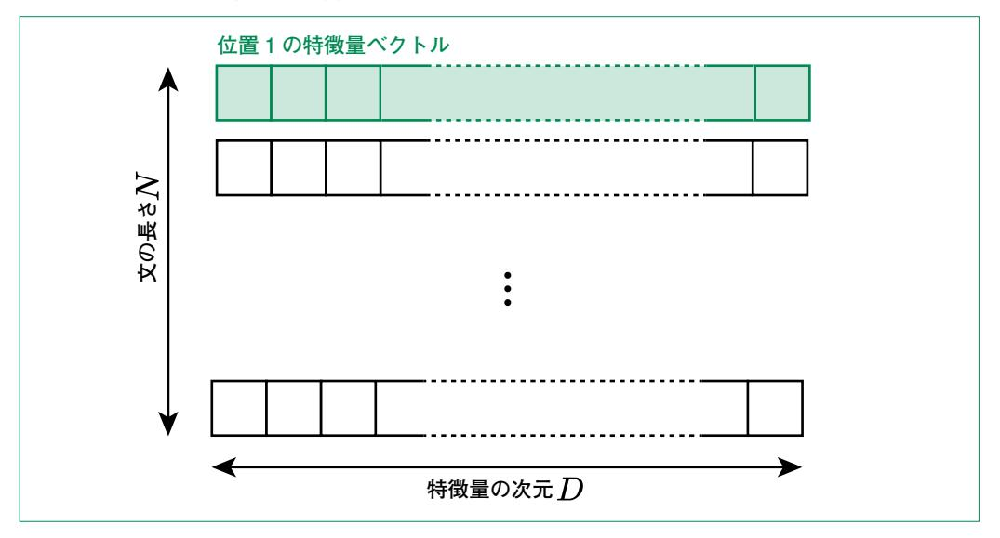

# 2.3 アテンション以外の部品

# 2.3.1 トークン埋め込み

 アテンション機構におけるクエリ・キー・バリューはベクトルになっていました。このベクトルはどのよう に与えられるのでしょうか。

 まず、文章を単語に分ける必要があります。英語の場合はスペース区切りでわかりやすいものの、 日本語の場合はこの時点で難しいタスクになります。また、現在よく用いられる区切り方はいわゆる単 語ではなく、サブワードと呼ばれる単位になす。このような文章を構成する基本的な単位を言語モデ ルの文脈ではトークンと呼びます。文章をトークンレベルに分割する方法については第3章で詳しく説 明します。

 トークン化ができていれば、トークンごとに IDを割り振れます。この割り振り方は一度決めたらトーク ン辞書として固定します。この辞書を用いて図2.3.1のように文章を数字の列に変換します。

#### 図2.3.1 トークンの変換



 ここで割り振られる数字には特に意味はありません。トークン埋め込みでは、この数字をベクトルに 変換します。単にベクトルに変換する場合、機械学習でよく用いられるのは One-Hotベクトルです。こ れは図2.3.2に示すようなベクトルで、IDが *i* であれば *i* 番目のみが 1、他が 0になります。

#### 図2.3.2 One-Hotベクトル

$$i$$
番目 $\downarrow$  $(0,0,\ldots,0,1,0,\ldots,0)$ 

 しかし、このようなベクトルでは単語の意味が捉えられません。例えば内積アテンションの計算をして も、同じ単語同士以外は全て 0になってしまいます。

 そこで用いるのが埋め込みベクトルです。このベクトルでは One-Hotベクトルよりも大幅に低い次 元に「埋め込み」ます(One-Hotベクトルではトークンの種類数分の次元が必要)。埋め込みベクトル にもさまざまな研究がありますが、Transformerではランダムな低次元ベクトルから始めて、学習する ことで単語の意味を反映したベクトルを獲得します。

 埋め込みベクトルは図2.3.3に示すように、トークン IDごとに表のような形で保持されます。入力時に 「2, 1, 3, 12, 9, 5」のようにトークン列が与えられると6個のベクトルがこの表から取り出されます。

図2.3.3 埋め込みベクトル

 この表は PyTorchの **nn.Embedding**というクラスで作れます。このクラスはトークンの種類数 (語彙数)と埋め込みベクトルの次元を与えて初期化します。トークン埋め込みを利用するスクリプトを コード 2.3.1に示します。

#### コード 2.3.1 トークン埋め込みの確認

```
import torch
from torch import nn
vocabulary_size = 100
d_model = 512
embedding = nn.Embedding(vocabulary_size, d_model)
tokens = torch.Tensor([1, 2, 3]).long()
print(embedding(tokens).shape)
```

 この例では埋め込み次元は 512で 1、2、3番目の単語の埋め込みベクトルを取得しています。その ため出力結果は **torch.Size([3, 512])**になります。

# 2.3.2 位置埋め込み

 2.3.1項のトークン埋め込みによって、適切に学習できればトークンの意味を捉えたベクトルが獲得で きます。文章を解釈するには、このようなトークンの意味に加えて、トークン同士の位置関係も重要にな ります。例えば「井上さんは犬を、大森さんは猫を飼っています。」という文章で、順番の情報がないと 誰が犬を飼ってるのかわからなくなります。

 しかし前節(2.2節)で説明したアテンション機構では、トークンの位置を扱うような仕組みはありませ んでした。そのため、このままでは順序のない意味の集合としてしか文章を扱えません。「位置エン コーディング」はこのような問題を解決するための方法です。

 では、位置の情報を入れ込むにはどうすればよいでしょうか。まず考えられるのは *i* 番目なら *i* とい う値を位置の情報にすることですが、これは文が長くなるほど際限なく値が大きくなるというデメリット があります。では、長さ *N* の文章に対して *i* 番目を *i/N* のようにエンコードするのはどうでしょうか。 この方法では最大が 1 になるため、先述の問題は解決するものの、文章の長さが事前にわかってい なければなりません。 、

 これらの両方の問題を解決する方法として Transformerの位置エンコーディングでは 0 から 1 の値を繰り返す三角関数を用います。ただし、1つの三角関数では複数の位置で同じ値になってしま うため、複数の周期を持つ三角関数を用います。

 位置エンコーディングは最終的にトークン埋め込みと足し合わせるため、次元数はトークン埋め込み と同じにします。この次元数を *D* とすると、位置*i* の位置エンコーディングの *d* 次元目は次のようにな ります。

$$\text{PE}(i,d) = \begin{cases} \sin\left(i/10000^{d/D}\right) & (\mathrm{d}$$
が偶数) \ \cos\left(i/10000^{(d-1)/D}\right) & (\mathrm{d}が奇数)

 分母の 10000はハイパーパラメータです。また、*d* の偶奇によって sin、cosを分けることの意味に ついては後述します。

上記の関数を可視化すると図2.3.4のようになります。

#### 図2.3.4 位置エンコーディング



 式の通り、次元が高い部分ほど周期が長く、位置による変化が緩やかなことがわかります。以降で の説明のため、*i* 番目の位置エンコーディングベクトルを PE*<sup>i</sup>* と表します。つまり、上記の関数を用い て次のように定義します。

$$PE_i = (PE(i, 0), PE(i, 1), \dots, PE(i, D - 1))$$

次に、異なる位置のベクトル PE*<sup>i</sup>* とPE*<sup>j</sup>* の内積を計算してみましょう**1**。

**<sup>1</sup>** 三角関数の加法定理、cos(*x* -*y* )=sin *x* sin *y* + cos *x* cos *y* を使います。

$$\begin{split} \left\langle \mathrm{PE}_i \mathrm{PE}_j \right\rangle &= \sum_{d=0}^{D-1} \mathrm{PE}(i,d) \mathrm{PE}(j,d) \\ &= \sum_{d=0}^{D/2-1} \left[ \sin \left( \frac{i}{10000^{2d/D}} \right) \sin \left( \frac{j}{10000^{2d/D}} \right) + \cos \left( \frac{i}{10000^{2d/D}} \right) \cos \left( \frac{j}{10000^{2d/D}} \right) \right] \\ &= \sum_{d=0}^{D/2-1} \cos \left( \frac{i-j}{10000^{2d/D}} \right) \end{split}$$

このように、 $\sin 2\cos \pi \cos \pi$ いた位置エンコーディングを用いると内積が相対位置関係 i-j のみで決定します。この内積を、横軸i、縦軸jとしてプロットしたものが図2.3.5です。近い位置ほど値が大きく遠い位置ほど値が小さい傾向にあることがわかります。




 ただし上述の結果は位置エンコーディングだけで考えた場合であることに注意してください。 コード 2.3.2で実装を確認します。ここで関数名に sinusoidalとついているのは、今回説明した位 置エンコーディングが Sinusoidal Position Encodingと呼ばれるためです。

#### コード 2.3.2 位置エンコーディングの実装

```
def sinusoidal_position_encoding(d_model: int, sequence_length: int) -> Tensor:
 pe = torch.zeros(sequence_length, d_model)
 dim_even = torch.arange(0, d_model, 2)
 dim_odd = torch.arange(1, d_model, 2)
 # unsqueeze で (sequence_length, 1) の形にする
 pos = torch.arange(0, sequence_length).unsqueeze(1)
 pe[:, dim_even] = torch.sin(pos / (10000 ** (dim_even / d_model)))
 pe[:, dim_odd] = torch.cos(pos / (10000 ** ((dim_odd - 1) / d_model)))
 # unsqueeze(0) でミニバッチの次元を先頭に追加
 return pe.unsqueeze(0)
```

 上記のスクリプトで位置エンコーディングが正しく実装できていることを確認するために、導出した 内積の理論値と実測値を比較してみましょう。コード 2.3.3に比較結果を可視化するスクリプトを示し ます。

#### コード 2.3.3 位置エンコーディングの実装の確認

```
import numpy as np
import matplotlib.pyplot as plt
from llm_from_scratch.transformer.utils import sinusoidal_position_encoding
# 位置エンコーディングの準備
d_model = 128
sequence_length = 100
pe = sinusoidal_position_encoding(d_model=d_model, sequence_length=sequence_
length)[0]
# 位置エンコーディングの内積を計算
dotprod = torch.matmul(pe, pe.transpose(0, 1))
# 位置エンコーディングのない積の理論値を計算
dots = np.zeros(sequence_length)
for pos in range(sequence_length):
 total = 0
 for d in range(d_model // 2):
```

```
 total += np.cos(pos / (10000 ** (2 * d / d_model)))
 dots[pos] = total
fig, ax = plt.subplots(1, 2, figsize=(12, 5))
ax[0].plot(dots)
ax[1].plot(dotprod[0])
ax[0].set_xlabel("位置の差")
ax[1].set_xlabel("位置の差")
ax[0].set_ylabel("内積")
ax[1].set_ylabel("内積")
ax[0].set_title("理論値")
ax[1].set_title("実測値")
plt.show()
```

正しく実装できていれば図2.3.6のように理論値と実測値が一致します。

### 図2.3.6 位置エンコーディングの内積の比較



# 2.3.3 フィードフォワード層

 Transformerには、アテンションの後にフィードフォワード層(Feed Forward Network: FFN) がついています。アテンション機構はクエリとキー、バリューを用いて入力全体の関係性を考慮した表 現を獲得するのに対して、フィードフォワード層は各位置の表現を独立に変換します(図2.3.7)。

#### 図2.3.7 Transformerのフィードフォワード層



 Transformerのフィードフォワード層は 2層のネットワークで構成されます。位置*i* の特徴量ベクト ルを *x <sup>i</sup>* とすると、出力は次のように計算できます。



 ただし、フィードフォワード層で用いているものはベクトルを入力としていて、ベクトルの各要素に対し て上記の計算をしています。

以上の計算を実装したものをコード 2.3.4に示します。

#### コード 2.3.4 フィードフォワード層の実装

```
d_model = 512
d_ff = d_model * 4
feed_forward = nn.Sequential(
 nn.Linear(d_model, d_ff),
 nn.ReLU(),
 nn.Linear(d_ff, d_model),
)
# d_model 次元のベクトル , 長さ 10 の入力を用意
x = torch.randn(1, 10, d_model)
print("input shape:", x.shape)
print("output shape:", feed_forward(x).shape)
```

正しく実装できていれば、入力と出力の **shape**が等しくなります。

# 2.3.4 スキップ接続

スキップ接続は図2.3.8のように、ブロックを迂回するような経路を作るような構造です。

#### 図2.3.8 スキップ接続



 ここでは簡単のため 1次元で考えてみましょう。入力を *x* 、出力を *y* として、間に挟まるブロック(図 2.3.8のマルチヘッドアテンションやフィードフォワード層)を関数*f* とすると、以下のように表現できます。

$$y = x + f(x)$$

この構造には以下のようなメリットがあります。

- 1. 誤差逆伝播法によって学習する際に、 直接つながる経路ができることで学習しやすくなる
- 2. 恒等写像(値を変えない関数)を表現しやすい

1については *y* を *x* で微分するとわかりやすいです。

$$y' = 1 + f'(x)$$

 後ろの層の誤差がδとした場合に、スキップ接続のレイヤーを挟んで入力側に伝わる誤差はδ・ (1+*f* '(*x* ))となります。そのため、*f* '(*x* )が 0に近い場合でも、誤差情報が途切れず伝わります。 2については、*f* (*x* )=0のように学習すればよいだけです。

前節のフィードフォワード層を間に挟む場合での実装をコード 2.3.5に示します。

#### コード 2.3.5 フィードフォワード層とスキップ接続の実装

```
import torch
from torch import nn
class FNN(nn.Module):
 def __init__(self, d_model, d_ff):
 super(FNN, self).__init__()
 self.linear1 = nn.Linear(d_model, d_ff)
 self.linear2 = nn.Linear(d_ff, d_model)
 def forward(self, x):
 return self.linear2(torch.relu(self.linear1(x)))
class SkipConnection(nn.Module):
 def __init__(self, d_model, d_ff):
 super(SkipConnection, self).__init__()
 self.sublayer = FNN(d_model, d_ff)
 def forward(self, x):
 return x + self.sublayer(x)
```

 これらのモデルを、入力と同じ出力が得られるように学習します。入力の次元を 10、中間層の次元 を 128とした場合のデータとモデルの定義をコード 2.3.6に示します。

#### コード 2.3.6 データとモデルの準備

```
N = 10000
data = torch.randn(N, 10)
model1 = FNN(10, 128)
model2 = SkipConnection(10, 128)
```

 学習に関しては Transformerの学習時に詳細に説明します。図2.3.9は横軸に学習のステップ、 縦軸にデータとモデル出力の平均二乗誤差をプロットしたものです。スキップ接続がある方が早く誤 差が小さくなっていることがわかります。

図2.3.9 スキップ接続がある場合とない場合の損失の比較



## 2.3.5 レイヤー正規化

レイヤー正規化は学習の安定化・効率化のためのブロックです。

 このブロックではニューラルネットワークのレイヤー(層)ごとに出力値の平均を 0 、分散を 1としま す。このような正規化のバリエーションとしてはバッチ正規化やインスタンス正規化などがあります。こ れらの正規化は元々、レイヤーごとに入力される値のずれ(内部共変量シフト)を抑えることで学習し やすくするために提案されました。

 内部共変量シフトとは、図2.3.10に示すように、レイヤーごとに入力値の分布が変わってしまうことを 指します。

#### 図2.3.10 内部共変量シフトのイメージ



本来の目的とは別に、レイヤー正規化の効果としては以下の 3つが挙げられます。

- ・ニューラルネットの非線形性を生かす
- ・学習を効率化する
- ・モデルの汎化性能を高める

 レイヤー正規化は、入力の位置ごとに適用されます。つまり、文章の長さが *N* であれば、1文に対し ては *N* 個の特徴量ベクトルに対して独立に計算します(図2.3.11)。

図2.3.11 レイヤー正規化の適用方法



1つの特徴量ベクトルを $x = (x_1, x_2, \dots, x_D)$ とすると、特徴量を次のように正規化します。

$$\tilde{x}_k = \frac{x_k - \mu}{\sigma^2}$$

ここで、 $\mu$ と $\sigma^2$  は次のように計算します。

$$\mu = \frac{1}{D} \sum_{i=1}^{d} x_i, \sigma^2 = \frac{1}{D} \sum_{i=1}^{d} (x_i - \mu)^2$$

実装をコード 2.3.7に示します。ここでは、擬似的に埋め込みベクトルを作成して動作を確認しています。平均や分散を計算する際の axisに -1を設定しているのは、特徴量の次元が一番後ろになっているためです。つまり、embedding\_dimの次元に沿って平均と分散を計算します。また、分散の計算時に unbiased=Falseを設定していることにも注意してください。これを設定しないとのかける。の計算の分母が D-1 になり、不偏分散を計算してしまいます。最後の出力で、平均がほぼ 0、分散がほぼ 1 になっていれば正しく実装できています。

#### コード 2.3.7 レイヤー正規化の動作確認

```
import torch

batch, sentence_length, embedding_dim = 20, 5, 10

# 埋め込みベクトルを擬似的に生成\nembedding = torch.randn(batch, sentence_length, embedding_dim)
mean = embedding.mean(axis=[-1], keepdim=True)
std = embedding.std(axis=[-1], keepdim=True, unbiased=False)

# 正規化\neps = 1e-8
normalized_embedding = (embedding - mean) / std.add(eps)

# 3番目の文の2番目の単語位置のベクトルを取得
vector = normalized_embedding[3, 2, :]
print(vector.mean(), vector.std(unbiased=False))
```

レイヤー正規化の主なアイデアは上述の通りですが、実際のレイヤー正規化には学習できるパラメータがあり、次式のようになります。

$$\widetilde{x}_k = \gamma_k \cdot \frac{x_k - \mu}{\sigma^2} + \boldsymbol{\beta}_k$$

 $\gamma_k$ 、 $\beta_k$  はそれぞれ k 次元目の特徴量に対する倍率と平均のシフトになります。レイヤー正規化では次元ごとのこれらの値も最適化します。

#### コード 2.3.8 レイヤー正規化の実装

```
class LayerNorm(nn.Module):
 def __init__(self, d_model: int, eps=1e-6):
 """Layer 正規化.
 Args:
 d_model (int): 埋め込み次元数
 eps (float): ゼロ除算防止のための微小値
 """
 super().__init__()
 self.gamma = nn.Parameter(torch.ones(d_model))
 self.beta = nn.Parameter(torch.zeros(d_model))
 self.eps = eps
 def forward(self, x: Tensor) -> Tensor:
 mean = x.mean(-1, keepdim=True)
 std = x.std(-1, keepdim=True, unbiased=False)
 return self.gamma * (x - mean) / (std + self.eps) + self.beta
```

上記のパラメータを考慮して、PyTorchのクラスとして実装したものをコード 2.3.8に示します。

**nn.Parameter**はレイヤーの重みなど、学習できるパラメータを定義するためのクラスです。倍 率を 1、平均のシフトを 0として初期化しています。