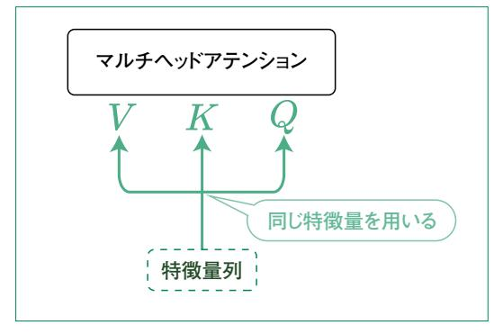
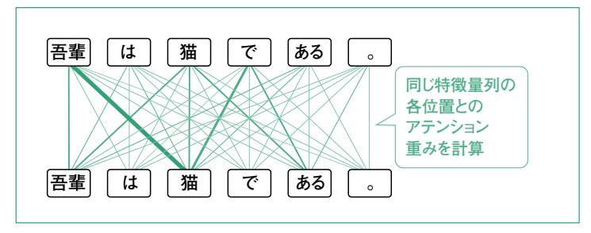
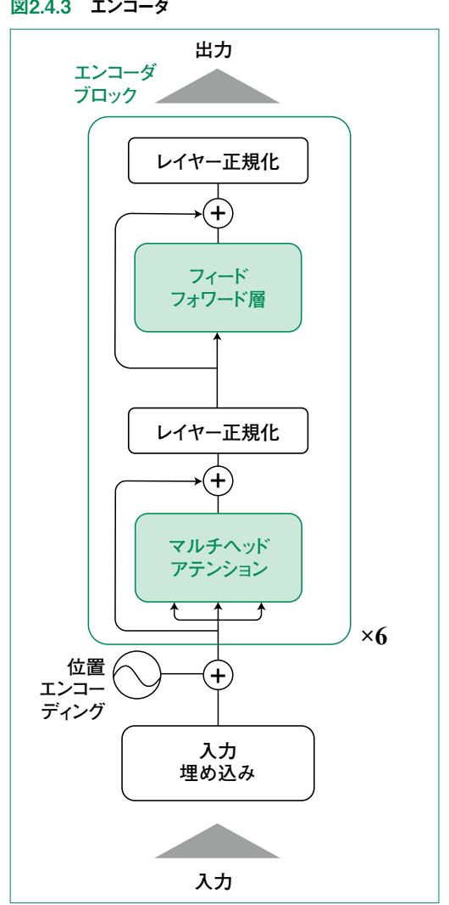
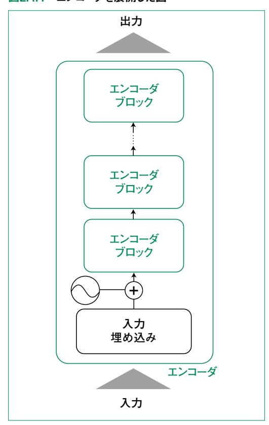
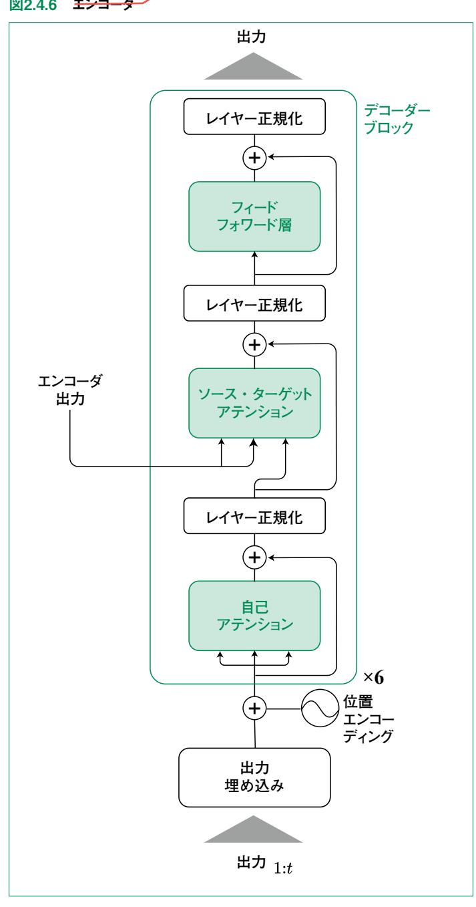
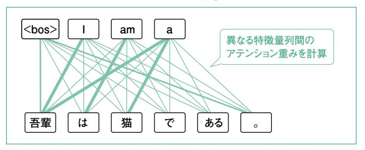
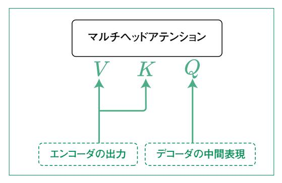
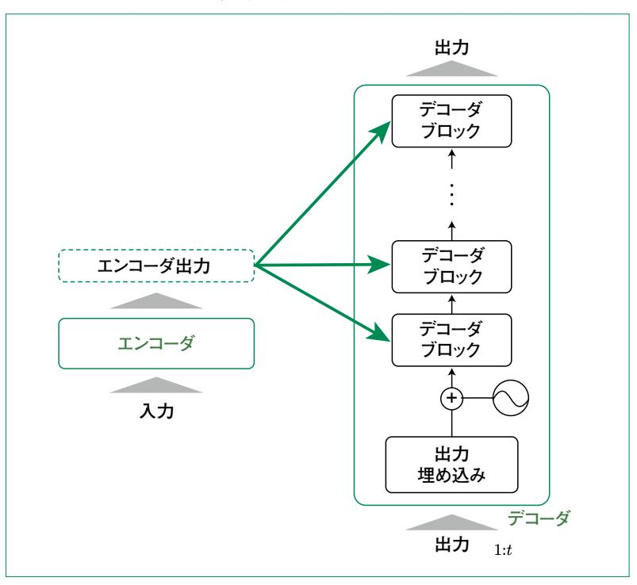

# 2.4 Transformerを作る

 ここまで Transformerを構成する主要な要素について説明してきました。本節ではそれらの要素 を組み合わせて Transformerモデル全体を実装していきます。

# 2.4.1 エンコーダ

 エンコーダの役割は、入力された文章を特徴量のベクトルに変換することです。具体的には、文章 中の各単語を埋め込みベクトルに変換し、各単語の周辺単語との関係性を考慮しながら、文章全体 の意味を表現するベクトルを生成します。

エンコーダは、以下の要素で構成されます。

トークン埋め込み : 単語をベクトルに変換

位置エンコーディング : 単語の位置情報を付加

自己アテンション : 各単語と他の単語との関係性を計算

フィードフォワード層 : 自己アテンションの出力を非線形変換

 ここで新たに現れた「自己アテンション」は、クエリとなる入力と、キー・バリューになる入力が同一で あるマルチヘッドアテンションのことです(図2.4.1)。入力となる文章の各単語を解釈するために、その 文章内で注目するべき部分を計算するため自己アテンションと呼ばれます(図2.4.2)。これの対となる 概念のソース・ターゲットアテンションについては 2.4.2節で扱います。

#### 図2.4.1 通訳タスク(短文)



図中の各単語は位置を表しているのであって、その 単語⾃体を⼊⼒するわけではない。後述の図2.4.4 に示すように、自己アテンションを含むエンコーダは繰 り返し適用され、1回目は単語と位置情報を足したも のが入力されるが、2回目以降は、エンコーダが出力 した各位置の特徴量が入力される。

#### 図2.4.2 自己アテンションの概念図



以上のように構成されるエンコーダの全体像を図2.4.3に示します。



 図中で「×6」と書いているのは、緑色の線で囲まれたブロックを 6回繰り返す、つまり図2.4.4のよう になっていることを表します。

図2.4.4 エンコーダを展開した図



 このように自己アテンションによる他の位置の「中間表現」との関係性の計算と、フィードフォワード層 による各位置の表現の変換で構成されたエンコーダブロックを複数積み重ねることで、入力文章の 特徴量を抽出します。本書で中間表現は、エンコーダまたはデコーダ内の各要素が出力する、計算 途中のベクトルを指します(マルチヘッドアテンションやレイヤー正規化、フィードフォワード層などの出 力)。

 エンコーダは入力されたベクトルと同じ次元のベクトルを、入力文章の長さ分だけ出力します。つま り、トークン埋め込みベクトルが 512次元で 10トークンある場合、512次元のベクトルを 10個出力しま す。入力時には、位置ごとのトークンの情報とそのトークンの位置の情報しか持ちませんが、出力時の 10個のベクトルはそれぞれが文全体を考慮した特徴表現になっています。

 では、エンコーダを実装してみましょう。まず必要なのは図2.4.3の緑色の線で囲まれたエンコーダブ ロックです。コード 2.4.1にその実装を示します。

#### コード 2.4.1 エンコーダブロック

```
class EncoderBlock(nn.Module):
     def init (self, d model: int, n heads: int, d k: int, d v: int, d ff:

int):
        super(). init ()
        self.attention = MultiHeadAttention(n heads, d k, d v, d model)
        self.layer_norm1 = LayerNorm(d_model)
        self.feed_forward = nn.Sequential(
            nn.Linear(d_model, d_ff),
            nn.ReLU().
            nn.Linear(d ff, d model),
        self.layer_norm2 = LayerNorm(d model)
     def forward(self. x: Tensor. src padding mask: Tensor | None = None) ->

→
Tensor:
        x_attention = self.attention(x, x, x, mask=src_padding_mask)
        x = self.layer_norm1(x + x_attention)
        x_ff = self.feed_forward(x)
        x = self.layer norm2(x + x ff)
        return x
```

エンコーダブロックは d\_model、n\_heads、d\_k、d\_v、d\_ffという5つの引数を基に作成されます。d\_model はエンコーダブロックの入出力となるベクトルの次元です。n\_heads はマルチヘッドアテンションでいくつのヘッドを用意するかを表しています。d\_k、d\_v は 2.2.4節の図2.2.15 における、K'や V'で表されるキー・クエリを線形変換した後の次元数です。これらは通常、d\_model / n\_heads に設定されます。クエリの次元を設定していないのは、内積アテンションにおいてクエリとキーの次元は同じである必要があるためです。最後の引数 d\_ff はフィードフォワード層の中間ユニットの次元数です。これを大きくすることで、フィードフォワード層に d\_model によらない表現力を与えることができます。各メソッドの中身については、図2.4.3のエンコーダブロックのつながり方をそのまま実装したものになっているので、図と照らし合わせて確認してみてください。

forwardメソッドではマスクを受け取って、それを自己アテンションに渡しています。2.2節で実装したアテンションではこのようなマスクはありませんでした。これについては2.5節で新たに解説と実装をします。以降でもいくつかのクラスでマスクを利用しますが、本節では利用しないため、無視してください。

エンコーダブロックの実装が完了したので、次はエンコーダそのものを作ります。エンコーダの実装はコード 2.4.2 の通りです。

#### コード 2.4.2 エンコーダ

```
class Encoder(nn.Module):
 def __init__(
 self,
 vocabulary_size: int,
 max_sequence_len: int,
 d_model: int,
 n_blocks: int,
 n_heads: int,
 d_k: int,
 d_v: int,
 d_ff: int,
 ):
 super().__init__()
 self.embedding = nn.Embedding(vocabulary_size, d_model)
 self.pe = PositionalEncoding(d_model, max_sequence_len)
 self.blocks = nn.ModuleList(
 [EncoderBlock(d_model, n_heads, d_k, d_v, d_ff) for _ in range(n_
blocks)]
 )
 def forward(self, x: Tensor, src_padding_mask: Tensor | None = None) ->
Tensor:
 x = self.embedding(x)
 x = self.pe(x)
 for block in self.blocks:
 x = block(x, src_padding_mask=src_padding_mask)
 return x
```

 コンストラクタの引数には、エンコーダブロックに与えるものの他に、語彙数( **vocabulary\_ size**)、入力文章の長さの上限(**max\_sequence\_len**)、エンコーダブロックを繰り返す回数(**n\_ blocks**)を与えます。

# 2.4.2 デコーダ

 デコーダの役割は、エンコーダによって生成された特徴量ベクトルから、出力単語列(文章)を生成 することです。デコーダによるテキストの生成は自己回帰的(Autoregressive)な生成と呼ばれ、エン コーダ出力に自身の過去の出力を加えて新たな出力を得るというプロセスを繰り返すことで文章を生 成します。図2.4.5にこのような文章生成の過程を示します **<sup>1</sup>**。

#### 図2.4.5 デコーダによる出力の生成


 図2.4.5にあるように、デコーダに最初、文章の始まり(Begin of Sentence)を表す「<bos>」という トークンが入力されます。これに対して、デコーダは最初の単語「I」を出力します。次のステップでは、 直前の出力である「I」を加えて「<bos> I」を入力し、「I am」という出力を得ます。このような計算を 繰り返して、デコーダが文章の終わり(End of Sentence)を表す「<eos>」を出力したら生成を終了 します。

 エンコーダは、文の全体を入力して一括の処理で出力を計算できました。これに対してデコーダは 上述のように、1語ずつ出力します。ChatGPTの Webアプリなどで、出力が前から順に少しずつ表 示されるのは、このような計算で出力が得られるたびに表示しているためです。

デコーダの全体像を図2.4.6に示します。構成要素は以下の通りです。

出力埋め込み : 単語をベクトルに変換

位置エンコーディング : 単語の位置情報を付加

自己アテンション : 各単語と他の単語との関係性を計算

ソース・ターゲットアテンション : エンコーダの出力と、デコーダの中間表現の関係性を計算

フィードフォワード層: 中間表現を非線形変換

**<sup>1</sup>** 図中で、新しい単語以外も出力されていることに注意してください。例えばステップ 2では新しい「am」だけでなく「I」 も出力されています。アテンションの構造上、エンコーダもデコーダも入力された系列と同じ長さの出力が得られま す。



 出力埋め込み、位置エンコーディングはエンコーダと同様です。エンコーダと大きく異なるのはソー ス・ターゲットアテンションという部分です。自己アテンションではクエリ・キー・バリューに入力される文は 同じでした。これに対してソース・ターゲットアテンションはソースとなるキー・バリュー、ターゲットである クエリにそれぞれ別の文を用います(図2.4.7)。Transformerでは、ソース側にエンコーダの出力、 ターゲット側にデコーダの中間表現を入力します(図2.4.8)。

#### 図2.4.7 ソース・ターゲットアテンションの概念図



#### 図2.4.8 ソース・ターゲットアテンション



 エンコーダ同様に、デコーダもブロックを 6回繰り返します(図2.4.9)。図に示したように各デコーダ ブロックのソース・ターゲットアテンションに与えられるエンコーダ出力は同じものです。

#### 図2.4.9 デコーダブロックを展開した図



 デコーダブロックとデコーダ自体の実装をそれぞれコード 2.4.3、2.4.4.に示します。特に、デコーダブ ロックの **forward**メソッドで **self.attention\_source\_target**に入力されている内容から ソース・ターゲットアテンションになっていることを確認してください。

### コード 2.4.3 デコーダブロック

```
class DecoderBlock(nn.Module):
 def __init__(self, d_model: int, n_heads: int, d_k: int, d_v: int, d_ ff:
int):
 super().__init__()
 self.attention = MultiHeadAttention(n_heads, d_k, d_v, d_model)
 self.layer_norm1 = LayerNorm(d_model)
 self.attention_source_target = MultiHeadAttention(n_heads, d_k, d_ v, 
d_model)
 self.layer_norm2 = LayerNorm(d_model)
 self.feed_forward = nn.Sequential(
 nn.Linear(d_model, d_ff),
 nn.ReLU(),
 nn.Linear(d_ff, d_model),
 )
 self.layer_norm3 = LayerNorm(d_model)
```

```
 def forward(
 self,
 x: Tensor,
 encoder_output: Tensor,
 tgt_mask: Tensor | None = None,
 src_tgt_padding_mask: Tensor | None = None,
 ) -> Tensor:
 x_attention = self.attention(x, x, x, mask=tgt_mask)
 x = self.layer_norm1(x + x_attention)
 x_attention_source_target = self.attention_source_target(
 x, encoder_output, encoder_output, mask=src_tgt_padding_mask
 )
 x = self.layer_norm2(x + x_attention_source_target)
 x_ff = self.feed_forward(x)
 x = self.layer_norm3(x + x_ff)
 return x
```

### コード 2.4.4 デコーダ

```
class Decoder(nn.Module):
 def __init__(
 self,
 vocabulary_size: int,
 max_sequence_len: int,
 d_model: int,
 n_blocks: int,
 n_heads: int,
 d_k: int,
 d_v: int,
 d_ff: int,
 ):
 super().__init__()
 self.embedding = nn.Embedding(vocabulary_size, d_model)
 self.pe = PositionalEncoding(d_model, max_sequence_len)
 self.blocks = nn.ModuleList(
 [DecoderBlock(d_model, n_heads, d_k, d_v, d_ff) for _ in range(n_
blocks)]
 )
 def forward(
 self,
 x: Tensor,
 encoder_output: Tensor,
 tgt_mask: Tensor | None = None,
 src_tgt_padding_mask: Tensor | None = None,
```

```
 ) -> Tensor:
 x = self.embedding(x)
 x = self.pe(x)
 for block in self.blocks:
 x = block(
 x,
 encoder_output,
 tgt_mask=tgt_mask,
 src_tgt_padding_mask=src_tgt_padding_mask,
 )
 return x
```

## 2.4.3 Transformer

 Transformerの実装をコード 2.4.5に示します。これまでにエンコーダとデコーダを実装しているの で、これらを組み合わせて構築します。また、2.1節の図2.1.6に示した通り、デコーダの出力後に線形 層があります。この線形層の入力は埋め込みベクトルの次元数、出力は扱える語彙数です。学習や 推論の都合上、実装には入れていませんが図2.1.6では線形層の後に softmax 関数があります。こ れによって、出力が語彙数分の確率になり、最も大きいものを Transformerの出力単語にできます。

#### コード 2.4.5 Transformer

```
class Transformer(nn.Module):
 def __init__(
 self,
 src_vocab_size: int,
 tgt_vocab_size: int,
 max_sequence_len: int,
 d_model: int,
 n_blocks: int,
 n_heads: int,
 d_k: int,
 d_v: int,
 d_ff: int,
 ):
 super().__init__()
 self.encoder = Encoder(
 src_vocab_size, max_sequence_len, d_model, n_blocks, n_heads, d_k,
d_v, d_ff
 )
 self.decoder = Decoder(
 tgt_vocab_size, max_sequence_len, d_model, n_blocks, n_heads, d_k,
d_v, d_ff
```

```
 )
 self.linear = nn.Linear(d_model, tgt_vocab_size, bias=False)
 def forward(
 self,
 src: Tensor,
 tgt: Tensor,
 src_mask: Tensor | None = None,
 tgt_mask: Tensor | None = None,
 src_tgt_mask: Tensor | None = None,
 ) -> Tensor:
 encoder_output = self.encoder(src, mask=src_mask)
 decoder_output = self.decoder(
 tgt, encoder_output, mask=tgt_mask, src_tgt_mask=src_tgt_mask
 )
 output = self.linear(decoder_output)
 return output
```

 次に、Transformerを用いて 1つの文章を出力する部分を作成しましょう。デコーダの説明で述 べた通り、出力の計算は、エンコーダの出力とデコーダのそれまでの出力を入力として次の単語を出 力します。この計算の実装をコード 2.4.6に示します **<sup>2</sup>**。

#### コード 2.4.6 Transformer出力の計算

```
@torch.inference_mode
 def inference(self, src: Tensor, bos_token: int, eos_token: int) -> Tensor:
 tgt_tokens = torch.tensor([[bos_token]]).to(src.device)
 encoder_output = self.encoder(src)
 for _ in range(20):
 decoder_output = self.decoder(tgt_tokens, encoder_output)
 pred = self.linear(decoder_output)
 pred = torch.tensor([[pred[0, -1].argmax().item()]]).to(src.device)
 tgt_tokens = torch.cat((tgt_tokens, pred), axis=-1)
 if pred[0, 0].item() == eos_token:
 break
 return tgt_tokens
```

コード 2.4.6で実装している内容は以下の通りです。

**<sup>2</sup>** このメソッドは Transformerクラス内に作成しています。

- 1. <bos>トークンをデコーダの入力(**tgt\_tokens**)に設定する
- 2. エンコーダの出力は for文の前に計算して **encoder\_output**に格納する
- 3. <eos>トークンが出力されるか、出力の限界(**max\_tokens**)になるまで ループして 1語ずつ推論する
  - a. デコーダと線形層の計算
  - b. 何番目の出力が最大であるかを取得
  - c. これまでの出力結果(**tgt\_tokens**)に結合します。

**@torch.inference\_mode**は、このメソッドの計算が推論として行うため、学習時に必要な値 の保存などはしないことを表しています。Transformerが適切に学習されていると、以上のような計 算によって適切な文章が生成されます。