# 2.5 Transformerの学習と推論

 2.4節では Transformerモデルと、適切に学習できた場合の文章生成メソッドを実装しました。こ の節では Transformerを学習する方法を説明します。ソースコードとしては実データを用いた学習 ができる部分まで紹介し、実際に出力を確認します。その後に発展的な内容として、2.4節で紹介した 以外の文章生成の方法を説明します。

# 2.5.1 クロスエントロピーによる学習

 Transformerによる文章生成は、エンコーダの出力と直前までの出力を元に、次の単語をボキャ ブラリーの中から選択するという多クラス分類問題を繰り返し解いていると捉えられます。そのため、 Transformerの学習には多クラス分類でよく用いられるクロスエントロピー誤差関数を目的関数とし て用います。クロスエントロピー誤差関数は正解となる確率分布と、モデル出力の確率分布を比較す る関数で、図2.5.1に示すように、分布の差が大きいほど値が大きくなります**1**。

# 図2.5.1 分布ごとのクロスエントロピーの違い

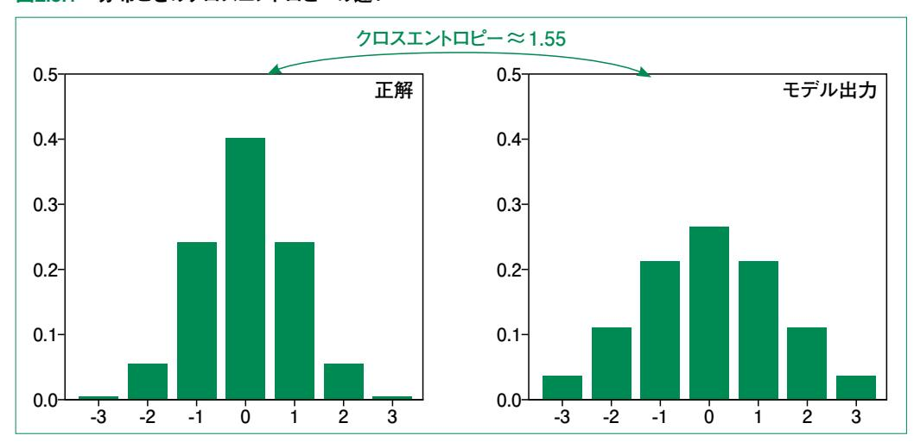

**<sup>1</sup>** 直感的には分布全体が少しシフトするだけであれば差は小さいですが、クロスエントロピーは必ずしも小さくなりませ ん。クロスエントロピーは、各位置(図中の -3, -2, …, 3など)ごとの確率値の差を計算します。位置の近さを考慮し た差を計算できる方法としては Wasserstein距離などがあります。

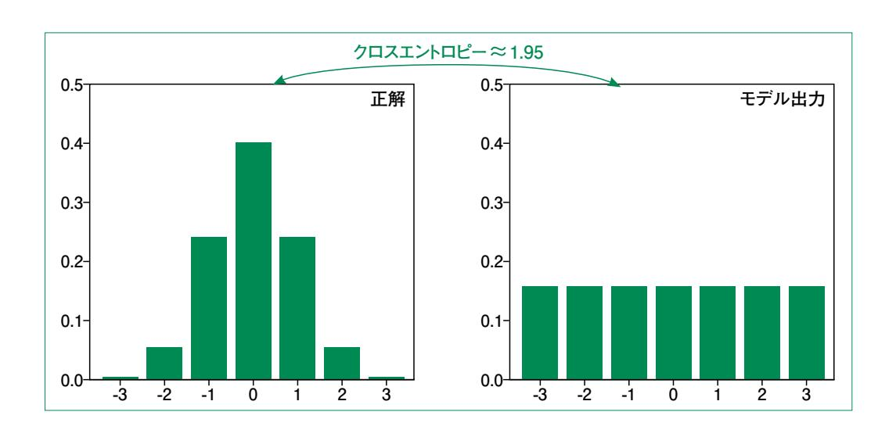

 文章生成タスクでは、正解データとして確率分布ではなく文章が与えられる場合が多いです。従っ て正解となる分布は、図2.5.2に示すような、1つの単語のみ確率が1で他が0になるような分布です。 そのため、クロスエントロピー誤差は実質、モデルが正解単語の確率を高く出力するほど小さくなりま す。

図2.5.2 単語予測時の正解分布

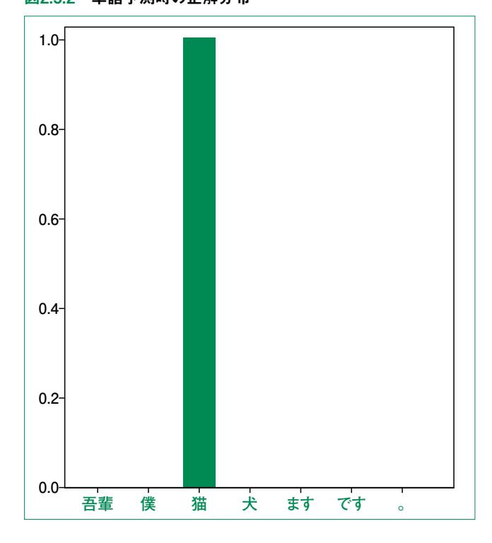

正解分布を  $p = (p_1, p_2, \cdots, p_N)$ 、モデルの出力分布を  $q = (q_1, q_2, \cdots, q_N)$ とすると、クロスエントロピー誤差 H(p, q)は以下のようになります。

$$H(\boldsymbol{p},\boldsymbol{q}) = -\sum_{i=1}^{N} p_i \log q_i$$

 $-\log q_i$  は  $q_i$  が0に近づくほど大きくなります。そのため、 $p_i = 1$ の部分で  $q_i$  の値が小さいと、 誤差が大きくなります。

実装はコード 2.5.1 のように PyTorch に用意されているクロスエントロピーを計算するクラスを用います。実行すると、予測1の方が予測2よりもクロスエントロピーが小さいことがわかります。

## コード 2.5.1 クロスエントロピーの実装

```
import torch
from torch import nn

p1 = torch.tensor([1.0, 0.0, 0.0]) # 正解
p2 = torch.tensor([0.7, 0.2, 0.1]) # 予測1
p3 = torch.tensor([0.1, 0.2, 0.7]) # 予測2

cross_entropy = nn.CrossEntropyLoss()
print(cross_entropy(p1, p2)) # 0.8514
print(cross_entropy(p1, p3)) # 1.4514
```

# 2.5.2 パディングマスクと後続マスク

2.4節のエンコーダやデコーダの実装時、アテンション機構にいくつかのマスクが現れました。ここでは、これらのマスクの役割について説明します。マスクには、パディング (Padding)マスクと後続 (Subsequent)マスクの2種類があります。

1つめのパディングマスクは、バッチ学習を行うために必要になります。バッチ学習では、複数の入力をまとめて与えることで計算を効率化します。その際に、与える入力は同じサイズになっている必要があります。つまり、文章の長さが $N_1,N_2,\cdots,N_k$ のようにバラバラの入力ではなく、全て長さNにそろっていなければなりません。そこで用いるのがパディングです。図2.5.3に示すようにパディングでは、1つのバッチ内における最長の文に合わせて、 ${\bf qad}$ トークンと呼ばれる特殊なトークンを追加します ${\bf 2}$ 。

<sup>2</sup> 図では省略していますが、実際は <bos> や <eos> を加えた後に <pad> を追加します。

## 図2.5.3 パディング

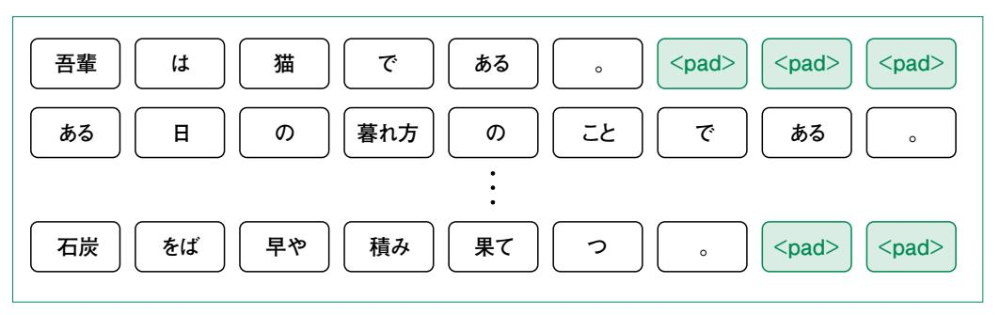

これによって例えば、バッチサイズが32で最長の文が10トークンであれば、入力を $32\times10$ の行列として扱えます。

図2.5.3の例では最長の文が9トークンであるため、1文目に3つの <pad>トークンを追加しています。最長の文が10トークンなら、<pad>トークンは4つ追加します。このように <pad>トークンは、たまたま同じバッチになった他の文に依存しており、<pad>トークン自体に文章を理解する上での意味はありません。そのため、Transformerで処理する際は、このトークンを無視する必要があります。パディングマスクはこの、<pad>トークンを無視するためのマスクです。

アテンション機構で <pad>トークンを無視するために、内積アテンションの softmax 関数を利用します。softmax は入力が  $a'_1$ ,  $a'_2$ , …,  $a'_n$  のとき、i 番目の出力は次のようになる関数でした。

$$a_i = \frac{\exp(a_i')}{\sum_{j=1}^n \exp(a_k')}$$

例としてパディングマスクで i 番目を無視したい場合、 $\alpha'_i$  に非常に小さい値  $(-\infty)$  を加えます。指数関数は中身が非常に小さいとき、値が0 に近づくため、アテンション重みが0として出力されます(図 2.5.4)。

図2.5.4 パディングマスク

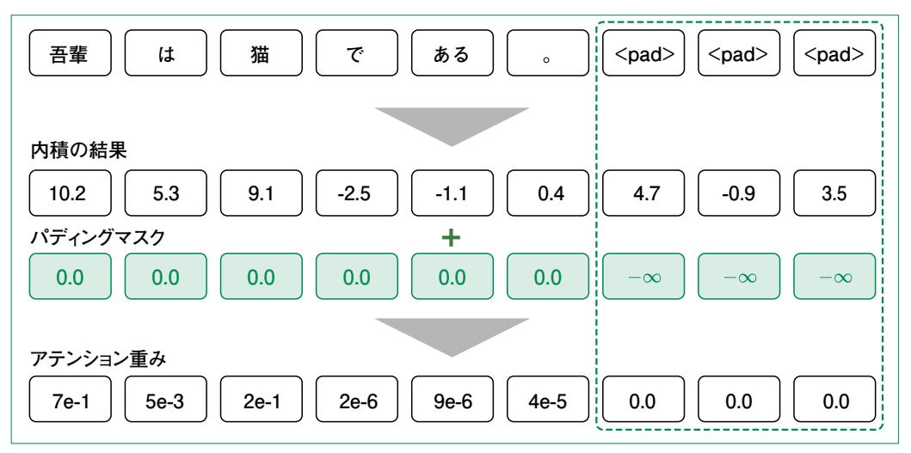

 パディングマスクは Transformer中の全てのアテンションに必要になります。もう一方の後続マス クは、デコーダにのみ適用されます。このマスクが必要になるのは学習時にデコーダに対して正解の 文全体を入力するためです。つまり、学習時には図2.5.5の下に示したような入力を与え、それらを1 トークン分左にずらした出力を正解とします**3**。

# 図2.5.5 学習時の予測方法

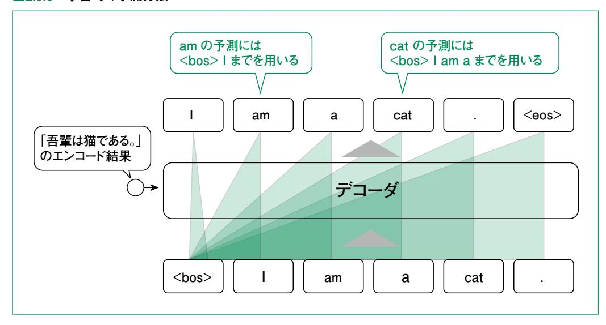

**<sup>3</sup>** これによって学習時は、文章の長さ分だけ繰り返す処理を省き、効率的に学習を進められます。このように、モデル 自身の出力ではなく、正解のトークン列を過去の出力かのように入力することを Teacher Forcingといいます。

図に示した通り、「cat」の予測には「<bos> I am a」までの入力しか参照してはいけません。これは、後ろの「cat」まで参照できてしまうと単に1個後ろのトークンを持ってくることしか学習できなくなるためです。このような未来(後続)のトークンを参照しないためのマスクが後続マスクです。

後続マスクもパディングマスクと同様に、無視したい位置に対して、softmax 関数への入力に∞を加算します。具体的には、図2.5.6に示したような上三角形部分が・∞になります・4。

図2.5.6 後続マスクの位置

|     |             |             |           | <b>+</b>  |           |           |           |
|-----|-------------|-------------|-----------|-----------|-----------|-----------|-----------|
|     |             | <bos></bos> |           | am        | a         | cat       |           |
| クエリ | <bos></bos> | 0           | $-\infty$ | $-\infty$ | $-\infty$ | $-\infty$ | $-\infty$ |
|     | I           | 0           | 0         | $-\infty$ | $-\infty$ | $-\infty$ | $-\infty$ |
|     | am          | 0           | 0         | 0         | $-\infty$ | $-\infty$ | $-\infty$ |
|     | а           | 0           | 0         | 0         | 0         | $-\infty$ | $-\infty$ |
|     | cat         | 0           | 0         | 0         | 0         | 0         | $-\infty$ |
|     |             | 0           | 0         | 0         | 0         | 0         | 0         |
|     |             |             |           |           |           |           |           |

アテンションには以上のように、大きく分けて2種類のマスクを用います。しかし、どちらのマスクもマスクによって無視する仕組み自体は同じため、アテンションの実装(コード 2.5.2)では1つのマスクとして受け取ります。

**<sup>4</sup>** マスクが行列になるのは、2.2.2<mark>節</mark>の図2.2.12で説明した通り、複数クエリを同時に扱うためです。

第1章

# コード 2.5.2 マスクを考慮した内積アテンションの実装

```
class ScaledDotProductAttention(nn.Module):
 def __init__(self):
 super().__init__()
 def forward(
 self, query: Tensor, key: Tensor, value: Tensor, mask: Tensor | None =
None
 ) -> Tensor:
 d_k = query.size(-1)
 # query の次元 (= キーの次元 ) でスケーリング
 # score.shape == (batch_size, query_len, key_len)
 score = torch.bmm(query, key.transpose(1, 2)) / (d_k**0.5)
 # マスクがある場合は , -infを代入して softmaxの値が0になるようにする
 # マスクは bool で受け取り、True の部分を -inf にする
 if mask is not None:
 score = score.masked_fill(mask, float("-inf"))
 weight = torch.softmax(score, dim=-1)
 output = torch.bmm(weight, value)
 return output
```

 Transformerに関しては2.4節ですでにマスク付きの実装を示しているため、ここでは実装は省 略します。2.4節の実装における、各マスクが Transformer 内のどの部分で用いられるかを図2.5.7 に示します。後続マスクがデコーダ側の自己アテンションにのみ付いていることに注意してください。こ れは、ソース・ターゲットアテンションではバリューとしてエンコーダ側の出力を使っており、未来の情報 を含まないためです。

図2.5.7 マスクの作用する部分


 次に、各マスクの実装方法を説明します。パディングマスクはコード 2.5.3に示すように、<pad>トー クンの IDを受け取り、それと一致する部分を Trueにします。

# コード 2.5.3 パディングマスクの実装

```
def create_padding_mask(pad_id: int, batch_tokens: Tensor):
 # batch_tokens.shape == (batch_size, sequence_length)
 mask = batch_tokens == pad_id
 mask = mask.unsqueeze(1)
 return mask
```

 ここで batch\_tokensはパディング済みのトークン列で、**(**バッチサイズ **,** 文章の長さ**)**というサイ ズです。そのため、一致する部分を Trueとしたマスクも同じサイズの Tensorになります。マスクは、 バッチ内の各要素に対して行列である必要があるため、**unsqueeze**によって、**(** バッチサイズ **, 1,** 文章の長さ**)**の形に変更しています**5**。

後続マスクの実装はコード 2.5.4のようになります。

# コード 2.5.4 後続マスクの実装

```
def create_subsequent_mask(batch_tokens: Tensor):
 sequence_len = batch_tokens.size(1)
 mask = torch.triu(
 torch.full((sequence_len, sequence_len), 1),
 diagonal=1,
 )
 mask = mask == 1
 mask = mask.unsqueeze(0)
 return mask
```

**torch.triu**は受け取った行列に対して上三角形部分以外を0にする関数です。diagonal引 数は対角線から何個の幅を追加で0にするかを指定します。今回の場合、対角線のみ追加で0にし たいので diagonal=1としました。マスクとしては True/Falseの状態にしたいため、その後に値が1 の部分を Trueにしています。最後の unsqueezeはマスクを **(1,** 文章の長さ**,** 文章の長さ**)**と いう形に変更しています。

**<sup>5</sup>** 実際は **(** バッチサイズ **,** 文章の長さ **,** 文章の長さ **)**という形のマスクが必要です。PyTorch の Tensorも NumPy配列と同様にブロードキャストされるため、今回は2次元目が1の状態にしています。

# 2.5.3 Transformerの学習

 これまでの節で、学習時に必要な内容は全てそろいました。ここでは、実際のデータを用いて Transformerを学習する方法を説明します。

 データセットとしては、田中コーパスという日英の対応する文章コーパスを前処理した small\_ parallel\_enjaを利用します。このデータでは、文章のトークン化や小文字化などがされています。田 中コーパスに含まれる文章の例を図2.5.8に示します。

# 図2.5.8 田中コーパスのデータのサンプル

**誰 が 一番 に 着 く か 私 に は 分か り ま せ ん 。**

**多く の 動物 が 人間 に よ っ て 滅ぼ さ れ た 。**

**私 は テニス 部員 で す 。**

**エミ は 幸せ そう に 見え ま す 。**

**この 事実 を 心 に 留め て お い て 下さ い 。**

# 日本語の文章 英語の文章

**i can 't tell who will arrive first .**

**many animals have been destroyed by men .**

**i 'm in the tennis club .**

**emi looks happy .**

**please bear this fact in mind .**

 small\_parallel\_enjaのデータは1万件ずつに分割されています。まずは動作確認のため、最初 の1万件のみを用いて学習を行うためコード 2.5.5のように設定してください。

# コード 2.5.5 データセットのダウンロードとパスの設定

```
data_dir = Path("small_parallel_enja")
if not data_dir.exists():
 !git clone <https://github.com/odashi/small_parallel_enja.git> {data_dir}
train_ja = data_dir / "train.ja.000"
train_en = data_dir / "train.en.000"
```

 small\_parallel\_enjaでは、1文が1行になっており、トークンはスペース区切りになっています。そ のため、学習データはコード 2.5.6のように読み込めます。ただし、<bos>、<eos>トークンは付いてい ないため、読み込み時に先頭と末尾に付与する必要があります。

# コード 2.5.6 学習データの読み込み

```
def iter_corpus(
 path: Path,
 bos: str | None = "<bos>",
 eos: str | None = "<eos>",
) -> Iterator[list[str]]:
 with path.open("r") as f:
 for line in f:
 if bos:
 line = bos + " " + line
 if eos:
 line = line + " " + eos
 yield line.split()
train_tokens_ja = [tokens for tokens in iter_corpus(train_ja)]
train_tokens_en = [tokens for tokens in iter_corpus(train_en)]
```

 ここで、train\_tokens\_ja、train\_tokens\_en はそれぞれ、文章ごとに単語を分割したリストのリス トになっています。各リストから要素を1つずつを抜き出すと、以下のようなリストになっています。

```
['<bos>', '誰 ', 'が ', '一番 ', 'に ', '着 ', 'く', 'か ', '私 ', 'に ', 'は ', '分か ', 
'り', 'ま', 'せ ', 'ん ', '。', '<eos>']
['<bos>', 'i', 'can', "'", 't', 'tell', 'who', 'will', 'arrive', 'first', '.', 
'<eos>']
```

 では、分割した単語リストからボキャブラリーを作成しましょう。ボキャブラリーとして重複なく単語の リストを持つことで、各単語に一意な数字( ID )を割り振れます。これには、torchtext の build\_ vocab\_from\_iterator 関数を利用します。コード 2.5.7に示すように、この関数には specialsとして 特殊トークンを渡します。特殊トークンとは、単語としてではなく、学習や推論時に何らかの機能を持つ トークンです。<bos>、<eos>、<pad>などが特殊トークンに当たります。これらのトークンに加えて、新 たに現れた <unk>トークンがあります。このトークンは未知の単語、つまりボキャブラリーに無い単語 を割り当てるトークンです。そのため、ボキャブラリーを作成した後に、デフォルトとして <unk>トークン の IDを割り振るように設定しています。

# コード 2.5.7 ボキャブラリーの作成

```
from torchtext.vocab import build_vocab_from_iterator
vocab_ja = build_vocab_from_iterator(
 iterator=train_tokens_ja,
 specials=("<unk>", "<pad>", "<bos>", "<eos>"),
)
vocab_ja.set_default_index(vocab_ja["<unk>"])
vocab_en = build_vocab_from_iterator(
 iterator=train_tokens_en,
 specials=("<unk>", "<pad>", "<bos>", "<eos>"),
)
vocab_en.set_default_index(vocab_en["<unk>"])
```

では、コード 2.5.8を実行して作成したボキャブラリーで文章を ID列に変換してみましょう。

# コード 2.5.8 単語変換辞書

```
print("<unk>:", vocab_ja["<unk>"]) # <unk>: 0
tokens = ["<bos>", "吾輩 ", "は ", "猫 ", "で ", "ある", "<eos>"]
for token in tokens:
 print(vocab_ja[token], end=" ")
```

 実行すると2 つめの printでは **2 0 5 437 12 667 3** のように出力されます。1 つめの printで表示した通り、<unk>トークンの IDは0です。今回のデータには吾輩という単語が入ってい ないため、未知語として扱われていることがわかります。

 次に、PyTorchを用いてデータをロードするためのクラスを作成します。データをロードする際は、 バッチ学習をするために、先述の通り<pad>トークンを追加します。<pad>トークンをいくつ追加する かはロードされたバッチによって異なります。データを読み込むたびに前処理を行う方法として、 PyTorchの DataLoaderクラスには collate\_fnという引数が用意されています。まずはこれを実装 しましょう(コード 2.5.9)。

# コード 2.5.9 collate\_fnの実装

```
from torchtext import transforms
src_transforms = transforms.Sequential(
 transforms.VocabTransform(vocab_ja),
 transforms.ToTensor(padding_value=vocab_ja["<pad>"]),
)
```

```
tgt_transforms = transforms.Sequential(
 transforms.VocabTransform(vocab_en),
 transforms.ToTensor(padding_value=vocab_en["<pad>"]),
)
def collate_fn(batch: Tensor) -> tuple[Tensor, Tensor]:
 src_texts, tgt_texts = [], []
 for s, t in batch:
 src_texts.append(s)
 tgt_texts.append(t)
 src_texts = src_transforms(src_texts)
 tgt_texts = tgt_transforms(tgt_texts)
 return src_texts, tgt_texts
```

 collate\_fnの引数 batchには、**[(**日本語文**1,** 英語文**1), (**日本語文**2,** 英語文**2),** … **]** といった形でデータが格納されています。最初の for 文ではこれを日本語文のリストと英語文のリスト に分解しています。その後、コード上部で定義している src\_transformsや tgt\_transformsという 変換を適用しています。変換の内容としては、単語から IDへの変換、バッチに含まれる最長のテキス トに合わせた <pad>トークンの追加と、PyTorchの Tensorへの変換という2つを行っています。

上述の collate\_fnを利用して、DataLoaderクラスを作成するコードをコード 2.5.10に示します。

# コード 2.5.10 DataLoaderの作成

```
from torch.utils.data import DataLoader
train_loader = DataLoader(
 list(zip(train_tokens_ja, train_tokens_en)), # 文章データ
 batch_size=64, # バッチサイズ
 shuffle=True, # データをシャッフルする
 collate_fn=collate_fn, # パディングの追加、ID の Tensor に変換
```

 各引数の内容はコメントに書いている通りです。コード 2.5.11を実行して想定通りにデータを取得 できるかを検証してみましょう。

# コード 2.5.11 DataLoader の動作確認

```
batch = next(iter(train_loader))
src_texts, tgt_texts = batch
print(src_texts.shape) # torch.Size([16, 18])
print(tgt_texts.shape) # torch.Size([16, 15])
```

 shapeの第1要素はバッチサイズなので、16と出力されるはずです。第2要素はそのバッチ内で最 も長い文の長さにそろえられるので、実行のたびに異なります。

 では、いよいよTransformerのインスタンスを作成します。今回の実装(コード 2.5.12)ではトークン 埋め込みは512次元、ブロックを繰り返す回数は6回、マルチヘッドアテンションのヘッド数は8に設定 します。

# コード 2.5.12 Transformer インスタンスの作成

```
device = torch.device("cuda" if torch.cuda.is_available() else "cpu")
print(device, "を使用 ")
embedding_dim = 512
n_blocks = 6
n_heads = 8
expansion_rate = 1
# ボキャブラリー数を取得
src_vocab_size = len(vocab_ja)
tgt_vocab_size = len(vocab_en)
# 最も長い文章の長さを取得
max_len_ja = len(max(train_tokens_ja, key=lambda x: len(x)))
max_len_en = len(max(train_tokens_en, key=lambda x: len(x)))
max_length = max(max_len_ja, max_len_en)
model = Transformer(
 src_vocab_size,
 tgt_vocab_size,
 max_sequence_len=max_length,
 d_model=embedding_dim,
 n_blocks=n_blocks,
 n_heads=n_heads,
 d_k=embedding_dim,
 d_v=embedding_dim,
 d_ff=embedding_dim * expansion_rate,
).to(device)
```

 損失関数や最適化手法、スケジューラなどの学習の設定はコード 2.5.13のようにします**6**。ここでは クロスエントロピー損失関数に ignore\_indexという引数を設定しています。これにより、<pad>トーク ンの部分では学習をしなくなります。

# コード 2.5.13 学習の設定

```
PAD_ID = vocab_ja["<pad>"]
criterion = nn.CrossEntropyLoss(ignore_index=PAD_ID) # クロスエントロピー誤差
lr = 0.0001 # 学習率
optimizer = torch.optim.AdamW(model.parameters(), lr=lr)
scheduler = torch.optim.lr_scheduler.StepLR(optimizer, 10.0, gamma=0.95)
```

学習をする関数は**コード 2.5.14**のように定義します。

# コード 2.5.14 モデルを学習するための関数

```
def train(model: nn.Module, log_interval: int = 10) -> list[float]:
 model.train()
 loss_history = []
 for i, (src_texts, tgt_texts) in enumerate(train_loader):
 # tgt の入力は最後の単語を除く
 tgt_input = tgt_texts[:, :-1]
 # tgt の出力は最初の単語を除く
 tgt_output = tgt_texts[:, 1:]
 src_padding_mask = create_padding_mask(PAD_ID, src_texts)
 tgt_padding_mask = create_padding_mask(PAD_ID, tgt_input)
 tgt_subsequent_mask = create_subsequent_mask(tgt_input)
 tgt_mask = tgt_padding_mask + tgt_subsequent_mask
 # Tensor のデバイスを設定
 src_texts, tgt_input, tgt_output = (
 src_texts.to(device),
 tgt_input.to(device),
 tgt_output.to(device),
 )
 src_mask, tgt_mask = src_mask.to(device), tgt_mask.to(device)
```

```
 # モデル出力を取得
```

```
 out = model(src_texts, tgt_input, src_padding_mask, tgt_mask, src_
padding_mask)
```

# **# 出力と教師データを1次元に変換**

```
 out_flat = out.view(-1, out.size(-1))
 tgt_flat = tgt_output.flatten()
 # 損失関数を計算
 loss = criterion(out_flat, tgt_flat)
```

**6** これらの設定についてよくわからない場合は付録の PyTorch入門を参照してください。

```
 optimizer.zero_grad()
 # 誤差逆伝播
 loss.backward()
 optimizer.step()
 if (i + 1) % log_interval == 0:
 print(f"step {i+1}: train loss = {loss.item()}")
 loss_history.append(loss.item())
 return loss_history
```

 ループの先頭での tgt\_input、tgt\_outputの取得方法は図2.5.5で説明した通りです。マスクは 図2.5.7にある通りのものを用います。ただし src\_tgt\_padding\_maskは src\_padding\_maskと同 じため、使い回しています。

 出力次元の変換では **(** バッチサイズ **,** 文章の長さ **,** ボキャブラリー数 **)**という3次元から **(**バッチサイズ×文章の長さ**,** ボキャブラリー数 **)**という2次元に変換しています。一方、教師データ の方はバッチサイズ×文章の長さというサイズの1次元に変更しています。2.5.1節で説明した通り、出 力側はボキャブラリー数分の要素を持つ確率分布で、教師側は1つの IDのみ確率1の確率分布な ので、このようなサイズになっています。また、上述のような変換が必要なのは、PyTorchの損失関数 が (バッチサイズ , 出力要素数 )という形(shape)の入力を受け取るためです。

 いよいよTransformerを学習します。今回は全データに対する学習を合計20エポックを回しま す。すでに学習用の関数は定義しているので実装はコード 2.5.14のようにシンプルになります。

# コード 2.5.14 学習

```
n_epochs = 20 # エポック数
for epoch in range(n_epochs):
 train(model)
```

 これまでのコードが適切に実行できていると、10ステップごとに表示される損失関数の値が下がっ ていくはずです。学習全体での誤差推移の一例を図2.5.9に示します。色が切り替わる点はエポック が切り替わっている部分です。

図2.5.9 学習ステップと損失関数の値

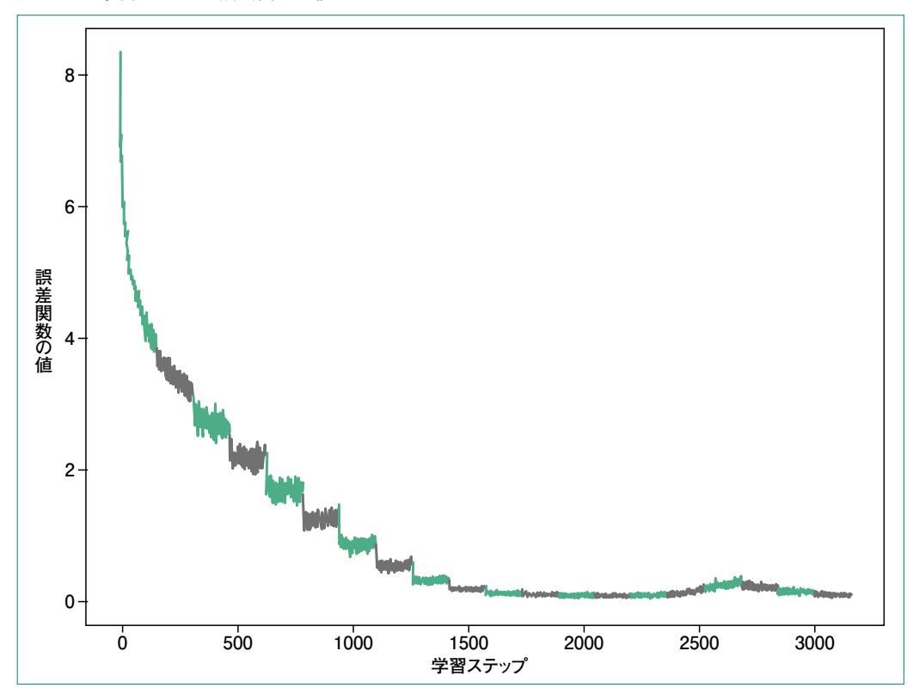

学習が完了したら、新たな文章の翻訳をしてみましょう。推論には2.4節の最後に実装した inference メソッドを利用してコード 2.5.15 のように実装できます。出力はトークン ID になるので、トークン ID から単語へ変換するために itos というオブジェクトを使用します。

# コード 2.5.15 推論

```
# 入力の準備

text = "<bos> 今日 の 天気 は 晴れ です。 <eos>"

tokens = text.split()\ninput_tokens = src_transforms([tokens]).to(device)
# 推論

tgt_tokens = model.inference(
    input_tokens, bos_token=vocab_ja["<bos>"], eos_token=vocab_ja["<eos>"]
)
# 出力の取得\nitos = vocab_en.get_itos()
text = " ".join(itos[token_id] for token_id in tgt_tokens[0])
print(text) # <bos> it is fine today . <eos>
```

 サンプルコードでは「今日の天気は晴れです。」のように簡単なテキストを入れて、「**it is fine today** 」と正しく翻訳できました **<sup>7</sup>**。他にもさまざまなテキストを入力してみて、今回学習した Transformerがどの程度の翻訳能力を獲得したか試してみてください。

# 2.5.4 発展的な推論方法

 2.4節で説明した推論方法では、トークンレベルで最も確率の高いものを選択していました。このよう に、1ステップごとに確率が最大のものを選ぶ方法を貪欲法といいます。ここでは、貪欲法以外の生成 方法として以下の3つを順番に紹介します。

- ・ビームサーチ
- ・top-k
- ・top-p

**図2.5.10**は、文章生成時の各ステップで選ぶ単語に関する分岐を示しています**8**。図の例では貪 欲法だと、**it**の確率が最も高いので **it**が選択されます。一方で、4単語目までを見ると全体としての 確率が、**<bos> the weather will**の方が **it**から始めたときの確率よりも高くなります。貪欲 法ではこのような、短期的には確率が低いものの、長期的には良い文章を見つけられません。

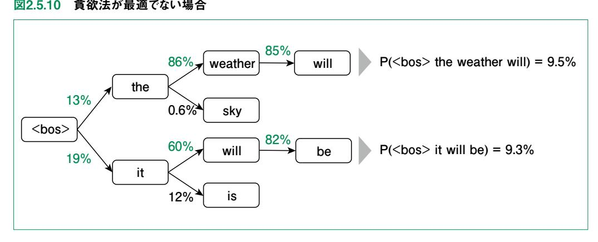

**<sup>7</sup>** 学習時の初期値や与える順番のランダム性から、具体的な翻訳結果は変わる可能性もあります。

**<sup>8</sup>** 実際は全ボキャブラリーに関する分岐があります。

長期的に良い文章を探すためには、あらゆる文章の確率を計算して確率が最大になるものを選ぶという方法が考えられます。しかし、これでは調べなければならないパターンが膨大になってしまいます。例えば、ボキャブラリー数が5000だとしても、図2.5.11に示す通り、2ステップ調べるだけで組み合わせは2500万通りです。10ステップにもなると約1037通りになってしまいます。

図2.5.11 組み合わせ爆発

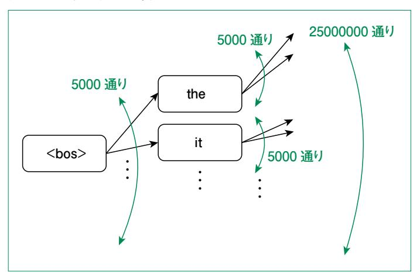

そこで、ビームサーチでは<mark>図2.5.12</mark>のように各ステップで確率の高いものに絞り、その次のステップを探索します。このとき、探索するルートとして残す数をビーム幅といいます。図の例ではビーム幅は2としています。

図2.5.12 ビームサーチ

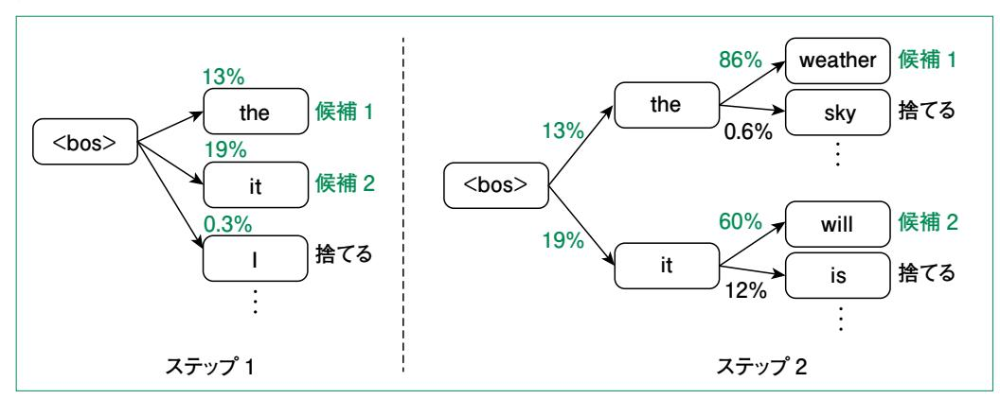

ビームサーチによる文章生成の実装をコード2.5.16に示します。

#### コード 2.5.16 ビームサーチ

```
from torch.nn import functional as F
            def beam search inference(
                model: nn.Module.
                src: Tensor.
                bos token: int.
                eos_token: int,
                beam_width: int = 5,
                max_length: int = 50,
            ) -> Tensor:
                device = src.device
                encoder output = model.encoder(src)
                # 初期状態の作成
                sequences = [[bos_token]]
                scores = torch.zeros(1, device=device)
                ended_seq_mask = [False]
                for in range(max length):
                    all candidates = []
                    for i in range(len(sequences)):
                        seg = seguences[i]
                        if ended_seq_mask[i]:
                           # 既に終了しているシーケンスはそのまま保持
                           all_candidates.append((scores[i], seq))
                           continue
                            tgt = torch.tensor(seq, dtype=torch.long, device=device). 

▼
            unsqueeze(0)
                        decoder output = model.decoder(tgt, encoder output)
                        logits = model.linear(decoder_output[:, -1, :])
                        log_probs = F.log_softmax(logits, dim=-1)
                        # 現在のスコアと次のトークンの確率を足して全候補を生成
                        for j in range(log_probs.size(1)):
★行頭がそろっていないと candidate = seq + [j]
                           candidate_score = scores[i] + log_probs[0, j]
プログラムが動かなくなる *ali_candidates.append((candidate_score, candidate))
                      ビーム幅でソートしてトップ beam width 個を選択
                     top_candidates = sorted(all_candidates, key=lambda tup: tup[0], 🔽
            <del>reverse-</del>Frue)[
                        :beam_width
                    sequences = [x[1] for x in top_candidates]
                    scores = torch.tensor([x[0] for x in top\_candidates], device=device)
                    ended_seq_mask = [seq[-1] == eos_token for seq in sequences]
                    # 全ての候補が終了トークンで終わっている場合、終了
```

```
if all(ended_seq_mask):
        break

# スコアが最も高い候補を選択

best_sequence = sequences[0]

return torch.tensor(best_sequence, device=device)
```

このコードではまず、くbos>トークンのみを持つ初期状態を作成します。その後、探索中の全ての単語列(シーケンス)がくeos〉に達するか、元から設定していた最大の長さに達するまでループを回します。このループ内では、新たな単語の確率を計算し、その確率の対数を取って前の単語までの対数尤度と足し合わせます。ただし、すでにくeos〉に達しているシーケンスについては次の単語は計算しません。このようなシーケンスと、新たな単語を加えたシーケンスのリストから、対数尤度が大きい順にビーム幅分を残して次のステップに移行します。

では、beam search inference 関数を用いて文章を生成してみましょう。

## コード 2.5.17 文章の生成

```
text = "<bos> 今日の天気は晴れです。<eos>"
tokens = text.split()\ninput_tokens = src_transforms([tokens]).to(device)
tgt_tokens = beam_search_inference(
    model, input_tokens, vocab_en["<bos>"], vocab_en["<eos>"], max_length=20
)\nitos = vocab_en.get_itos()
text = " ".join(itos[token_id] for token_id in tgt_tokens)
print(text) # <bos> the weather is fine today . <eos>
```

貪欲法に比べると生成に時間がかかったと思います。貪欲法では単にボキャブラリー数×ステップ数の探索でしたが、ビームサーチではこれがビーム幅倍されるためです。出力された文章については、例文のレベルでは大差なかったかもしれません。貪欲法と同様に、さまざまなテキストを入力してみて、実際にどのような傾向があるのか試してみてください。

貪欲法もビームサーチによる生成も、何度実行しても同じ文章が生成されるような、決定的なアルゴリズムになっていました。一方、以降で紹介する top-k、top-p はモデルの出力する確率を用いたサンプリングを行う、非決定的なアルゴリズムです。人間の書く文章は、尤度を最大化する決定的なアルゴ

**<sup>9</sup>** ある単語列が現れる尤度は、その列の単語全でに対してモデルの出力する確率の積  $p_1 \cdot p_2 \cdot p_n$  です。対数関数 は単調増加なので、対数をとっても大小関係は変わりません

リズムに比べて、単語ごとに見ると確率の低いものも用いていることが知られています。そのため、物語などのクリエイティブな文章を生成させたいときは、単に尤度を最大化するのではなくサンプリングを用いたアルゴリズムの利用が有効です。

top-kや top-pの説明の前に、まず温度 (Temperature)パラメータを用いたサンプリングについて説明します。ChatGPTなどを API経由で利用したことがある人はこのパラメータを見たことがあると思います。温度パラメータは Transformer の最後の線形層の出力に対する softmax に用いられるもので、温度 T の softmax 関数は次式のようになります。

$$\operatorname{softmax}(\boldsymbol{x}, T) = \frac{\exp(\boldsymbol{x}_i / T)}{\sum_{i=1}^{n} \exp(\boldsymbol{x}_i / T)}$$

温度パラメータによる、分布の変化を図2.5.13に示します。上式からもわかるように T=1 の場合が元の分布です。図はランダムに作成した分布に対して、 $T=0.1,\ 1.0,\ 2.0$  の場合をプロットしたものです。

図2.5.13 温度パラメータごとの分布の変化

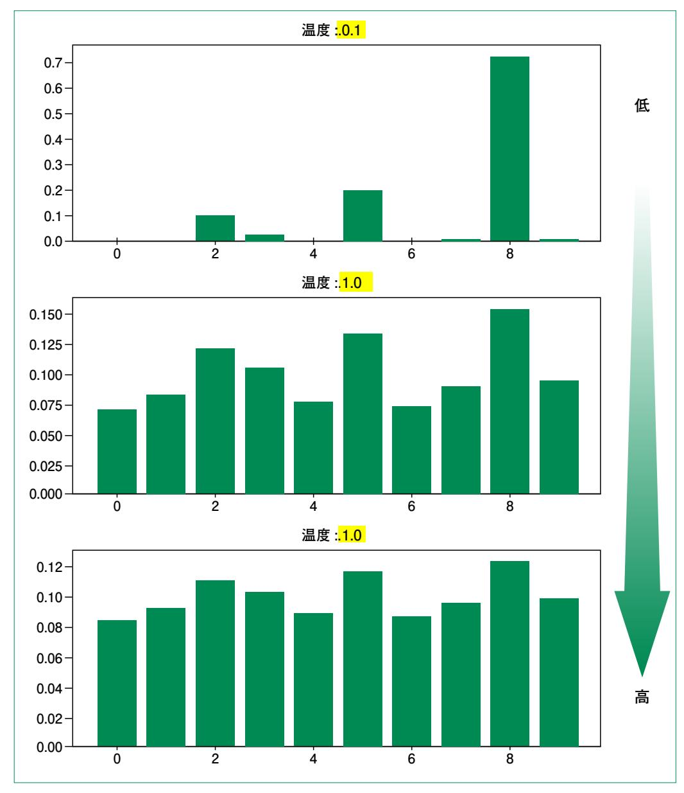

図からわかるように、温度が高くなるほど確率の差がなくなり、温度が低いほど差が大きくなっています。そのため、ランダム性を高くしたければ温度を高くし、決定的なサンプリングに近づけたければ温度を低く設定します。特に T=0 の場合は、サンプリングを行わず単なる貪欲法による文章生成を行うのと同じになります。

温度パラメータ付きのサンプリングによる文章生成を実装してみましょう(コード 2.5.18)。

# コード 2.5.18 温度 パラメータ付きのサンプリング

```
def temperature_inference(
    model: nn.Module.
    src: Tensor.
    bos token: int.
    eos token: int.
    temperature: float = 1.0.
    max\_length: int = 50,
):
    tgt_tokens = torch.tensor([[bos_token]]).to(src.device)
    encoder output = model.encoder(src)
    for in range(max length):
        decoder output = model.decoder(tgt tokens, encoder output)
        score = model.linear(decoder output)
        # 温度パラメータによる変換
        score = score / temperature
        porbability = F.softmax(score[0, -1], dim=-1)
        # トークンをサンプリング
        pred = torch.multinomial(porbability, 1)
        tgt tokens = torch.cat((tgt tokens, pred), axis=-1)
        if pred[0, 0].item() == eos token:
            break
    return tgt_tokens
```

文章の生成部分はこれまでと同様ですが、今回はサンプリングを用いているため、毎回異なる出力が得られます。複数回試して、どのような文章が生成されるか確認してください。

上述のサンプリングでは、モデルの出力した全単語に対する確率分布から、次の単語をサンプリングしていました。これに対して、top-k サンプリングではまず、モデルの出力した確率分布のうち、上位 k 個のみを取り出します。その後、取り出した k 個に関して正規化した分布からサンプリングを行います。

例えばボキャブラリー数が N として、各単語の確率が大きい順に  $(\hat{p}_1, \hat{p}_2, \cdots, \hat{p}_N)$  の場合、以下のように確率分布を変換します。

$$\widehat{p}_i = \begin{cases} \frac{p_i}{\sum_{j=1}^N p_j} & i \leq k \ 0 & i > k \end{cases}$$

〈bos〉 it is の次の単語と〈bos〉 it is fineの次の単語の出力確率を図2.5.14に示します。top-kで k=3として変換された確率分布は図2.5.15のようになります。

# 図2.5.14 元の出力確率

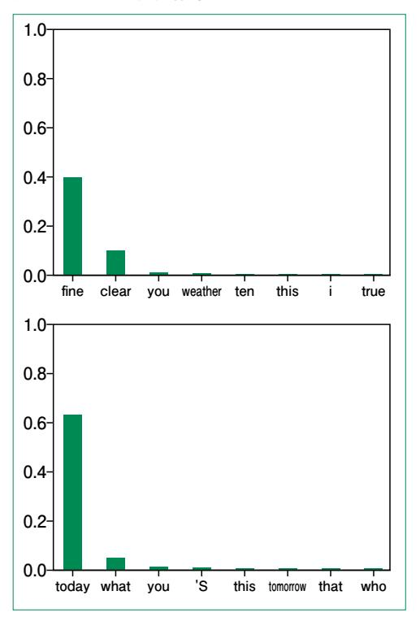

図2.5.15 top-kの出力確率

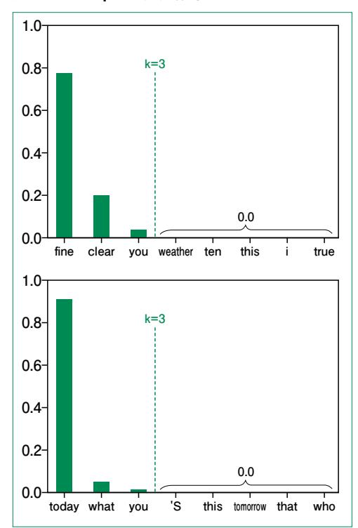

コード 2.5.19 に示すように実装では、確率を大きい順に変換する際にインデックスの並べ替えを先に計算します 10。

# コード 2.5.19 top-k サンプリング

```
@torch.inference_mode
def top_k_inference(
    model: nn.Module,
    src: Tensor,
    bos_token: int,
    eos_token: int,
    temperature: float = 1.0,
    k: float = 5,
    max_length: int = 50,
):
    tgt_tokens = torch.tensor([[bos_token]]).to(src.device)
```

**<sup>10</sup>** 確率分布だけソートしてしまうとサンプリング時に IDが 0~kのトークンからサンプリングしてしまうためです。

```
 encoder_output = model.encoder(src)
 for _ in range(max_length):
 decoder_output = model.decoder(tgt_tokens, encoder_output)
 score = model.linear(decoder_output)
 # 温度パラメータによる変換
 score = score / temperature
 probability = F.softmax(score[0, -1], dim=-1)
 # 確率の高い順にソートしたインデックスを取得
 idx_sorted = torch.argsort(probability, descending=True)
 # 上位 k個のインデックスを取得
 idx_k = idx_sorted[:k]
 # 上位 k個の確率を取得
 p_k = probability[idx_k]
 # 正規化
 p_k /= torch.sum(p_k)
 # トークンをサンプリング
 pred = torch.multinomial(p_k, 1)
 pred = idx_k[pred].unsqueeze(0)
 tgt_tokens = torch.cat((tgt_tokens, pred), axis=-1)
 if pred[0, 0].item() == eos_token:
 break
 return tgt_tokens
```

 このコードを用いて、複数回サンプリングしてみてください。単に温度パラメータを利用するサンプリ ングに比べると、適切な文章を生成しやすいはずです。ただし、今回は学習データ数を抑えているた め、top-kでも文章として成立していないサンプルも出力されるかもしれません。

 top-kは、取り出す単語の個数 kを指定しました。これに対して top-pでは、個数は指定せずに上 位から確率の合計が p 以上になるまでの単語を取り出します。図2.5.16に top-kの問題点とtop-p のアイディアを示します。

図2.5.16 確率に極端な偏りがある場合

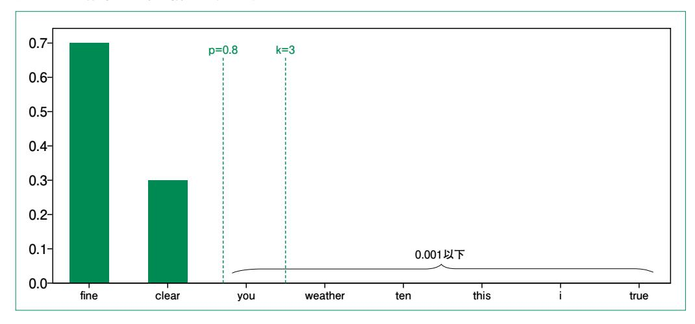

図のように、top-kでは非常に低い確率の単語も選ばれてしまう可能性があります。一方、top-pでは確率が高い部分で閾値を超えるため、確率の低い単語は選択されません。

top-pによるサンプリングの実装をコード 2.5.20 に示します。

# コード 2.5.20 top-p サンプリング

```
@torch.inference_mode
def top_p_inference(
   model: nn.Module.
   src: Tensor.
   bos token: int.
   eos token: int.
   temperature: float = 1.0,
   p: float = 0.8,
   max\_length: int = 50,
):
   tgt tokens = torch.tensor([[bos token]]).to(src.device)
   encoder output = model.encoder(src)
   for _ in range(max_length):
       decoder_output = model.decoder(tgt_tokens, encoder_output)
       score = model.linear(decoder_output)
       # 温度パラメータによる変換
       score = score / temperature
       porbability = F.softmax(score[0, -1], dim=-1)
       idx sorted = torch.argsort(porbability, descending=True)
       p_sorted = porbability[idx_sorted]
       # ソートされた確率の累積和を計算
       p_cumsum = torch.cumsum(p_sorted, dim=-1)
       # p を超える最初のインデックスを取得
```

```
 idx = torch.sum(p_cumsum < p).item() + 1
 # インデックスが範囲内に収まるように調整
 idx = min(idx, len(p_cumsum) - 1)
 # p を超えない範囲で上位の確率分布を取得
 p_top = p_sorted[:idx]
 # 正規化
 p_top = p_top / torch.sum(p_top)
 # トークンをサンプリング
 pred = torch.multinomial(p_top, 1)
 pred = idx_sorted[pred]
 tgt_tokens = torch.cat((tgt_tokens, pred), axis=-1)
 if pred[0, 0].item() == eos_token:
 break
 return tgt_tokens
```

 top-pによるサンプリングについても、複数回実行して、どのような出力が得られるか確認してみま しょう。top-kと比べると、おかしな文章を生成することは少ないはずです。