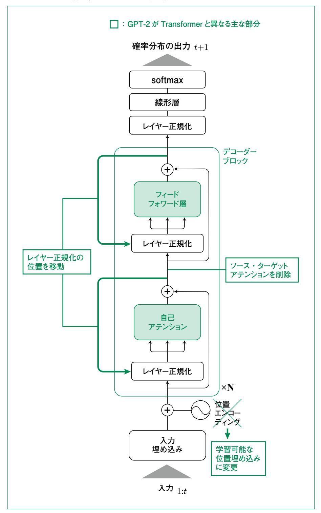

# 3.3 GPTモデルの学習

 2章では、Transformerアーキテクチャの詳細を学び、エンコーダー・デコーダー構造を持つ翻訳 モデルを実装しました。本節では、その Transformerのデコーダー部分のみを使用した GPTモデ ルの学習について解説します。GPTは 2章で解説したアテンション機構や Transformerブロックの 知 識を基 盤としながら、言 語 生 成に特 化した設 計となっています。ここまでの章で学んだ Transformerの基礎知識と GPTの概念、そしてトークナイザーの実装を組み合わせて、実際に GPTモデルを学習させる方法を段階的に理解していきましょう。

## nanoGPTについて

 本節の実装は、Andrej Karpathy氏が開発した nanoGPTを参考にしています。nanoGPTは、 GPTモデルの学習と推論を最小限のコードで実現した教育的なプロジェクトで、MITライセンスの下 で GitHubリポジトリ(https://github.com/karpathy/nanoGPT)で公開されています。約300行 というコンパクトなコードで GPT-2レベルのモデルを実装しており、シェイクスピアの作品集や大規模 Webテキストコーパスである OpenWebTextでの学習が可能です。教育目的に最適化された理解 しやすい実装となっているため、GPTの仕組みを学ぶには最適な教材といえるでしょう。

 本書の実装では、nanoGPTの設計思想を参考にしつつ、2章で実装した Transformerの各モ ジュール(**llm\_from\_scratch/transformers/**内のマルチヘッドアテンション、位置エンコー ディング、フィードフォワード層など)を再利用しています。これにより、2章で解説した Transformerの 翻訳モデルとGPTの関係性がより明確になり、両者が同じ基盤技術の上に構築されていることを実 感できるでしょう。また、日本語テキストでの学習例として夏目漱石の作品を使用した実装も提供して います。

 nanoGPTは、OpenAIの GPT-2モデルを再現することを目標としており、実際に 124Mパラメータ のモデルで同等の性能を達成しています。本節では、この nanoGPTの設計思想を参考にしながら、 さらに初心者にも理解しやすいように段階的に実装を進めていきます。

## 3.3.1 学習の全体像

 GPTシリーズ(GPT-1から GPT-5まで)に共通する学習プロセスは、大規模なテキストデータから 言語の規則性やパターンを自動的に学習する過程です。このプロセスは大きく6つのステップで構成

されています。

 最初に、生のテキストデータをモデルが処理できる形式に変換する必要があります。これがデータ の準備段階で、テキストをトークン化し、学習用のバッチを作成します。次に、GPTアーキテクチャに基 づいてモデルを定義します。このモデルは、入力されたトークン列から次のトークンを予測するように設 計されています。

 学習の中核となるのは損失関数の設定です。GPTシリーズでは次単語予測タスクのためにクロス エントロピー損失を使用します。この損失を最小化するために、AdamWオプティマイザーと学習率ス ケジューリングを組み合わせた最適化手法を採用します。実際の学習は、フォワードパス、バックプロ パゲーション、パラメータ更新という一連の処理を繰り返すことで進行します。最後に、学習したモデル の性能を評価し、実際にテキストを生成させることで、モデルが言語を適切に学習できているかを確 認します。

# 3.3.2 データの準備とデータローダー

 GPTシリーズのモデルの学習において、データの準備は極めて重要な工程です。GPTは自己回 帰型モデルとして設計されており、テキストシーケンスから次の単語を予測することで言語を学習しま す。この学習方式を実現するために、適切なデータ処理が必要となります。

 データセットクラスの実装では、入力テキストをトークン化し、指定された長さのチャンクに分割しま す。各チャンクから入力シーケンスとターゲットシーケンスのペアを作成します。例えば、"The cat sat on the mat"というテキストがあった場合、"The cat sat on the"を入力として "cat sat on the mat"を出力として学習させます。これにより、モデルは文脈から次の単語を予測する能力を獲得して いきます。

 実装の詳細は **llm\_from\_scratch/gpt/dataset.py**および **llm\_from\_scratch/ gpt/tokenizer.py**に記載しています。基本的な構造として、TextDatasetクラスはテキストと トークナイザー、ブロックサイズ(コンテキスト長)を受け取り、学習用のデータを準備します。

## **class TextDataset(Dataset):** コード3.3.1 データセットクラスの実装

 **"""テキストデータセットクラス""" def \_\_init\_\_(self, text, tokenizer, block\_size=128): self.tokenizer = tokenizer self.block\_size = block\_size self.tokens = tokenizer.encode(text)**

```
def __getitem__(self, idx):
# 入力とターゲットのペアを作成
chunk = self.tokens[idx:idx + self.block_size + 1]
x = torch.tensor(chunk[:-1], dtype=torch.long)
y = torch.tensor(chunk[1:], dtype=torch.long)
return x, y
```

## 3.3.3 GPTモデルのアーキテクチャ

GPTシリーズのモデルは、2章で学んだ Transformerアーキテクチャのデコーダー部分のみを使用した設計となっています。2章の翻訳モデルではエンコーダーが原文を処理し、デコーダーが翻訳文を生成する構造でしたが、GPTシリーズではエンコーダーを使用せず、デコーダーのみで言語モデリングを行います。この選択には明確な理由があります。GPTシリーズは文章を左から右へ順次生成していく自己回帰型モデルであり、未来の情報を参照せずに次の単語を予測する必要があるためです。

図3.3.1 に、2章で解説した Transformerアーキテクチャと GPT-2の構造的な違いを示します。この図から、GPT-2では元の Transformer デコーダーから以下の重要な変更が加えられていることがわかります。まず、最も顕著な違いは、エンコーダーとの相互作用を担うソース・ターゲットアテンション層が完全に削除されている点です。これは、GPT-2が翻訳のような入力-出力ペアではなく、単一のテキストシーケンスから次の単語を予測する言語モデルとして設計されているためです。

位置情報の扱いも重要な変更点です。2章で実装した標準的な Transformer では、固定的な正弦波関数による位置エンコーディングを使用していましたが、GPT-2では学習可能な位置埋め込みを採用しています。これにより、モデルは学習データに応じて最適な位置表現を獲得できるようになり、より柔軟な文脈理解が可能となります。

また、レイヤー正規化の配置にも改良が加えられています。GPT-2ではPre-Layer Normalizationと呼ばれる手法を採用し、各サブレイヤー(自己アテンション層とフィードフォワード層)の前にレイヤー正規化を配置しています。一方、サブレイヤーの後にレイヤー正規化を置くTransformerの手法は、Post-Layer Normalizationと呼ばれています。この変更により、より深いネットワークでも勾配の流れが改善され、学習の安定性が向上します。

図の下部に示したように、これらの Transformer ブロックは N層繰り返され、GPT-2の各バリアントで異なる層数が使用されます。最小の GPT-2 Smallでは 12層、最大の GPT-2 XLでは 48層となり、モデルの規模に応じて調整されます。各ブロック内の自己アテンション層では、アテンションスコアが  $1/\sqrt{d_k}$  でスケーリングされることで勾配の安定性が保たれ、フィードフォワード層 (MLP)と共に残差

図3.3.1 GPT-2の構造(Transformerとの違い)



接続で結ばれています。さらに、過学習を防ぐために Dropoutが各層に適用されています。最終的 に全ブロックを通過した後、最終的なレイヤー正規化を経て、線形層(言語モデルヘッド)によって語 彙サイズへの投影が行われます。

 モデルの中心となるのは、2.2節で詳しく説明したマルチヘッド自己アテンション機構です。これによ り、モデルは入力シーケンス内の異なる位置の関係性を同時に学習できます。2章ではエンコーダー の自己アテンションとデコーダーのソース・ターゲットアテンションを組み合わせましたが、GPTではデ コーダーの自己アテンションのみを使用します。アテンション機構には因果的マスク(Causal Mask) が適用され、各位置が自分より後の位置の情報を参照できないようになっています。これは 2章でも触 れた、学習時と推論時の条件を一致させるための重要な制約です。

 モデルの基本構造を以下に示します。完全な実装は **llm\_from\_scratch/gpt/model. py**にありますが、ここでは主要な構成要素を抜粋して紹介します。

#### コード3.3.2 GPT-2モデルの基本構造

```
class GPT(nn.Module):
 """GPTモデルの基本構造"""
 def __init__(self, vocab_size, n_embd=768, n_layer=12, n_head=12,
 block_size=1024, dropout=0.1):
 super().__init__()
 # トークンと位置の埋め込み
 self.token_embedding = nn.Embedding(vocab_size, n_embd)
 self.position_embedding = nn.Embedding(block_size, n_embd)
 self.drop = nn.Dropout(dropout)
 # Transformerブロック(n_layer個)
 self.blocks = nn.Sequential(*[
 TransformerBlock(n_embd, n_head, dropout)
 for _ in range(n_layer)
 ])
 # 最終層の正規化と出力層
 self.ln_f = nn.LayerNorm(n_embd)
 self.head = nn.Linear(n_embd, vocab_size, bias=False)
 def forward(self, idx, targets=None):
 B, T = idx.shape
 # トークンと位置の埋め込みを加算
 pos = torch.arange(0, T, dtype=torch.long, device=idx.device).
unsqueeze(0)
 tok_emb = self.token_embedding(idx)
 pos_emb = self.position_embedding(pos)
```

```
 x = self.drop(tok_emb + pos_emb)
 # Transformerブロックを通す
 x = self.blocks(x)
 x = self.ln_f(x)
 # 語彙への投影
 logits = self.head(x)
 # 損失の計算(学習時のみ)
 loss = None
 if targets is not None:
 B, T, C = logits.shape
 logits = logits.view(B*T, C)
 targets = targets.view(B*T)
 loss = F.cross_entropy(logits, targets)
 return logits, loss
```

 このコードから、GPTモデルがボキャブラリーサイズ、埋め込み次元、レイヤー数、ヘッド数などのパ ラメータを指定することで、様々な規模のモデルを構築できることがわかります。

## 3.3.4 学習ループの実装

 GPTモデルの学習では、AdamWオプティマイザーを使用します。AdamWは通常の Adamオプ ティマイザーに weight decay(過学習を防ぐためにパラメータの大きさを抑制する仕組み)を正しく 実装したバージョンで、LLMの学習で標準的に使用されています。重要な点として、weight decay はすべてのパラメータに一律に適用するのではなく、バイアス項、レイヤー正規化のパラメータ、埋め 込み層には適用しません。これは経験的に良い結果をもたらすことが知られています。

 学習率のスケジューリングも重要な要素です。学習の初期段階では線形ウォームアップを行い、そ の後コサイン減衰スケジュールに従って学習率を減少させます。ウォームアップは、モデルのパラメー タがランダムな初期値から始まる際の不安定性を軽減する効果があります。

 学習ループでは、まずフォワードパスでモデルの予測を計算し、クロスエントロピー損失を算出しま す。次にバックプロパゲーションで勾配を計算し、勾配クリッピングを適用して勾配爆発を防ぎます。最 後にオプティマイザーでパラメータを更新します。この一連の処理を指定されたステップ数だけ繰り返 すことで、モデルは徐々に言語パターンを学習していきます。

 完全な実装は **llm\_from\_scratch/gpt/trainer.py**にあり、GPT-2で使用されているも のと同じ betas=(0.9, 0.95)の設定を採用しています。

# 3.3.5 学習の実行とテキスト生成

 実際に GPTモデルを学習させる際には、まず小規模なデータセットで動作を確認することが重要 です。本実装では、学習例として **examples/train\_gpt\_soseki.py**を提供しています。これ は夏目漱石の作品(『吾輩は猫である』など)を使用しており、文字レベルでの言語モデリングを行い ます。

 夏目漱石データセットでの学習(**train\_gpt\_soseki.py** )は日本語の文字数が多いため、 GPUの使用を推奨します。学習が進むと、損失が徐々に減少していくことが確認できます。

 学習が完了したモデルを使って実際にテキストを生成すると、以下のような結果が得られます。な お、GPT-2は純粋な言語モデルであり、短いプロンプト(開始文)を与えると、その続きを自動的に生 成します。これは ChatGPTのような対話型のモデルとは異なり、質問に答えるのではなく、文章の続 きを予測・生成する仕組みです。

#### **#「吾輩は」という入力に対する生成結果**

**入力: '吾輩は '**

#### **生成結果:**

**吾輩はようやく突然折して、吾輩の傍へ筆硯と原稿用紙を並べて腹這になって、 しきりに何か唸っている。大方草稿を書き卸す序開きとして妙な声を発するのだろうと 注目していると、ややしばらくして筆太に「香一」とかいた。**

#### **#「夏の」という入力に対する生成結果**

**入力: '夏の '**

#### **生成結果:**

**夏の叔母さんと喧嘩をして帰って行く雪江とか云う奇麗な名のお嬢さんである。 もっとも顔は名前ほどでもない、ちょっと表へ出て一二町あるけば必ず逢える人相である。**

 このように、学習したモデルは夏目漱石の文体を模倣し、原作に登場する人物や情景を含んだ文 章を生成できるようになります。文字レベルでの学習にもかかわらず、文法的にもある程度整った文章 が生成されているのがわかります。

 このような基 本 的な言 語モデル( G P T - 2 )が、後に I n s t ru c t i o n Tu n i n g や R LH F (Reinforcement Learning from Human Feedback)などの技術によって改良され、ChatGPT のような対話型AI へと発展していきます。4章では、このような応用技術について詳しく学んでいきま す。

 生成時のサンプリング手法については、2.5節で解説した温度パラメータとtop-kサンプリングを実 装しています。本実装の **generate**メソッドでは、温度パラメータで確率分布の鋭さを調整し、top-k サンプリングで上位k 個の候補から選択することで、多様性と品質のバランスを取った文章生成を実 現しています。なお、2章で紹介した top-pサンプリングは、実装の簡潔さを優先して本節では省略し ていますが、必要に応じて追加することも可能です。

# 3.3.6 大規模学習のための最適化とアーキテクチャの発展

 実際の大規模な GPTシリーズのモデルの学習では、本実装よりもさらに高度な最適化技術とアー キテクチャの改良が使用されています。

### 学習の効率化技術

**Mixed Precision Training**では、FP16や BF16といった低精度の浮動小数点数を使 用することで、メモリ使用量を削減し計算速度を向上させます。**Gradient Accumulation**を 使用すると、物理的なバッチサイズの制限を超えて、実効的により大きなバッチサイズで学習すること が可能になります。

 複数の GPUやノードを使用した **Distributed Training**も、大規模モデルの学習には不 可欠です。データ並列、モデル並列、パイプライン並列などの手法を組み合わせることで、数千億パラ メータ規模のモデルも学習可能になります。これらの技術については、4章で解説します。

 特に注目すべき技術として **Flash Attention**があります。これはアテンション計算をメモリ効 率的に実装したもので、PyTorch 2.0以降では **torch.nn.functional.scaled\_dot\_ product\_attention**として利用可能です。本実装では教育的な観点から標準的なアテンショ ン実装を採用していますが、実用的なシステムでは Flash Attentionの使用を検討すべきでしょう。

## Mixture of Experts(MoE)アーキテクチャ

 LLMの計算効率を劇的に改善する技術として、**Mixture of Experts(MoE)**アーキテクチャ があります。MoEは複数の「エキスパート」と呼ばれる独立したフィードフォワード層を持ち、ゲーティン グ層が各入力トークンに対して適切なエキスパートを選択的に活性化する仕組みです。通常の Transformerではすべてのパラメータが常に使用されるのに対し、MoEではこの「スパース性」によ り計算量を大幅に削減します。

 具体的な動作としては、8つのエキスパートを持つモデルで各トークンが 2つのエキスパートのみを 使用する場合、計算コストは全体の約4分の 1になります。これによりモデル容量を拡大しながら計算 コストを抑制でき、各エキスパートが異なるパターンや知識領域に特化することでモデル全体の表現 力も向上します。例えば、1.76兆パラメータという巨大なモデルでも、実効的には 440Bパラメータ相当 の計算量で動作させることが可能です。

 一方で、MoEには技術的な課題も存在します。すべてのエキスパートが均等に使用されるような 負荷分散が必要であり、これが適切に行われないと一部のエキスパートに処理が集中してしまいま す。また、ゲーティング機構の学習は不安定になりやすく、適切な正則化技術が必要です。さらに、推 論時には使用されないエキスパートも含めて全パラメータをメモリに保持する必要があるため、メモリ 要件は依然として高いままという課題もあります。

# 3.3.7 ハイパーパラメータ設定

 GPTモデルの性能は、ハイパーパラメータの設定に大きく依存します。小規模な実験では、語彙サ イズ1000、埋め込み次元128、4層の Transformerブロックといった設定で、約50万パラメータのモ デルを構築できます。これは学習の動作確認や簡単な実験に適しています。

 中規模のモデルとして、GPT-2 smallに相当する設定では、語彙サイズ50257、埋め込み次元 768、12層の Transformerブロックを使用し、約1億2400万パラメータのモデルとなります。このサイ ズのモデルは、適切なデータセットで学習させることで、実用的な言語生成能力を獲得できます。

 これらの設定は **GPTConfig**クラスで管理していて、用途に応じて柔軟に調整可能です。モデル サイズと必要な計算リソース、期待される性能のバランスを考慮して、適切な設定を選択することが 重要です。

## まとめ

 本節では、GPTモデルの学習について、データ処理からモデル実装、学習ループ、テキスト生成ま で、包括的に解説しました。実装は nanoGPTを参考にしながら、教育的な観点から初心者でも理解 しやすい構造にまとめています。

 実装コードは、モデル本体を **llm\_from\_scratch/gpt/model.py**に、トークナイザーを **tokenizer.py**に、データセット処理を **dataset.py**に、学習ループを **trainer.py**にそれぞ れ配置しています。また、実行可能なサンプルとして **examples/train\_gpt\_soseki.py**を用 意しています。

 これらの実装を通じて、GPTモデルの基本的な仕組みを理解し、実際に動作させることができるよ うになりました。実際の大規模な GPTモデルでは、分散学習や Flash Attentionなどのより高度な 最適化技術が使用されますが、基本的な原理は本節で学んだものと同じです。次章では、これらの 基礎的な実装をベースに、より実践的なファインチューニングや応用について学んでいきます。