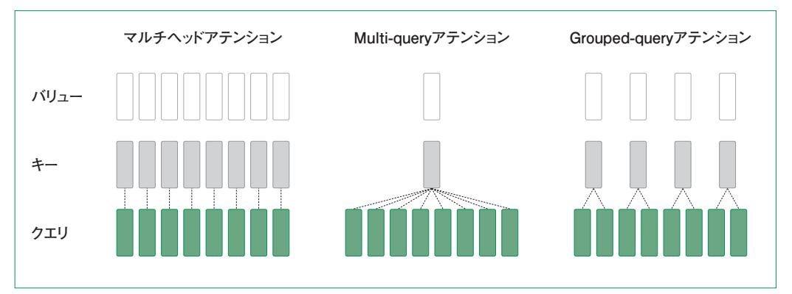
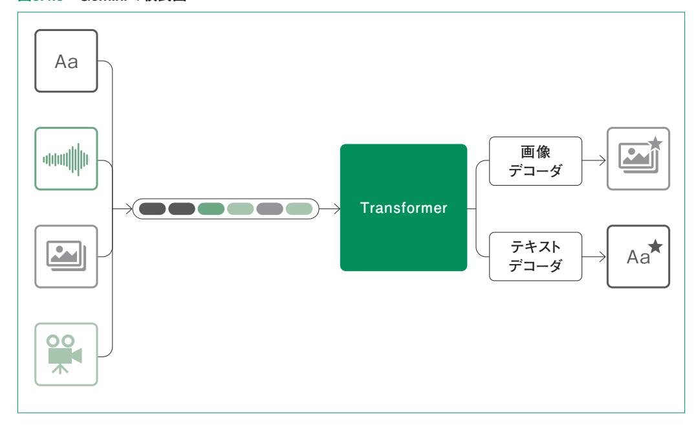

# 他の代表的な LLM 3.4

 大規模言語モデル(LLM)は、近年の人工知能(AI)の発展において重要な役割を果たしていま す。特に、自然言語処理(NLP)分野における LLMの進化は、さまざまな産業や日常生活に大きな影 響を与えています。本節では、代表的な LLMの発展とその応用について詳しく探ります。

 具体的なモデルの発展とその技術的特徴を中心に解説していきます。3.4.1項では、ビッグテックが 開発した LLMについて、それぞれのモデルの進化過程、技術的な革新点、実際の応用事例を紹介 します。

 次に 3.4.2項では、その他の注目すべきLLMと、その多様な応用について説明します。特に、マル チモーダルモデルの台頭に焦点を当て、テキスト、画像、音声などの異なるモダリティを統合して処理 する能力がどのように進化しているかを示します。これにより、LLMの応用範囲が広がり、新たな技 術革新がもたらす可能性について考察します。

 本節を通じて、LLMの最新動向とその未来像について深く理解し、技術の進化が私たちの生活 や仕事にどのように影響を与えるのかを考えていきましょう。

# 3.4.1 GPTモデルの発展

### Metaが開発したモデル

 Metaは複数の注目すべきLLMを開発しています。その代表的なモデルには以下のものがありま す。

#### BlenderBot

 流暢な対話の実現を目的としたこのモデルは、最大90億パラメータを持つ初期バージョンから始ま りました。2022年に発表された BlenderBot3は、後述の OPT-175Bを基に構築され、感情理解、知 識ベースの質問応答、長期記憶の組み込み、インターネット検索機能を統合している点が特徴的で す。

#### OPT(Open Pre-trained Transformer Language Models)

 GPT-3に匹敵する性能を持つオープンソースモデルとして注目を集めた OPTは、1.25億から 1750億パラメータまでの 9種類のモデルが提供されています。テキスト生成、分類、質問応答など多

様な NLP(自然言語処理)タスクに対応します。事前学習済みモデルとソースコードが一般公開され ていますが、OPT-175Bは非商用ライセンスになっている点に注意が必要です。

## ★LLaMA → Llamaとしました。そちらが正式と思います。

#### Llama

 Llama1、Llama2、Llama3から Llama4へとバージョンアップを重ねている Llamaシリーズは、オー プンソース戦略の中核として進化を遂げてきており、Llama 3(2024年4月)の 8B、70Bモデルから始 まり、Llama 3.1(2024年7月)では 405Bという世界最大級のオープンソースモデルとして公開されま した。Llama 4(2025年4月)は Mixture of Experts(MoE)アーキテクチャを採用し、Scoutモデル で 1000万トークンという画期的なコンテキストウィンドウを実現しました。Llama 4 Maverickは 400B 総パラメータ(17B活性)で 100万トークンを処理可能です。現在訓練中の Llama 4 Behemoth(約 2兆パラメータ)は、ネイティブマルチモーダル機能と12言語サポートを提供予定です。

## Googleが開発したモデル

Googleも複数の先進的な LLMを開発しています。主要なモデルは以下の通りです。

## LaMDA(Language Model for Dialogue Applications)

 対話生成に特化したこのモデルは、膨大な会話データでトレーニングされています。幅広いトピック に関して自然な対話が可能であり、事実への忠実性を重視している点が特徴です。初期の Bardの 内部LLMとして採用されましたが、現在は Geminiシリーズに統合されています。

#### PaLM(Pathways Language Model)

 5400億パラメータを持つこの巨大なモデルは、Webページ、Wikipedia、ニュース記事、GitHub のオープンソースコード、ソーシャルメディアの会話データなど、多様なソースのデータで学習されてい ます。6144個のチップを使用した大規模トレーニングを行い、57.8%という高いハードウェアFLOP 使 用率を達成しています。PaLM 2を経て、現在はその技術が Geminiシリーズに継承されています。

#### Flamingo

 DeepMindが開発したこのマルチモーダルモデルは、自然言語処理とコンピュータビジョンを統合 しています。30億、90億、800億パラメータの 3つのモデルがあり、視覚エンコーダーに OpenAIの CLIPを使用しています。画像キャプション生成、画像説明、画像ベースの質問応答に強みを持ち、高 い Few-shot学習能力を示しています。YouTubeショートの検索システムにも採用されています。

#### Gemini

LaMDAとPaLMの技術を統合・進化させた Geminiシリーズは、Googleの主力LLMとして発展

しています。Gemini 1.5 Pro(2024年2月)は当時としては初の 200万トークンのコンテキストウィンド ウを実現し、2時間の動画や 6万行以上のコードを処理可能になりました。Gemini 2.0 Flash(2024 年12月)は「エージェント時代」向けに設計され、ネイティブマルチモーダル出力(テキスト、画像、音声) と双方向ストリーミングを実装しています。Gemini 2.5 Pro(2025年3月実験版、6月一般提供)は初の 「思考モデル」として内蔵推論機能を搭載し、LMArenaリーダーボードで 1位を獲得、AIME 2025 で 88.0%という驚異的なスコアを記録しています。Deep Thinkモードでは、適応的な思考バジェット により性能とコストを最適化しています。

#### OpenAIが開発したモデル

 OpenAIは、GPTシリーズを中心に革新的な LLMを次々と開発してきました。主要なモデルの進 化は以下の通りです。3.1節で詳しく解説しているので、簡単にまとめます。

- ・GPT-1(2018年)は 1.17億パラメータを持ち、Transformerアーキテクチャを使用 して文脈に基づいたテキスト生成に優れていました。
- ・GPT-2(2019年)は 15億パラメータに拡大され、より大規模なデータセットでトレーニ ングされ、長文生成、要約、翻訳、質問応答など多様なタスクに対応できるようになりました。
- ・GPT-3(2019年)は 1750億パラメータという巨大なモデルとなり、多様な NLPタス クに対応する高い汎用性と、Few-shot学習での優れた性能を示しました。
- ・InstructGPT(2022年)は GPT-3をベースに、人間の意図により沿ったテキスト生成 を実現し、現代的な指示ベースの AIモデルの基盤となりました。
- ・GPT-4(2023年)はさらに性能と汎用性を向上させ、その後の GPT-4Vでマルチモー ダル機能(画像理解・処理)が追加されました。最新の GPT-4oでは音声認識・生成機能や リアルタイムビデオ解析機能も統合されています。
- ・GPT-4.1(2025年4月)は 100万トークンのコンテキストウィンドウを実現し、SWEbench Verifiedで 54.6%を記録しました。
- ・GPT-5(2025年8月)は統一アーキテクチャで推論と非推論機能を融合し、256K (ChatGPT)から 400K(API)トークンのコンテキストウィンドウを提供しています。

#### 推論特化モデル

 OpenAIは GPTシリーズと並行して、Project Strawberry技術を基にした推論特化モデルo1、 o3シリーズを開発しており、MATHベンチマークで 90%以上のスコアを達成しています。

## Anthropicが開発したモデル

Anthropicの主要なモデルは以下の通りです。

#### Claude 3ファミリー(2024年3月)

 Opus、Sonnet、Haikuの 3つのモデルで展開され、それぞれ異なる用途に最適化されています。 標準で 20万トークン、選択された顧客向けには 100万トークンのコンテキストウィンドウを提供してお り、長文処理において当時から業界をリードしていました。

#### Claude 3.5シリーズ

 Claude 3.5 Sonnet(2024年6月)は、Claude 3 Opusを上回る性能を同価格で実現し、 HumanEvalで 92.0%という業界最高水準のコーディング性能を達成しました。2024年10月には革 新的な「コンピューター使用機能」をパブリックベータで提供開始し、画面の解釈とキーボード・マウス 操作のシミュレーションを可能にしました。Claude 3.5 Haiku(2024年11月)も追加され、高速で低コ ストな選択肢を提供しています。

#### Claude 3.7(2025年2月)

 ハイブリッド推論という仕組みを導入し、単一モデルで即時応答と拡張思考の二重モードを実現し ました。これにより、タスクの複雑さに応じて自動的に最適な推論方法を選択できるようになっていま す。

#### Claude 4シリーズ(2025年5月~8月)

 最新の Claude 4ファミリーでは、Opus 4が SWE-bench Verifiedで 72.5%という業界トップのス コアを達成しました。Claude 4 Opus 4.1(2025年8月5日)は、前バージョンから 50%の高速化を実 現し、複数のベンチマークで大幅な性能向上を達成しています。憲法的AI(Constitutional AI)の 原則に基づいた安全性の向上も継続的に実装されています。

#### 中国系モデル

主要4社以外にも、特に中国系企業を中心に革新的な LLMが次々と登場しています。

#### DeepSeek

 DeepSeek-V3(2024年12月)は、大規模モデルでありながら効率的な訓練手法により低コストで の開発を実現し、オープンソースとして公開されたことで注目を集めています。DeepSeek-R1(2025 年1月)は推論特化モデルとして、MATHベンチマークで 97.3%を達成し、OpenAI o1に匹敵する 性能を実現しています。MITライセンスで提供され、完全な商用利用が可能です。

#### Qwen Alibaba

Qwen 3(2025年4月)は 235B MoEアーキテクチャ(22B活性)を採用し、119言語をサポートする

グローバルモデルです。36兆トークンで訓練され、MMLU-Reduxで 92.7%、LiveCodeBenchで 70.7%という優れたスコアを記録しています。

#### GLM

 GLM-4.5(2025年7月)は 355Bパラメータの「エージェントネイティブ」モデルとして設計され、複雑 なタスクの自律的実行に特化しています。MITライセンスで提供され、中国語と英語の両方で高い性 能を発揮します。

## 欧州・その他のモデル

## Mistral AI(フランス)

 Mixtral 8x22B(2024年4月)は 176B総パラメータのスパースMoEアーキテクチャで、39B活性パ ラメータで効率的に動作します。Magistral(2025年)は同社初の推論特化モデルとして、複雑な推 論タスクに対応しています。Apache 2.0ライセンスで完全商用利用が可能です。

#### xAI Grok

 Grok-4(2025年7月)は「世界で最も知能的なモデル」を標榜し、ネイティブツール使用機能とリアル タイム情報アクセスを特徴としています。X(旧Twitter)のデータを活用した独自の学習により、最新 の話題に強い特性を持ちます。

#### その他の注目モデル

 Cohereの Command R+(100B+)、Stability AIの StableLM 2(12B)、Hugging Faceの BLOOM(176B、46言語対応)などが、それぞれ特定の用途で強みを発揮しています。

#### 主要LLMの機能比較

 表3.4.1は、2025年10月時点での主要LLMの技術的特徴を比較したものです。各モデルの重要 な属性として、推論特化機能、マルチモーダル対応、コンテキスト長、オープンソース化の状況をまとめ ています。

第3章

## ★上下に分けました

#### 表3.4.1 主な LLMの機能比較

| モデル名              | 開発企業       | パラメータ数      | 推論特化機能 | マルチモーダル          |
|-------------------|------------|-------------|--------|------------------|
| GPT-5             | OpenAI     | 非公開         | ○      | ○(テキスト/画像/音声/動画) |
| GPT-4             | OpenAI     | 1.76T       | ×      | ○(GPT-4V/4o)     |
| o3                | OpenAI     | 非公開         | ○      | ×                |
| Claude 4 Opus 4.1 | Anthropic  | 非公開         | ○      | ○(画像)            |
| Claude 3.5 Sonnet | Anthropic  | 非公開         | ×      | ○(画像+PC操作)       |
| Gemini 2.5 Pro    | Google     | 非公開         | ○      | ○(ネイティブ)         |
| Gemini 2.0 Flash  | Google     | 非公開         | ×      | ○(双方向ストリーミング)    |
| Llama 4 Scout     | Meta       | 非公開         | ×      | ○(ネイティブ)         |
| Llama 4 Maverick  | Meta       | 400B(17B活性) | ×      | ○                |
| Llama 3.2         | Meta       | 11B/90B     | ×      | ○(画像)            |
| DeepSeek-V3       | DeepSeek   | 671B        | ×      | ×                |
| DeepSeek-R1       | DeepSeek   | 非公開         | ○      | ×                |
| Qwen 3            | Alibaba    | 235B(22B活性) | ×      | ○                |
| GLM-4.5           | Zhipu AI   | 355B        | ×      | ○                |
| Mixtral 8x22B     | Mistral AI | 176B(39B活性) | ×      | ×                |
| Magistral         | Mistral AI | 非公開         | ○      | ×                |
| Grok-4            | xAI        | 非公開         | ×      | ○                |

| モデル名              | コンテキスト長   | オープンソース | 特徴                              |
|-------------------|-----------|---------|---------------------------------|
| GPT-5             | 256K-400K | ×       | 統一アーキテクチャで推論と生成を融合              |
| GPT-4             | 128K      | ×       | 業界最高水準の汎用性能                     |
| o3                | 128K      | ×       | MATH 90%以上、競技プログラミングで人間超え       |
| Claude 4 Opus 4.1 | 200K      | ×       | SWE-bench 72.5%でエンジニアリングタスク最高性能 |
| Claude 3.5 Sonnet | 200K      | ×       | コンピュータ使用機能で GUI自動操作可能           |
| Gemini 2.5 Pro    | 2M        | ×       | Deep Thinkモードで適応的推論時間調整         |
| Gemini 2.0 Flash  | 1M        | ×       | リアルタイム双方向対話に最適化                 |
| Llama 4 Scout     | 10M       | ○       | 世界最長1000万トークンコンテキスト             |
| Llama 4 Maverick  | 1M        | ○       | 12言語ネイティブサポート                   |
| Llama 3.2         | 128K      | ○       | オープンソース初の本格マルチモーダル機能搭載          |
| DeepSeek-V3       | 128K      | ○(MIT)  | 560万ドルという驚異的低コストで訓練             |
| DeepSeek-R1       | 128K      | ○(MIT)  | MATH 97.3%で数学問題解決世界最高           |
| Qwen 3            | 128K      | ○       | 119言語サポートでグローバル対応               |
| GLM-4.5           | 128K      | ○(MIT)  | 自律的エージェント実行に特化                  |
| Mixtral 8x22B     | 64K       |         | ○(Apache2.0) 完全商用可能な最大級オープンソース  |
| Magistral         | 32K       |         | ○(Apache2.0) 欧州初の推論特化モデル        |
| Grok-4            | 128K      | ×       | X(Twitter)データ活用                 |

## 技術トレンドの分析

 表3.4.1から、現在の LLM開発における重要なトレンドが明確に読み取れます。まず最も顕著な動 向として、推論特化モデルの台頭が挙げられます。OpenAI o3、DeepSeek-R1、Gemini 2.5 Proと いった専用モデルが、数学や科学の問題において人間の専門家レベルの性能を達成しています。こ れらのモデルは「思考の連鎖」を内蔵し、段階的な推論プロセスを経て回答を生成する能力を持って います。

 マルチモーダル機能も急速に対応が進んでいます。2025年の主要モデルの約80%が何らかの形 でマルチモーダル機能を搭載し、特に GPT-5や Gemini 2.0は「ネイティブマルチモーダル」として、 最初から複数のモダリティを統合的に処理することを前提に設計されています。Claude 3.5の「コン ピュータ使用機能」のような革新的な機能も登場し、従来の画像認識を超えた新しい形の相互作用 を可能にしています。

 コンテキスト長の拡大も著しい進歩を見せています。Llama 4 Scoutの 1000万トークン、Gemini 2.5 Proの 200万トークンといった、従来の限界を大きく超えるコンテキスト処理能力により、長大な文 書や動画の一括処理が可能になりました。これは実用面で大きな影響を与え、複雑な業務タスクへ の適用可能性を大幅に広げています。

 最後に、オープンソース化の進展も重要なトレンドです。中国系モデル(DeepSeek、Qwen、GLM) に加えて、Metaの Llamaシリーズや Mistral AI が積極的にオープンソース戦略を推進していま す。特に MITや Apache 2.0ライセンスで提供される完全商用利用可能な高性能モデルの増加に より、LLM技術の民主化が急速に進んでいます。

## アーキテクチャレベルでの LLM改善と効率化手法

## Mixture of Experts(MoE)の標準化

 MoEアーキテクチャは 2024~2025年に業界標準として確立されました(MoEの技術的詳細につ いては 3.3.6節を参照)。各社の主要モデルでの実装例として、GPT-4 が 8 つのエキスパート(各 220B)を使用し、DeepSeek-V3では「共有エキスパート」という一部のエキスパートを常に活性化さ せる概念を導入、Llama 4では MoE 層と密な層を交互に配置する設計を採用するなど、それぞれ が独自の工夫を加えています。

#### Flash Attention 3とメモリ最適化

 Flash Attention 3(2024年)は NVIDIA Hopper GPUに最適化され、非同期処理とFP8サ ポートにより2〜4倍の高速化を実現しました。Grouped-queryアテンション(GQA)は、マルチヘッド アテンションとMulti-queryアテンションの中間的手法として、多くの最新モデルで採用されています。 Grouped-queryアテンションは、Multi-queryアテンションの表現力の低下を改善するために考案

されたアーキテクチャです。この手法では、クエリをグループ化し、グループごとに固有のキーとバリュー を使用して自己アテンションを計算します。各グループ内では、キーとバリューの重み行列を共有しま す。これにより、Multi-queryアテンションと比べて表現力を向上させつつ、計算量とメモリ使用量を 削減できます。

図3.4.2 Multi-queryアテンションとGrouped-queryアテンションのイメージ

「GQA: Training Generalized Multi-Query Transformer Models from Multi-Head Checkpoints」 (https://arxiv.org/abs/2305.13245)の Figure 2を基に作成した。

#### KVキャッシュ

 KVキャッシュは、Transformerモデルにおける推論時の計算効率(2.5節参照)を向上させるた めの重要なアーキテクチャです。自己アテンションでは、各トークンと他のすべてのトークンとの関連性 が計算されますが、過去のトークン同士の関連性は一度計算されれば変化しないため、再計算する 必要はありません。KVキャッシュは、このような過去の計算結果を保存し、再利用するメカニズムで す。これにより、推論時の計算コストが大幅に削減され、処理が効率化されます。最新の実装では、 PagedAttention(vLLM)により動的なメモリ管理が可能になり、複数のリクエストで KVキャッシュ を共有する Multi-Query Cachingも実用化されました。これにより、推論時のメモリ使用量を最大 90%削減しながら、スループットを 10倍以上向上させることが可能になっています。

#### レイヤー正規化

 レイヤー正規化(2.3.5節参照)には、各サブレイヤーの前に適用する Pre-LN( Pre-Layer Normalization)と、各サブレイヤーの後に適用する Post-LN(Post-Layer Normalization)があり ます。適用する位置によりモデルの学習特性が変わります。

 この Pre-LNとPost-LNに加えて、RMSNorm(Root Mean Square Normalization)が多くの 最新モデルで採用されています。RMSNormは計算効率が高く、LLaMA、Gemini、Mistralなどで 標準的に使用されています。また、DeepNormや SubLNなどの新手法により、1000層を超える超深

## 3.4.2 その他の LLM

## マルチモーダルモデルの台頭

 マルチモーダルモデルは、テキスト、画像、音声などの複数のモダリティを入出力に利用可能なモデ ルです。これにより、異なるモダリティ間をつなげられるようになり、テキストだけでは利用できない幅広 い分野への応用が可能になります。

 近年、LLMをバックボーンに採用することで、LLMの汎用的な知識や推論能力をテキスト以外の モダリティにも活用できるようになり、マルチモーダルモデルの能力が劇的に改善しています。例えば、 Med-Geminiは医療分野に適用され、CT 画像などの医療画像を基に病状を説明したり、画像に対 して質問したりできます。また、RT-2はロボット分野への応用研究として、周囲の環境を写した画像と 指示文を入力することで、ロボットに実環境で指示に沿った行動を取らせられます。

 当初は特別な機能として注目されていたマルチモーダル機能ですが、2024~2025年にかけて急 速に「標準機能」へと進化しました。現在では主要な LLMの多くが、何らかの形でマルチモーダル 機能を搭載するようになっています。

**マルチ**

**モーダル モデル**

図3.4.2 マルチモーダルモデルのイメージ

・GPT-4oと GPT-5:OpenAIの GPT-4o(2024年5月)は、テキスト、画像、音声、動 画を統合的に処理する真のマルチモーダルモデルです。232ミリ秒という人間の会話速 度に近い音声応答を実現し、リアルタイムビデオ解析により、例えばスポーツの試合を見な がらルールを説明するなどの複雑なタスクが可能です。OCR機能により画像内のテキスト も高精度で読み取ります。GPT-5(2025年8月)では、これらの機能が統一アーキテク チャでさらに洗練され、256K-400Kトークンのコンテキストでマルチモーダル処理が可 能になっています。

・Geminiシリーズ:Google DeepMindの Gemini 1.5 Pro(2024年2月)は、業界 初の 200万トークンコンテキストを実現し、2時間の動画や数万枚の画像を一度に処理で きます。Gemini 2.0 Flash(2024年12月)は「ネイティブマルチモーダル」として設 計され、テキスト、画像、音声を同時に生成する統合型モデルです。最新の Gemini 2.5 (2025年3月)では、これらに思考機能が加わり、複雑な視覚的推論タスクでも優れた性 能を示しています。

図3.4.3 Geminiの模式図

・Llama 3.2と Llama 4:Metaの Llama 3.2(2024年9月)は、オープンソース初の 本格的マルチモーダルモデル(11B、90B)として登場し、画像理解機能を無料で提供し ました。Llama 4(2025年4月)では、ネイティブマルチモーダル機能が全モデルに標準 装備され、最大1000万トークンのコンテキストで動画処理も可能になっています。これに より、オープンソースでも商用モデルと同等のマルチモーダル機能が実現されました。

・Claude 3.5:Anthropicは 2024年10月に「コンピュータ使用機能」という画期的な 機能を導入しました。これは従来の画像認識を超えて、実際のコンピュータ画面を解釈し、 キーボード・マウス操作をシミュレートできる機能です。例えば、Webサイトのナビゲーショ ンやフォーム入力を自動化でき、新しい形のマルチモーダル相互作用を実現しています。

### 推論強化モデルの登場

 2024年後半から 2025年にかけて、複雑な推論タスクに特化した新しいカテゴリーのモデルが登場 しました。OpenAIの o1/o3シリーズ、DeepSeek-R1(中国)、Gemini 2.5 Proの思考モデルなどが、 数学や科学の難問で人間の専門家に匹敵する性能を示しています。これらのモデルは「思考の連 鎖」を内蔵し、段階的な推論プロセスを経て回答を生成します(詳細な学習手法については 5章で 扱います)。

## 特化型モデルの多様化

 汎用的な LLMとは別に、特定の分野に特化したモデルの開発も活発です。コード生成特化では GitHub Copilot、Code Llama、DeepSeek-Coder V2などが実用レベルに達し、科学・数学特化 では DeepSeek-Mathや AlphaFold 3(タンパク質構造予測)が専門家レベルの性能を実現して います。これらの特化型モデルは、より小さなパラメータ数で特定分野において汎用モデルと同等以 上の性能を達成しています。

#### まとめ

 ビッグテック以外の企業や研究機関も、多様な大規模言語モデル(LLM)を開発し、それぞれが独 自の強みを発揮しています。特にマルチモーダルモデルの進化は、テキスト、画像、音声などの異なる モダリティを統合して処理する能力を飛躍的に向上させています。これにより、医療、ロボット工学な ど、幅広い分野への応用が可能となり、LLMの利用範囲がさらに拡大しています。これらの技術革 新は、AIの多様な応用に新たな可能性をもたらしています。