# 複数GPUを用いた 4.2 学習の並列実行

 大規模モデルを学習する場合、複数の GPUを用いて効率的に学習する必要があります。ここで は、データ並列、テンソル並列、パイプライン並列という3つの並列化手法と、ZeROと呼ばれるメモリ 効率を上げる手法について紹介します。PyTorchを用いた個別の実装も併せて示します。

## 4.2.1 GPUを利用した学習

 第2章の Transformerの学習でも、GPUは利用していました。ここでは、複数GPUを利用する際 に必要な用語の整理と、全体に共通する事柄の説明をします。

複数の GPUを利用する際は、以下の 2通りの状況がありえます。

- ・1つのコンピュータが搭載する複数の GPUを利用する
- ・複数のコンピュータ上の GPUを利用する

 このとき、各コンピュータのことをノードと呼びます。複数GPUを利用する計算では、計算結果をまと めるために GPU間での通信が発生します。ノード内での通信は比較的高速にできるものの、ノードを またいだ通信には時間がかかります。そのため、全体で同じ数の GPUを利用する場合は 1ノード内 で完結している方が好ましいです。しかし、実際は 1つのノード内の GPUでは足りない場合もあり、複 数ノードを利用することになります。

 GPUの IDは各ノード内で管理されます。これに対して、ノードをまたいで付与される IDをランクと 呼びます。このイメージを図4.2.1に示します。ノード1でもGPUの IDは 0、1になっていますが、ランク は 2、3になっていることに注意してください。

図4.2.1 複数ノードがある場合の GPU ID

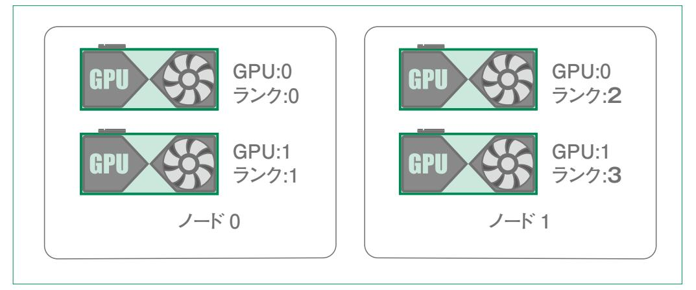

 図の例では全体で GPUが 4個あります。このような全体での GPUの数を World Sizeと呼びま す。

## 4.2.2 データ並列

学習の効率化といった場合、以下の 2通りが考えられます。

時間効率化: 短い時間で学習できる

空間効率化: (1GPUあたりの)メモリ使用量を抑えて学習できる

 データ並列(Data Parallel)は、これらのうち、時間効率化にあたります。そのため、1GPUあたりに 使用されるメモリ量は、並列化しない場合と同等程度になります。

 1 つの GPUに載るサイズのモデルを学習する場合は、どのように学習時間を短縮できるでしょう か。最も簡単な方法はバッチサイズを大きくすることです。これは、GPU上で並列に計算されるデータ 量が増え、モデルがより早く全てのデータを見終わるためです。例えば、データ数が 128でバッチサイ ズが 32だと、合計で 4周計算する必要がありますが、バッチサイズが 64であれば 2周ですみます。

 データ並列はこのアイデアを、複数GPUで行うことで計算を効率化します。複数の GPUでデータ を処理するため、モデルは図4.2.2のようにコピーされます。

#### 図4.2.2 データ並列の概念図


 ここで、新たにローカルバッチ、グローバルバッチという単語が現れました。これは、通常の学習にお けるバッチと同様に、データセットを適当なサイズに分割したものです。データ並列では、これをさらに 分割して各GPUに割り当てます。そのため、大元のバッチをグローバルバッチ、GPUごとに割り当てら れるバッチをローカルバッチとして区別します。

データ並列化をした際の処理の流れを図4.2.3に示します。

#### 図4.2.3 データ並列時の処理の流れ

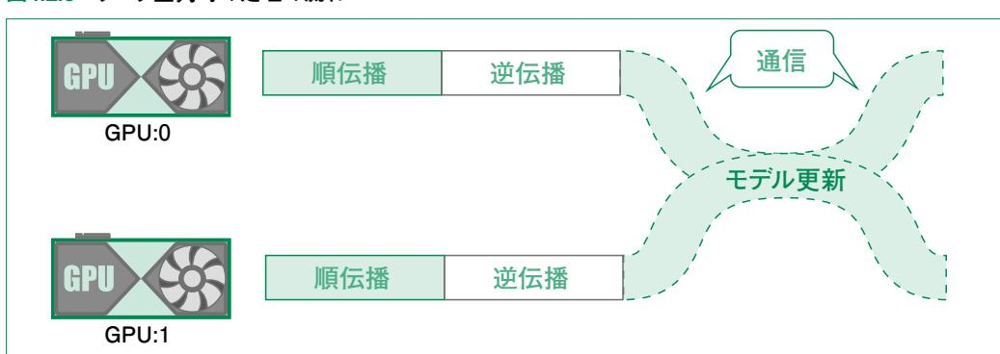

 データ並列時の学習では、順伝播と逆伝播(勾配の計算)はそれぞれの GPU内で行われます。一 方、モデルを更新する際は、各GPUで計算された勾配の平均値を用いて更新するため、GPU 間の 通信が必要になります。通信は 1つの GPUがホストとなって各GPUがホストとやりとりをする方法や、 それぞれの GPU同士でやりとりをする方法があります。また、更新自体も全ての GPUの計算が終了 するのを待つ同期型と、計算が終わり次第更新する非同期型がありますが、これらについての説明 は本書の範疇を越えるため省略します。

 計算リソースが無限にある場合、グローバルバッチをとにかく大きくして、全てのデータを 1周の計 算で使えばよいでしょうか。答えは NOです。これは、単一の GPUで学習する場合にもいえることで すが、バッチサイズを大きくしすぎると、むしろ収束が遅くなってしまうことが知られています。実際はこ のような問題が顕在化するほどの計算リソースを利用できることはほぼありませんので、このことにつ いては知識として知っておく程度でよいでしょう。

 第2章で作成した Transformerの学習をデータ並列を用いて並列化してみましょう。学習の本体 である train関数を示す前に、それを呼び出している main関数を確認します(コード4.2.1)。

#### コード4.2.1 データ並列を用いた学習コードの main関数

```
def main():
 n_gpu = 4
 batch_size = 64
 n_epochs = 10
 data_dir = Path("small_parallel_enja")
 train_dataset, dataset_info = load_dataset(data_dir)
 os.environ["MASTER_ADDR"] = "localhost"
 os.environ["MASTER_PORT"] = "12355"
 mp.spawn(
 train,
 args=(n_gpu, batch_size, n_epochs, train_dataset, dataset_info),
 nprocs=n_gpu,
 join=True,
```

 環境変数に設定している **MASTER\_ADDR**は、マルチノードで学習する際に必要になるものです。 マルチノード学習の場合は、マスタープロセスと呼ばれる実行の中心になるようなプロセスが動いてい るノードのアドレスを指定する必要があります。今回のコードは、複数GPUをシングルノードで使う例な ので localhostを指定しています。同様に **MASTER\_PORT**は、マスタープロセスが動いているノード で通信に利用できるポートを指定します。

**mp**は **import torch.multiprocessing as mp**のようにインポートしたモジュールで、並 列化のようなマルチプロセスの処理を扱います。**mp.spawn** 関数に各ランクで実行させたい関数 (**train**)と引数を渡すことで並列処理を実行します。

**train** 関数をコード4.2.2に示します。**mp.spawn**で並列実行される関数ですが、完全に独立に

動いているわけではなく、誤差逆伝播の際など適宜、他の GPUと連携しています。PyTorchではこ のような通信に関して開発者が管理しなくてもデータ並列のコードが書けるようになっています。

#### コード4.2.2 データ並列を用いた学習コード

```
def train(rank, n_gpu, batch_size, n_epochs, train_dataset, dataset_info):
 #1. GPU に関する設定
 init_process_group("nccl", rank=rank, world_size=n_gpu)
 torch.manual_seed(0)
 torch.cuda.set_device(rank)
 # create local model
 embedding_dim = 512
 n_blocks = 6
 n_heads = 8
 expansion_rate = 1
 # 最も長い文章の長さを取得
 model = Transformer(
 # Transformer の引数
 # ...
 ).to(rank)
 #2. ここで各 rank の GPU にモデルを配置
 model = DDP(model, device_ids=[rank])
 #3. rank ごとにデータを分割するためのサンプラーを作成
 sampler = DistributedSampler(
 train_dataset, num_replicas=n_gpu, rank=rank, shuffle=True
 )
 train_loader = DataLoader(
 train_dataset,
 batch_size=batch_size,
 sampler=sampler,
 collate_fn=dataset_info["collate_fn"],
 )
 PAD_ID = dataset_info["vocab_src"]["<pad>"]
 criterion = nn.CrossEntropyLoss(ignore_index=PAD_ID) # クロスエントロピー
 lr = 0.0001 # 学習率
 optimizer = torch.optim.AdamW(model.parameters(), lr=lr)
 scheduler = torch.optim.lr_scheduler.StepLR(optimizer, 10.0, gamma=0.95)
 pbar = tqdm(total=n_epochs, desc=f"rank{rank}", position=rank)
 for epoch in range(n_epochs):
 pbar.update(1)
 for i, (src_texts, tgt_texts) in enumerate(train_loader):
 # マスクや入出力の準備
 # ...
 #4. Tensor のデバイスを設定
 src_texts, tgt_input, tgt_output = (
```

```
 src_texts.to(rank),
 tgt_input.to(rank),
 tgt_output.to(rank),
 )
 src_padding_mask, tgt_mask = src_padding_mask.to(rank), tgt_mask.
to(rank)
 # モデル出力の計算
 # ...
 # 損失関数の計算と誤差逆伝播
 # ...
 scheduler.step()
 #5. モデルの保存
 if rank == 0:
 torch.save(model.state_dict(), "transformer.pth")
```

**#...**と記載している部分は、第2章の内容からほぼ変わっていないため省略しています。大きく 変わった部分の直前には #1から #5のように数字を割り振っています。

 まず #1では、**init\_process\_group**で「バックエンド」において、現在のプロセスが World Size中のどのランクにあたるかを指定しています。バックエンドというのは、GPU間の通信を実際に扱 うライブラリで、nccl、gloo、mpiの 3つが指定可能です。速度やサポートする機能の多さから、GPU で利用する際は ncclを指定する場合が多いです。**set\_device**では、**rank** 番目の GPUを利用 するように設定しています。

 #2は、モデルをデータ並列で学習するための設定です。#3は、データをローカルバッチに分解す るためのクラスを作成しています。学習ループ中の #4では、データを **rank**で指定されたデバイスに 載せています。単一の GPUの場合はここで **rank**ではなく**"cuda"**を指定していました。

 最後の #5は、モデルの保存です。データ並列では、各ランクのデバイスでモデルが共有されてい るため、ランクが 0の場合のみモデルを保存するように書きます。

## 4.2.3 テンソル並列

 テンソル並列と、後述するパイプライン並列はどちらもモデル並列と呼ばれる並列化の一種です。 データ並列ではデータを複数の GPUに分解して計算していたのに対し、モデル並列ではモデルを複 数の GPUに分解して計算します。そのため、モデルサイズを固定した状況では、並列数を増やすほ ど各GPUが持つパラメータの数が減り、メモリ使用量を抑えることができます。この技術によって 1つ の GPUには乗り切らない数十億、数百億パラメータを超える大規模言語モデルの学習が可能になり ます。

テンソル並列は図4.2.4に示すように、モデルを縦**1**に割くような並列化です。

図4.2.4 テンソル並列

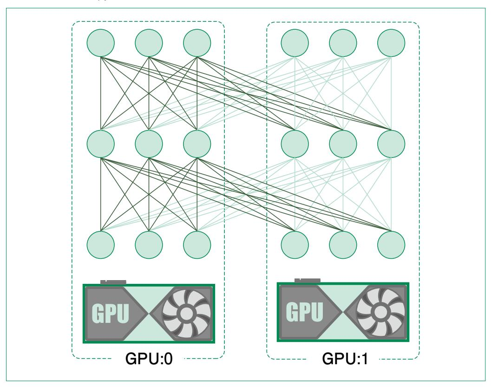

 実際は完全に分割できているわけではなく、図中における濃い線と薄い線の部分の計算を別々の GPUで行うようなイメージです。図からもわかるように、GPU0側の計算にもGPU1側のユニット(丸い 部分)からの入力が必要になります。そのため、図のようなテンソル並列では各レイヤーを計算するご とに出力を共有するための通信が発生します。

 この通信は、単一の GPUで計算しているときには必要のないものでした。このように、モデル並列 は、より大きなモデルを学習できるようになる反面、適切に設計しなければ時間効率は低くなってしまい ます。

1層目のテンソル並列を数式でも確認してみましょう。

 入力を *x* = (*x* <sup>1</sup> , *x* <sup>2</sup> , …, *x* <sup>6</sup> )として、次のレイヤーのユニット*i* につながる重みベクトルを *w <sup>i</sup>* と します。このとき、出力(*y* <sup>1</sup> , *y* <sup>2</sup> , … , *y* <sup>6</sup> )を得るための計算は、図4.4.5に示したように、*y* <sup>1</sup> , *y* <sup>2</sup> ,

**<sup>1</sup>** 縦か横かは図の書き方によりますが、本書の図に従って縦としています。

*y* <sup>3</sup> )の計算と(*y* <sup>4</sup> , *y* <sup>5</sup> , *y* <sup>6</sup> )の計算に分けることができます。

#### 図4.4.5 テンソル並列の数式

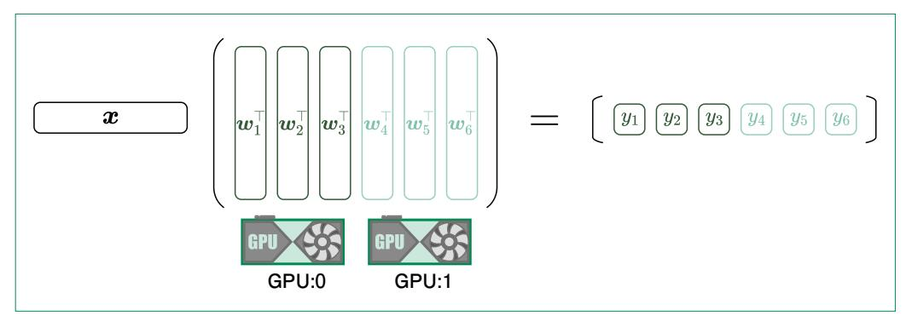

 図4.4.4に示した並列化では、2層目の計算時に 1層目の出力を全GPUで共有する必要がありまし た。これを改善するためには、図4.2.6のように分解することができます。

#### 図4.2.6 改善したテンソル並列

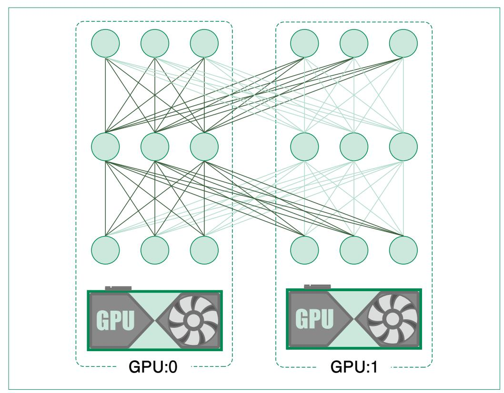

図の真ん中のユニットは入力側も出力側もそれぞれの濃い線または薄い線のみになっていることに注目してください。このように分解すれば、2層の MLP (多層パーセプトロン)では最終出力の計算以外で計算結果の共有が発生せず、効率的なテンソル並列が可能になります。

効率的なテンソル並列を数式で表すと図4.2.7のようになります。

#### 図4.2.7 効率的なテンソル並列の数式表現

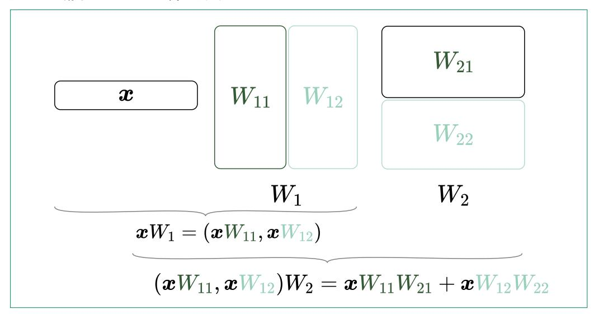

数式中で、 $W_1$  (1層目)と  $W_2$  (2層目)の分解方法が列方向と行方向といった形で変わっていることが見て取れます。このように、同じ線形レイヤーでもどの方向に分解するべきかが状況に応じて変わります。そのため、テンソル並列はモデルのアーキテクチャに応じて適切に設計する必要があり、データ並列と比べると難易度が高くなります。

次に、PyTorchを用いた実装を確認します。まず、デバイスメッシュと呼ばれる、GPU同士をどのように連携させるかの定義をします。これについては本書で深くは扱いません。ここではシングルノードの 4 GPUでの学習を行うため、コード4.2.3のように指定してください。

#### コード4.2.3 メッシュの定義とランクの取得

```
from torch.distributed.device_mesh import init_device_mesh tp_mesh = init_device_mesh("cuda", (4,)) rank = tp_mesh.get_rank() # コードが動いているプロセスの GPU ランクを取得
```

おおまかなコードの流れはデータ並列と同様ですが、大幅に異なるのがモデル作成後の、レイヤー ごとの並列化方法を定義する部分です。該当箇所をコード4.2.4に示します。

#### コード4.2.4 レイヤーの並列化方法の定義

```
 # レイヤーごとに並列化の方法を定義
 for module in [model.encoder, model.decoder]:
 # エンコーダ・デコーダのブロック
 for block in module.blocks:
 tp_plan_block = {
 "attention.linear_o": RowwiseParallel(),
 "feed_forward.0": ColwiseParallel(),
 "feed_forward.2": RowwiseParallel(),
 }
 parallelize_module(
 module=block,
 device_mesh=tp_mesh,
 parallelize_plan=tp_plan_block,
 )
 # マルチヘッドアテンションのヘッドごと
 for attention in block.attention.heads:
 tp_plan_attention = {
 "linear_q": ColwiseParallel(),
 "linear_k": ColwiseParallel(),
 "linear_v": ColwiseParallel(),
 }
 parallelize_module(
 module=attention,
 device_mesh=tp_mesh,
 parallelize_plan=tp_plan_attention,
 )
```

 すでに説明したように、テンソル並列には列方向と行方向の分解があります。PyTorchではこれ が、**torch.distributed.tensor.parallel** の **ColwiseParallel**と **RowwiseParallel**として用意されています。これらを用いて、レイヤーを分解する方法を辞書の 形で定め、同じモジュール内の **parallelize\_module**関数に **parallelize\_plan**として渡 します。これによって、プログラムがモデルをどのように分解すればよいか認識できます。

 他は概ねデータ並列と同様ですが、ここでは **mp.spawn**を利用しないため、main 関数はコード 4.2.5のようになります。

#### コード4.2.5 テンソル並列時の main関数

```
def main():
 device = "cuda"
 data_dir = Path("small_parallel_enja")
 train_dataset, dataset_info = load_dataset(data_dir)
 train(
```

```
 batch_size=64,
 n_epochs=10,
 train_dataset=train_dataset,
 dataset_info=dataset_info,
 device=device,
 )
 if rank == 0:
 print(torch.cuda.max_memory_allocated())
```

 最後の **torch.cuda.max\_memory\_allocated**は、そのプログラムが動いている間に利用 された GPUメモリの最大値を返す関数です。並列化しない場合や、並列数を変更した場合と比べて どのように変化するかを確認してみてください。

 テンソル並列のコードをシングルノードの 4 GPUで実行するには、次に示す torchrunコマンドを 利用します。

**torchrun --standalone --nproc\_per\_node=4 section02\_tensor\_parallel.py**

**--standalone**はシングルノードを用いることや特定のバックエンドを指定するコマンドで、**̶ nproc\_per\_node**はノードごとのプロセス数を指定します。ここでは 4 GPUなので 4と指定してい ます。

 実行してみると学習に非常に時間がかかったのではないでしょうか。今回は簡易的に作成した Transformerモデルのフィードフォワード層とマルチヘッドアテンションのみ並列化しています。実際 には **ColwiseParallel**や **RowwiseParallel**に加えて **SequenceParallel**を用いた レイヤー正規化や、**loss\_parallel**を用いた損失関数の並列化も行います。余力がある読者は、 これらを用いてより適切なテンソル並列の設計に挑戦してみてください。

## 4.2.4 パイプライン並列

 テンソル並列はモデルを縦に割く並列化であると説明しました。これに対してパイプライン並列は図 4.2.8に示すようにモデルを横に割くような並列化です。

図4.2.8 パイプライン並列

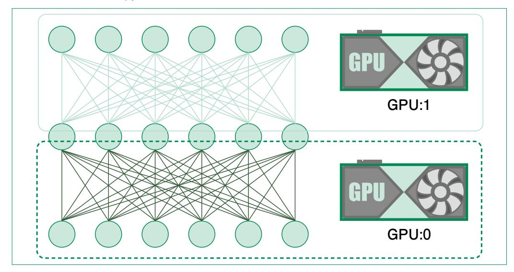

2GPUの場合、この並列化での計算の流れは次のようになります。

- 1. 最初のレイヤーを GPU0で計算
- 2. 計算結果を GPU1に転送
- 3. 2つ目のレイヤーを GPU1が計算
- 4. GPU1で誤差逆伝播
- 5. 誤差情報を GPU0に転送
- 6. GPU0で誤差逆伝播

 GPUが 4つある状況で、この計算の流れを示したのが図4.2.9です。Fや Bで表したのがそれぞ れのレイヤーにおける順伝播や逆伝播のバッチ計算です。

図4.2.9 パイプライン並列の処理の流れ

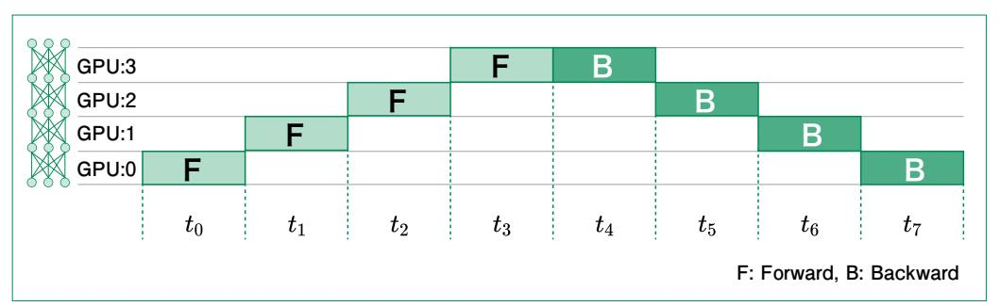

 このような計算は、図4.2.10に示すバケツリレーに例えることができます。バケツが処理中のデータ で、運ぶ人が GPUになります。

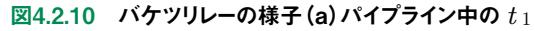

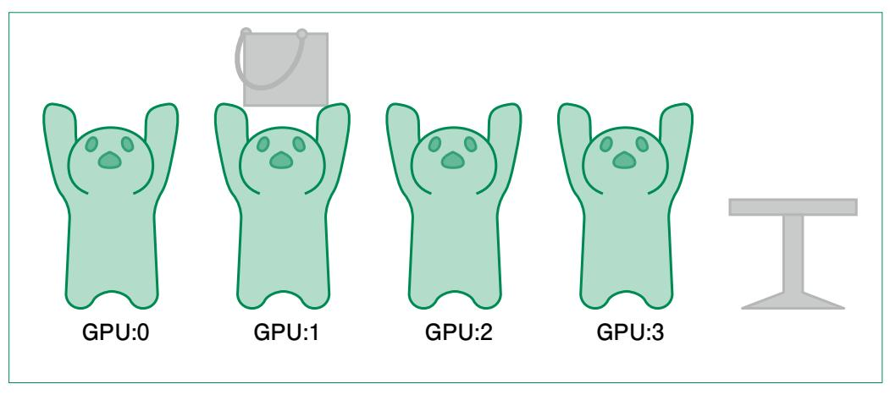

 図からもわかるように、GPU1がバケツを運んでいるとき、GPU0、GPU2、GPU3は何もしていません。 この状態では計算リソースが無駄になってしまうので、図4.2.11のようにバケツを小さくして、少しずつ 運ぶのはどうでしょうか。このように小さく分けたバケツのことを、マイクロバッチと呼びます。

図4.2.11 バケツリレーの様子(b)パイプライン中の *t* <sup>3</sup>

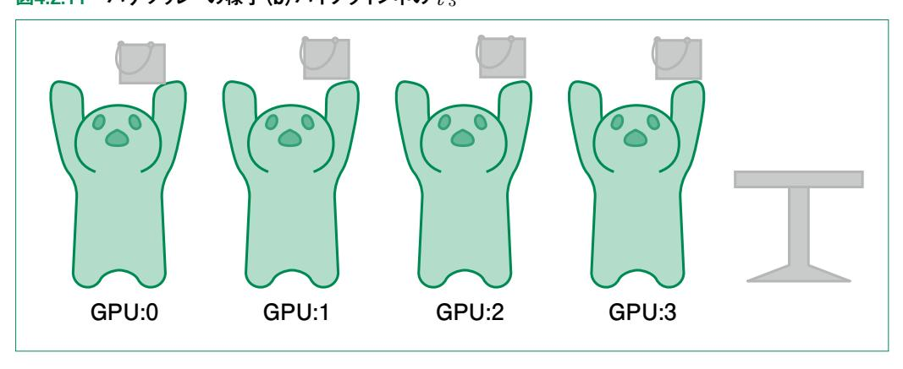

マイクロバッチを用いたパイプラインを図4.2.12に示します。


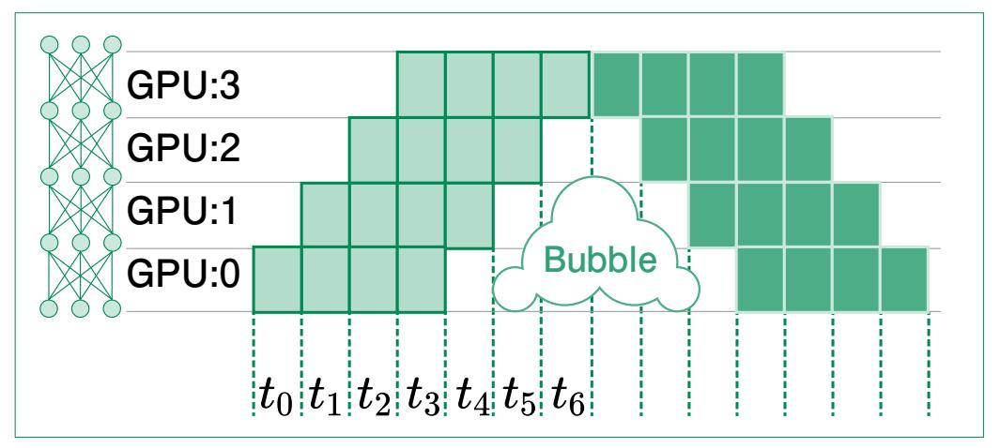

 図に示した通り、GPUが稼働していない時刻が減っており、計算効率が向上していることがわかり ます。しかし、図中の Bubbleと書かれている部分では 1個以上の GPUが休止状態になってしまい ます。このような休止状態が発生するのは、誤差逆伝播を行うために全ての順伝播が完了している 必要があるためです。これはバケツリレーの例に戻すと、図4.2.13に示すように、一旦全てのバケツを テーブルに置き終わらなければ、反対方向には渡せないことと対応しています。

図4.2.13 バケツリレーの様子(c)パイプライン中の *t* <sup>6</sup>

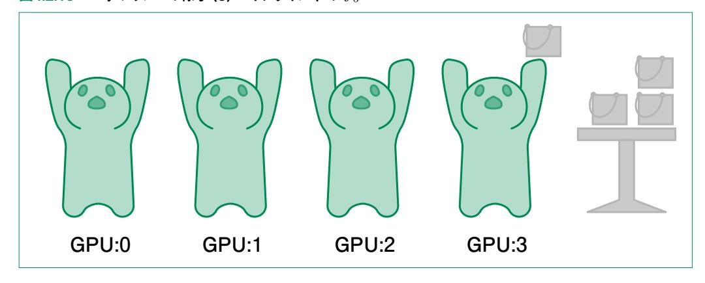

 Bubbleを小さくするには、マイクロバッチを小さくすればよいです。例えば 4並列であれば順伝播 中のバブルになる時刻は最後の 3ステップのみです(図中の *t* <sup>4</sup> ~ *t* <sup>6</sup> )。そのため、各ステップにかか る時間が小さいほどバブルも小さくなります。ただし、GPUは大量のデータを同時に処理する際に効 率が良いため、マイクロバッチが小さすぎて同時に処理するデータが少なくなると、全体としての処理 が遅くなってしまうことに注意してください。

### パイプライン並列の実装

 PyTorchを用いたパイプライン並列を行うためのライブラリとして、PyTorchグループが管理して いる PiPPyというものがあります。2024年に、このライブラリはアルファ版として PyTorch内の▲コー ド**torch.distributed.pipelining**に組み込まれています **<sup>2</sup>**。

## 4.2.5 3D並列化

 4.2.2項から 4.2.4項でデータ並列、テンソル並列、パイプライン並列という3通りの並列化手法を紹 介しました。3つのうち、テンソル並列とパイプライン並列は、モデルを縦横に分解するような並列化で した。これらに対して図4.2.14のように奥行き方向にモデルをコピーするデータ並列を加えたものを、ま とめて 3D並列化(3D Parallelism)と呼びます。大規模言語モデルの学習においては、3D並列化 は重要な技術の 1つであり、4.3節で解説する DeepSpeedなどのライブラリにも実装されています。

図4.2.14 3D並列化

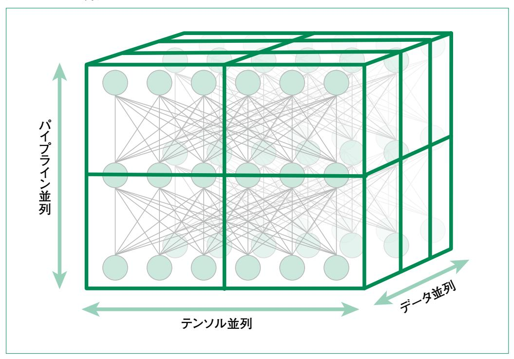

**2** 書籍執筆時点でもアルファ版であり仕様変更がありうることから、パイプライン並列の実装は記載していません。

## 4.2.6 ZeRO

 3D 並列化のうち、モデル並列に分類される 2つの方式は、1つの GPUに収まりきらないモデルを 学習できる反面、どの GPUにモデルのどの部分を割り当てるかという、モデルの分解方法を適切に 設計するのは難しいタスクになります。特に、テンソル並列とパイプライン並列を同時に用いる場合、適 切に設計するには並列処理に関する高度な知識を要求します。ZeROはこのような問題を回避し て、誰でも大規模モデルの学習を可能にする方法の 1つです。

 ZeROは Zero Redundancy Optimizerの略で、データ並列における際のメモリ利用を効率化 する手法です。先述の通り、モデル並列は実装が困難なのに対し、ZeROはどのようなモデルに対し てもシステマチックに適用できるという利点があります。

 ZeROはいくつかの観点で最適化を行います。図4.2.15はそれらのうち、モデルパラメータに関す る最適化の例を表しています。この例では、濃い部分のパラメータをその GPUで持っており、薄い部 分はその GPUには置かないようにしています。ZeROでは図に示したように、パラメータを各GPUで 重複なく保持しておき、計算に必要になったら、そのパラメータを持つ GPUと通信し、受け取ったパラ メータを用いて計算したのち削除します。これによって、各GPUが実際にメモリ上に持つパラメータ数 が小さくなり、巨大なモデルの学習が可能になります。

図4.2.15 ZeROにおけるモデルパラメータのイメージ

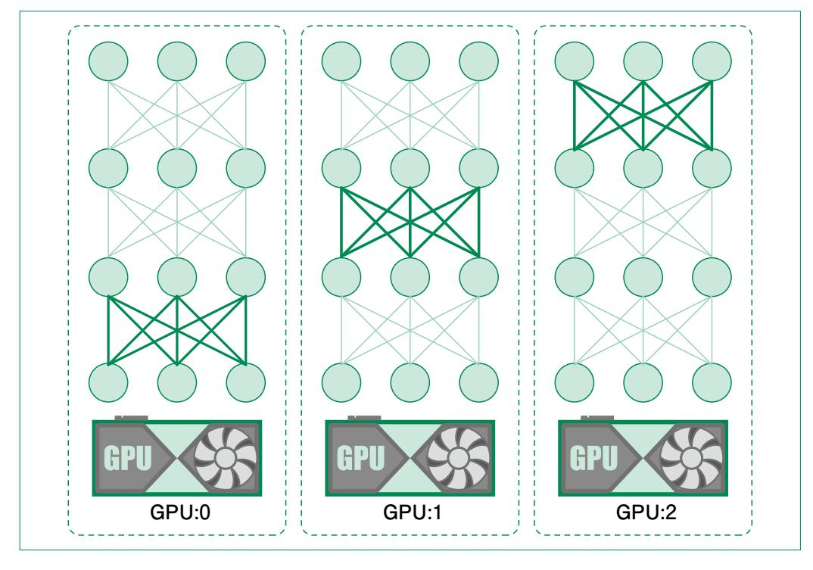

 このように、レイヤーごとにパラメータの授受を行うことから、パイプライン並列と混同している読者も いるかもしれません。パイプライン並列との大きな違いは、1つのデータに関する中間出力を GPU間で 通信するのではなく、GPUごとに別々の計算を行っており、モデルパラメータの方を通信している点で す。別々のデータに関する計算なので、GPU 間に前後関係も発生せず、パイプライン並列のようなバ ブルも発生しません。

 ここまでは、モデルパラメータに関する最適化のイメージを説明しました。大規模言語モデルにおい て、メモリを利用する主要素は 3つあります。

- 1. モデルパラメータ
- 2. 学習時の勾配情報
- 3. オプティマイザの状態

 オプティマイザの状態というのは、Adamのような最適化手法においてモデルパラメータをアップ デートするために保持しなければならない情報のことです。比較的シンプルなモーメンタム**3**でも、勾 配情報と同程度の容量が追加で必要になります。Adamのように複雑なものになると、さらに数倍の 容量が必要です。さらに 1.、2.の容量も加わるため、全体ではモデルパラメータの 10倍以上の容量 が必要になります。ZeROの論文中では、1.5Bパラメータの GPT-2を Adamで学習するには、パラ メータ数の 16倍である 24GBのメモリが必要であると計算されています。

 以上のような観点から、すでに説明したモデルパラメータに関する効率化だけでは不十分であるこ とがわかります。ZeROでは、上述の 3つの要素で効率化しており、次のような 3つの最適化ステージ を用意しています。

・Stage1: オプティマイザ状態のみ最適化

・Stage2: さらに勾配情報も最適化

・Stage3: さらにモデルパラメータも最適化

 このように段階的に最適化を行うのは、ステージが上がるごとにメモリが削減される一方、GPU 間 の通信オーバーヘッドが増えてしまうというトレードオフ関係にあるためです。そのため、実際に用いる 際には、利用可能な計算リソースやモデルサイズを加味してどのステージを使うべきかを検討します。

ZeROは次節(4.3節)で DeepSpeedを使って実装します。

**<sup>3</sup>** パラメータの勾配降下方向を累積しておき、新しい勾配だけでなく累積した方向も加味してパラメータをアップデート する手法。損失関数のランドスケープ上でパラメータが慣性をつけたような動きをする。