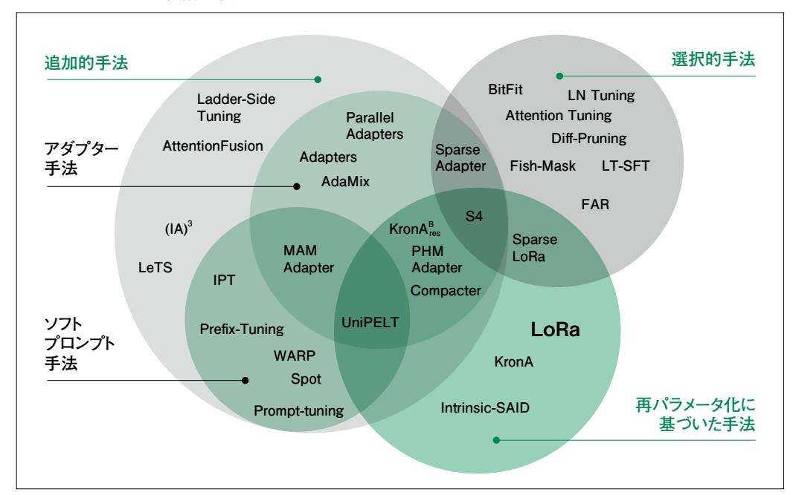
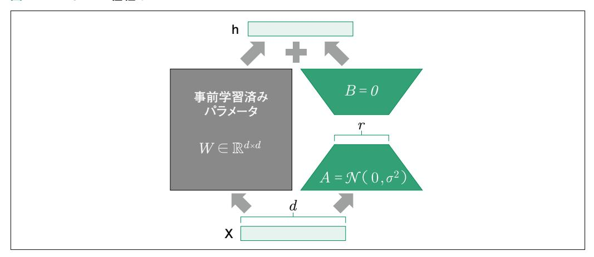

# 4.4 学習の効率化(LoRA)

 4.3節では LLMの全パラメータを更新するような事前学習について学びました。このような学習は モデルの規模が大きくなるにつれて、ローカル環境やクラウド上の低コストなインスタンスでは計算リ ソースが足りない場合が多くなります。大企業や研究機関が大規模な事前学習をする場合や、5章 で学ぶアラインメントを行ったモデルに対してファインチューニングを加えたい場合でも、全パラメータ を調整するのは難しいです。本節ではこのような場合に対処するパラメータ効率の良いファイン チューニング(PEFT:Parameter Effective Fine-Tuning)について解説します。

# 4.4.1 LLMの計算リソース

 LLMの利点として、Zero-shot 学習や Few-shot 学習でさまざまなタスクに対応できることが挙げ られます。これは、事前学習によって獲得された広範な言語理解能力や、5章で学ぶアラインメントに よって獲得された指示追従能力を利用することで、新しいタスクに迅速に適応できるからです。一方 で、特定のドメインに特化させるなど、LLMの能力を大幅にアップデートする目的で、モデルのパラメー タを更新したい場合もあります。

 近年の LLMのような大きなモデルの場合、パラメータ数が膨大なので、わずかなデータ数を学習 する場合でも大きな計算リソースが必要となります。そのため、限られた計算リソースで学習する方法 が必要になります。具体的には、PEFT(Parameter-Efficient Fine-Tuning)と呼ばれる、学習す るパラメータ数を少なくするような手法が取られます。以降で説明する LoRAは、その類の手法の中 でも近年で特に人気です。

 本節では、4.4.2項で効率的な学習方法全般について概説し、4.4.3項で LoRAについて解説しま す。その後、4.4.4項では LoRAのイメージをつかむためにイチから実装します。難解そうな学習方法 が、いかにシンプルに実装されているかが体験できます。4.4.5項では、実際のプロジェクトで活用でき る HuggingFace PEFTライブラリを用いた実践的な LoRA 学習方法を解説し、4.4.6項では青空 文庫コーパスを用いた実際の学習結果を示します。

# 4.4.2 効率的な学習方法

ファインチューニングには、モデルのすべてのレイヤーを調整する方法と、モデルパラメータの一部のみを効率的に調整する PEFT という手法があります。 PEFT は一般的に低コストでファインチューニングができるため、多様な手法が提案されています。

PEFTには大きく三つの分類があります [1]。「追加的手法(Additive methods)」「再パラメータ 化に基づいた手法(Reparametrization-based methods)」「選択的手法(Selective methods)」です(図4.4.1)。

#### 図4.4.1 PEFTの3種類の手法



「Scaling Down to Scale Up: A Guide to Parameter-Efficient Fine-Tuning」[1]から引用して和訳。

追加的手法は、既存のモデルに新たにパラメータやレイヤーを追加し、その追加部分のみを学習します。これにはさらに、モデルの重みを固定したままで入力の埋め込みに学習可能なパラメータを追加する「ソフトプロンプト手法(Soft Prompts methods)」と、モデルに新たな学習可能なレイヤーを追加する「アダプタ手法(Adapters methods)」の2種類があります。

ソフトプロンプト手法は、入力トークンの埋め込みに学習可能なテンソルを連結し、誤差逆伝搬法で 最適化することでタスクの性能を上げる手法です。つまり、入力テキストにテンソルを加えて学習可能 にします。アダプタ手法は、Transformerのサブレイヤー後に小さな全結合ネットワークを導入しま す。分かりやすく言うと、モデルに層を追加して学習します。

 次に、再パラメータ化に基づいた手法は低ランク(後述)表現を活用し、学習するパラメータ数を最 小限に抑えるのが特徴です。その中でも特に人気な手法なのが LoRAと呼ばれる手法です [2]。 LoRAは Low-Rank Adaptation の略で、学習すべきパラメータを削減( Low-Rank )し適用 (Adaptation)する学習方法を指します。LoRAの詳細は、この後の 4.4.3項で詳しく解説します。

 最後の選択的手法は選択的に学習を行う手法で、例えばモデルのバイアスのみをチューニングす るなどがあります。

# 4.4.3 LoRAの理解

### LoRAとは何か

 LoRA(Low-Rank Adaptation)は、前述のように、事前学習済みの LLMに対して、軽量なファ インチューニングを行うための手法である PEFTの一種です。LoRAは、図4.4.2にあるように、事前 学習済みモデルのパラメータ*W* を直接更新するのではなく、低ランクのアダプタ*A,B* を追加するこ とで、タスク固有の適応を行います。

#### 図4.4.2 LoRAの仕組み



「LoRA: Low-Rank Adaptation of Large Language Models」[2]から引用して和訳。

具体的には、事前学習済みモデルの各層に、次のようなアダプタを追加します。

$$W_a = W_0 + \Delta W$$
  $\Delta W = BA$ 

ここで、 $W_0$  は事前学習済みモデルの重み行列、 $\Delta$  W はアダプタ、 $B \in \mathbb{R}^{d \times r}$ と $A \in \mathbb{R}^{r \times d}$  は それぞれランクが r の行列です(ランクの解説など数学的な説明に興味がある方はコラム「なぜ小さな行列の積で十分なのか」参照)。d は元のモデルの入力次元数、r はハイパーパラメータで、通常は d よりもはるかに小さな値に設定されます。

ファインチューニングの際には、事前学習済みモデルのパラメータ $W_0$ は固定し、アダプタのパラメータBとAのみを更新します。これにより、事前学習済みモデルの知識を保持しつつ、タスク固有の適応を効率的に行えます。

# Column

# なぜ小さな行列の積で十分なのか

LoRA の核心は  $\lceil d \times d \rangle$  の大きな更新行列  $\Delta W$  を、 $d \times r$  の行列  $B \ge r \times d \rangle$  の行列 A の積で表現する |という点です。なぜこれで十分なのでしょうか?

#### 行列のランクと情報量

行列の**ランク (階数)**とは、その行列が持つ「独立した情報の次元数」です。例えば、以下の 3×3行列を考えます。

$$\left(\begin{array}{ccc}
1 & 2 & 3 \\
2 & 4 & 6 \\
3 & 6 & 9
\end{array}\right)$$

この行列は3行ありますが、2行目は1行目の2倍、3行目は1行目の3倍です。1行目の情報だけで全体を復元できるため、この行列のランクは1です。9個の数値があっても、実質的な情報量は1行分しかありません。

#### LoRA における低ランク制約

 $d\times r$  の行列 B と  $r\times d$  の行列 A の積 B A は、 $d\times d$  の行列になりますが、そのランクは r 以下に制限されます。つまり、B A は「r 次元分の情報しか持たない  $d\times d$  行列」です。

LoRAの仮説は、「事前学習済みモデルのファインチューニングに必要な変更は、フルランク (d次元)の自由度を必要とせず、低ランク (r次元)で十分である」というものです。事前学習で獲得した能力を大きく変える必要はなく、特定タスクへの適応は少ない次元で表現できる、という考え方です。

#### パラメータ削減の効果

*d* =768、*r* = 8 の場合、次のようにパラメータが削減されます。

- ・通常の更新:768 × 768 = 589,824パラメータ
- ・LoRA:768 × 8 + 8 × 768 = 12,288パラメータ(約98%削減)

*r* を大きくすると表現力は上がりますが、パラメータ数も増えます。実用上は *r* = 4〜 *r* =16 程度がよく使われます。

 なお、ランクについては、まえがきの「数学に関する補足」でも説明しているので併せて読 んでみてください。

# LoRAの特徴と利点

LoRAには以下のような特徴と利点があります。

- ・軽量なファインチューニング:LoRAでは、事前学習済みモデルのパラメータを直接更新す るのではなく、低ランク行列に分解したアダプタのみを更新するため、ファインチューニン グに必要なパラメータ数が大幅に削減されます。これにより、メモリ使用量や計算コストを 抑えつつ、効率的にタスク固有の適応ができます。
- ・事前学習済みモデルの知識の保持:LoRAでは、事前学習済みモデルのパラメータを固定 するため、事前学習で得られた汎用的な知識を保持したまま、タスク固有の適応ができま す。これにより、少量のデータでも効果的にファインチューニングができます。
- ・タスク間の干渉の軽減:LoRAでは、各タスクにそれぞれ独立したアダプタを追加するた め、異なるタスク間での干渉を軽減できます。これにより、マルチタスク学習や継続学習に おける負の転移の問題を緩和できます。
- ・柔軟性と拡張性:LoRAは、様々なアーキテクチャの事前学習済みモデルに適用でき、ま た、アダプタのランクを調整することで、タスクの複雑さに応じて適応の度合いを制御でき ます。これにより、幅広いタスクや要件に対して柔軟に対応できます。LoRAによる重み更 新Δ*W* = *BA* の大きさを調整する係数としてスケーリングファクターが用いられます。

 以上のように、LoRAは、大規模な事前学習済みモデルを効率的かつ効果的にタスク固有の要件 に適応させるための強力な手法であり、自然言語処理やコンピュータビジョンなど、様々な分野で活用 されています。

# 4.4.4 LoRA の理解

#### LoRAの実装

4.4.3項の内容を実装に落とし込むと以下のようになります。

#### コード4.4.1 LoRA の実装

```
class LoRA(nn.Module):
    def __init__(self, original_weight, rank, alpha):
        super(LoRA, self).__init__()
        self.alpha = alpha
        self.rank = rank
        self.original_weight = original_weight
        self.A = nn.Parameter(torch.randn(original_weight.size(0), rank))
        self.B = nn.Parameter(torch.randn(rank, original_weight.size(1)))

def forward(self):
    # ΔWの部分
    low_rank_modification = self.A @ self.B

# alphaを使って補正の影響をスケーリング
    modified_weight = self.original_weight + self.alpha * low_rank_varank_varank_varank_varank_varank_varank_varank_varank_varank_varank_varank_varank_varank_varank_varank_varank_varank_varank_varank_varank_varank_varank_varank_varank_varank_varank_varank_varank_varank_varank_varank_varank_varank_varank_varank_varank_varank_varank_varank_varank_varank_varank_varank_varank_varank_varank_varank_varank_varank_varank_varank_varank_varank_varank_varank_varank_varank_varank_varank_varank_varank_varank_varank_varank_varank_varank_varank_varank_varank_varank_varank_varank_varank_varank_varank_varank_varank_varank_varank_varank_varank_varank_varank_varank_varank_varank_varank_varank_varank_varank_varank_varank_varank_varank_varank_varank_varank_varank_varank_varank_varank_varank_varank_varank_varank_varank_varank_varank_varank_varank_varank_varank_varank_varank_varank_varank_varank_varank_varank_varank_varank_varank_varank_varank_varank_varank_varank_varank_varank_varank_varank_varank_varank_varank_varank_varank_varank_varank_varank_varank_varank_varank_varank_varank_varank_varank_varank_varank_varank_varank_varank_varank_varank_varank_varank_varank_varank_varank_varank_varank_varank_varank_varank_varank_varank_varank_varank_varank_varank_varank_varank_varank_varank_varank_varank_varank_varank_varank_varank_varank_varank_varank_varank_varank_varank_varank_varank_varank_varank_varank_varank_varank_varank_varank_varank_varank_varank_varank_varank_varank_varank_varank_varank_varank_varank_varank_varank_varank_varank_varank_varank_varank_varank_varank_varank_varank_var
```

実装はかなりシンプルですが、数学的なコーディングに慣れていない方向けに解説します。プログラムの 12行目の self.A @ self.B は、self.A と self.B という 2 つの行列の積を計算しており、数式の BA の部分です。

#### LoRA のハイパーパラメータ

プログラム中に登場する、rankや alpha はハイパーパラメータですが改めて機能について説明します。

#### rank (LoRAの内部次元数)

- ·低ランク行列A. Bの内部次元数を決定します。
- ・rankが大きいほど、LoRAの表現力が高くなります。 つまり、元の重み行列Wの変化をより細かく近似できます。
- ・一方で、rankが大きすぎると過学習のリスクがあり、また計算コストも高くなります。
- ・rankは通常、元の重み行列Wの次元数よりもはるかに小さい値に設定します(例:512次元の埋め込み層に対して rank=8など)。

・rankを増やすことで精度が向上する場合もありますが、その効果は次第に頭打ちになる 傾向があります。

#### alpha(scaling factor)

- ・LoRAによる重み更新ΔW = BAの大きさを調整する係数です。
- ・alphaが大きいほど、LoRAによる重み更新の影響が大きくなります。つまり、事前学習済 みの重みからの変化量が大きくなります。
- ・alphaが小さすぎると、LoRA の効果が限定的になります。逆に大きすぎると、事前学習 済みの知識を破壊してしまうリスクがあります。
- ・一般的には alpha = rank、または alpha = 2 × rankに設定されます(例: rank=8 なら alpha=16)。タスクやモデルに応じて調整することで精度が向上する場合がありま す。
- ・rankと alphaの最適値の組み合わせは、タスクやモデルによって異なります。

#### LoRAの GPTモデルへの適用

 GPTモデルのような Transformerベースのモデルにおいて LoRAを適用する場合、特定の層、 特に自己アテンション層が考えられます。論文[2]では、クエリ、キー、バリュー、出力射影(W\_q, W\_k, W\_v, W\_o)のすべてに LoRAを適用した場合に最も高い精度が得られたと報告されています。

#### コード4.4.2 LoRAの実装

```
class LoRALayer(nn.Module):
 def __init__(self, in_dim, out_dim, rank, alpha):
 super().__init__()
 self.A = nn.Parameter(torch.randn(in_dim, rank))
 self.B = nn.Parameter(torch.zeros(rank, out_dim))
 self.alpha = alpha
 def forward(self, x):
 return self.alpha * (x @ self.A @ self.B)
class LinearWithLoRA(nn.Module):
 def __init__(self, linear, rank, alpha):
 super().__init__()
 self.linear = linear
 self.lora = LoRALayer(linear.in_features, linear.out_features, rank,
alpha)
 def forward(self, x):
 return self.linear(x) + self.lora(x)
```

```
class SelfAttentionWithLoRA(nn.Module):
    def init (self, embed dim, num heads, lora rank, lora alpha):
         super(). init ()
         self.num heads = num heads
         self.head dim = embed dim // num heads
         self.W_q = LinearWithLoRA(nn.Linear(embed_dim, embed_dim), lora_rank, 

lora_alpha)
         self.W k = LinearWithLoRA(nn.Linear(embed dim, embed dim), lora rank.

▼
lora alpha)
         self.W v = LinearWithLoRA(nn.Linear(embed dim, embed dim), lora rank.→
lora alpha)
         self.W o = LinearWithLoRA(nn.Linear(embed dim. embed dim), lora rank.

▼
lora_alpha)
    def forward(self. x):
         batch size, seg len, embed dim = x.size()
         q = self.W q(x).view(batch size, seq len, self.num heads, self.head \overline{z}
dim).transpose(1, 2)
         k = self.W_k(x).view(batch_size, seq_len, self.num_heads, self.head_

▼
dim).transpose(1, 2)
         v = self.W_v(x).view(batch_size, seq_len, self.num_heads, self.head_

dim).transpose(1, 2)
         attn weights = torch.matmul(q, k.transpose(-2, -1)) / math.sqrt(self.

head dim)
         attn_weights = F.softmax(attn_weights, dim=-1)
         attn_output = torch.matmul(attn_weights, v).transpose(1, 2).contiguous().

view(batch_size, seq_len, embed_dim)
         attn_output = self.W_o(attn_output)
         return attn output
```

この実装では、LoRALayerとLinearWithLoRA、SelfAttentionWithLoRAのクラス定義を実装しています。

LoRALayerでは、LoRAの先述の実装例にもあったように、基本的なレイヤーの定義をしています。具体的には、初期化関数において低ランク行列A, Bの生成およびスケーリングファクターである alphaを定義していて、forwardメソッドにて、ΔWの計算を実装しています。

LinearWithLoRAは、標準の線形レイヤーにLoRAを組み合わせたものです。既存の線形レイヤーの出力に対してLoRAによる補正を加えるアルゴリズムが実装されています。

SelfAttentionWithLoRAでは、LoRAを使用した自己アテンション機構を実装しています。初期 化メソッドでは、原論文[2]において最も表現能力が高くなった条件と同じように、W\_q, W\_k, W\_v,

W\_oに対して低ランク行列を定義しています。forwardメソッドにおいては、自己アテンション機構の アルゴリズムである、クエリ、キー、バリューやアテンション重み、アテンション出力の計算が実装されて います。

 コード4.4.3では、先ほど定義した LinearWithLoRAと SelfAttentionWithLoRAを用いた GPT2モデルに LoRAを適用する関数が実装されています。

#### コード4.4.3 GPT2モデルへの LoRAの適用

```
# from transformers import models
def apply_lora_to_gpt2(model, rank, alpha):
 for name, module in model.named_modules():
 if isinstance(module, nn.Linear):
 lora_layer = LinearWithLoRA(module, rank, alpha)
 parent_name = '.'.join(name.split('.')[:-1])
 child_name = name.split('.')[-1] 
 parent = model.get_submodule(parent_name) 
 setattr(parent, child_name, lora_layer)
 if isinstance(module, models.gpt2.modeling_gpt2.GPT2Attention):
 embed_dim = module.embed_dim
 num_heads = module.num_heads
 parent_name = '.'.join(name.split('.')[:-1])
 child_name = name.split('.')[-1]
 parent = model.get_submodule(parent_name)
 setattr(parent, child_name, SelfAttentionWithLoRA(embed_dim, num_
heads, rank, alpha))
 print(embed_dim, num_heads, parent_name, child_name)
```

 手順としては、モデルのモジュール名一覧から、線形層のインスタンスに該当する部分に対して、先 ほど定義した LinearWithLoRAクラスに置き換えるようにして適用します。GPT2の自己アテンショ ン機構モジュールである GPT2Attentionを SelfAttentionWithLoRAクラスに置き換える際も同 様に行います。

 コード4.4.4では実際に GPT2の学習可能パラメータ数が LoRAの適用前後でどの程度減少し たのかを確かめています。

 一番下の出力を見ると元の GPT2の学習可能パラメータ数は 124,439,808個(約1.2億個)だった のが、LoRAの適用後には 29,346,440個(約3000万)へと約23.58%に減少していることがわかりま す。

#### コード4.4.4 学習可能パラメータ数の減少を確認

```
# from transformers import GPT2LMHeadModel
# モデルの学習可能パラメータ数を数える関数
def count trainable parameters(model):
   return sum(p.numel() for p in model.parameters() if p.requires grad)
original model = GPT2LMHeadModel.from pretrained('qpt2')
original_params = count_trainable_parameters(original_model)
# GPT2モデルのパラメータを固定
for param in original model.parameters():
   param.requires grad = False
# LoRA を適用した GPT-2モデルを作成
lora rank = 8
lora_alpha = 16
lora_model = apply_lora_to_gpt2(original_model, lora_rank, lora_alpha)
# LoRAの学習可能パラメータ数を計算
lora params = count trainable parameters(lora model)
# 結果を表示
print(f"オリジナルGPT-2の学習可能パラメータ数: {original params}")
print(f"LoRA適用後の GPT-2の学習可能パラメータ数: {lora_params}")
print(f"削減したパラメータ数: {original_params - lora_params}")
print(f"パラメータ減少率: {(lora_params / original_params) * 100:.2f}%")
```

#### 出力

```
# オリジナルGPT-2の学習可能パラメータ数: 124439808
# LoRA適用後の GPT-2の学習可能パラメータ数: 29346440
# 削減したパラメータ数: 95093368
# パラメータ減少率: 23.58%
```

# 4.4.5 HuggingFace PEFTを用いた LoRA学習

4.4.4項では LoRA の仕組みを理解するためにスクラッチで実装しました。実際のプロジェクトで LoRA を活用する場合は、HuggingFace が提供する PEFT ライブラリ (https://huggingface.co/docs/peft)を使用することで、より簡潔かつ安定した実装が可能です。本節では、PEFTライブラリを用いて GPT-2モデルに LoRAを適用し、ファインチューニングを行う方法を解説します。

#### PEFTライブラリのインストール

PEFTライブラリは pipでインストールできます。

```
pip install peft
```

# LoRA設定の定義

PEFTライブラリでは、**LoraConfig**クラスを使用して LoRAのハイパーパラメータを設定します。

#### コード4.4.5 LoraConfigクラス

```
from peft import LoraConfig, TaskType
lora_config = LoraConfig(
 task_type=TaskType.CAUSAL_LM, # タスクの種類(因果言語モデル)
 r=8, # LoRAのランク(低ランク行列の次元数)
 lora_alpha=32, # スケーリングファクター
 lora_dropout=0.1, # ドロップアウト率
 target_modules=["c_attn", "c_proj"], # LoRAを適用する層
```

主要なパラメータは次の通りです。

#### 表4.4.1 主なパラメータ

| パラメータ          | 説明                                  |  |
|----------------|-------------------------------------|--|
| task_type      | タスクの種類。言語モデルの場合は TaskType.CAUSAL_Lm |  |
| r              | 低ランク行列の次元数。4.4.3項で説明した rank に相当     |  |
| lora_alpha     | LoRAの出力をスケーリングする係数                  |  |
| lora_dropout   | LoRA層に適用するドロップアウト率                  |  |
| target_modules | LoRAを適用する層の名前リスト                    |  |

**target\_modules**には、モデル内の線形層の名前を指定します。GPT-2の場合、**c\_attn**(ク エリ/キー/バリューの射影)と **c\_proj**(出力射影)が アテンション層の主要な線形層です。

#### モデルへの LoRA適用

**get\_peft\_model**関数を使用して、既存のモデルに LoRAを適用します。

#### コード4.4.6 get\_peft\_model関数

```
from transformers import AutoModelForCausalLM, AutoTokenizer from peft import get_peft_model

# ベースモデルの読み込み
model_name = "rinna/japanese-gpt2-medium"
model = AutoModelForCausalLM.from_pretrained(model_name)
tokenizer = AutoTokenizer.from_pretrained(model_name)

# LoRAの適用
model = get_peft_model(model, lora_config)

# 学習可能パラメータ数の確認
model.print_trainable_parameters()
```

出力例は次の通りです。

```
trainable params: 1,179,648 || all params: 337,668,096 || trainable%: 0.35%
```

ベースモデルの約3.4億パラメータのうち、LoRAによって追加された約118万パラメータ(0.35%) のみが学習対象となります。4.4.4項のスクラッチ実装と比較して、PEFTライブラリではより少ないパラ メータ数で効率的な学習が可能です。

#### Trainerを用いた学習

HuggingFaceのTrainerクラスと組み合わせることで、通常のファインチューニングと同様の手順で学習できます。

#### コード4.4.7 Trainer を使った学習

```
# データコレーターの設定
data_collator = DataCollatorForLanguageModeling(
    tokenizer=tokenizer,
    mlm=False, # Causal LMなのでMLMは無効
)

# 学習設定
training_args = TrainingArguments(
    output_dir="./models/gpt2-lora",
    num_train_epochs=3,
    per_device_train_batch_size=4,
    gradient_accumulation_steps=4,
```

```
 learning_rate=1e-4,
 logging_steps=100,
 save_strategy="epoch",
 fp16=True,
)
# Trainerの初期化と学習実行
trainer = Trainer(
 model=model,
 args=training_args,
 train_dataset=train_dataset,
 data_collator=data_collator,
)
trainer.train()
```

 LoRAの学習では、通常のファインチューニングよりも高い学習率(例: 1e-4〜3e-4)を使用すること が推奨されます。これは、学習対象のパラメータ数が少ないため、より大きな更新幅でも安定して学習 できるためです。

#### LoRAアダプタの保存と読み込み

学習済みの LoRAアダプタは、ベースモデルとは別に保存・読み込みが可能です。

#### コード4.4.8 LoRAアダプタの保存と読み込み

```
# アダプタの保存
model.save_pretrained("./models/gpt2-lora-adapter")
# アダプタの読み込み
from peft import PeftModel
base_model = AutoModelForCausalLM.from_pretrained("rinna/japanese-gpt2-medium")
model = PeftModel.from_pretrained(base_model, "./models/gpt2-lora-adapter")
```

 保存されるファイルは **adapter\_model.safetensors**(約5MB)と**adapter\_config. json**のみであり、ベースモデル全体(約1.3GB)を保存する必要がありません。これにより、複数のタ スク用アダプタを効率的に管理できます。

#### アダプタのマージ

 推論時のオーバーヘッドを削減したい場合、LoRAアダプタをベースモデルにマージして単一のモ デルにできます。

#### コード4.4.9 アダプタのマージ

#### # アダプタをベースモデルにマージ

merged\_model = model.merge\_and\_unload()

#### # マージ後のモデルを保存

merged\_model.save\_pretrained("./models/gpt2-lora-merged")

マージ後のモデルは通常の Transformers モデルとして扱えるため、LoRA を意識せずに推論を 実行できます。ただし、マージ後はアダプタの切り替えができなくなる点に注意が必要です。

#### スクラッチ実装との比較

4.4.4項のスクラッチ実装とPEFTライブラリの違いを以下にまとめます。

#### 表4.4.2 スクラッチ実装と PEFTライブラリの主な違い

| 項目          | スクラッチ実装          | PEFTライブラリ              |
|-------------|------------------|------------------------|
| 実装の複雑さ      | 高い(各層への適用を自分で実装) | 低い(設定を渡すだけ)            |
| 適用対象の柔軟性    | 高い(任意の層に適用可能)    | 中程度(target_modulesで指定) |
| 保存・読み込み     | 自前で実装が必要         | 組み込みサポート               |
| Trainerとの統合 | 追加実装が必要          | シームレスに動作               |
| デバッグの容易さ    | 高い(コードが手元にある)    | 低い(内部実装の理解が必要)         |

学習の目的で LoRA の仕組みを理解するにはスクラッチ実装が有効ですが、実際のプロジェクトでは PEFTライブラリの使用を推奨します。

# 4.4.6 学習結果と考察

本項では、4.4.5項で説明した PEFT ライブラリを用いて、青空文庫コーパスで rinna/japanesegpt2-mediumを LoRAファインチューニングした実際の結果を示します。

#### 学習設定

#### 表4.4.3 学習設定

| 項目            | 値                                  |
|---------------|------------------------------------|
| ベースモデル        | rinna/japanese-gpt2-medium         |
| データセット        | 青空文庫(約11万サンプル)                     |
| GPU           | NVIDIA RTX 6000 Ada Generation × 1 |
| エポック数         | 3                                  |
| バッチサイズ        | 4(勾配累積4ステップ)                       |
| 学習率           | 1e-4                               |
| LoRA rank (r) | 8                                  |
| LoRA alpha    | 32                                 |
| LoRA dropout  | 0.1                                |
| 対象モジュール       | c_attn, c_proj                     |

# 学習結果

LoRAによる学習は約5時間で完了しました(3エポック、約2550ステップ)。

#### 表4.4.4 学習結果

| 項目         | 値                |
|------------|------------------|
| 学習時間       | 約5時間(シングルGPU)    |
| 学習可能パラメータ数 | 約118万(全体の 0.35%) |
| アダプターサイズ   | 約8.3MB           |
| ベースモデルサイズ  | 約1.4GB           |

 アダプタのみを保存することで、約1.4GBのベースモデル全体を保存する必要がなく、約8.3MBの アダプタファイルのみで済みます。これにより、複数のタスク向けアダプタを効率的に管理できます。

#### 4.3節との比較

4.3節のフルファインチューニングと比較して、LoRAの特徴を確認します。

#### 表4.4.5 フルファインチューニングと LoRA の比較

| 項目            | フルファインチューニング (4.3節) | LoRA(本節)        |
|---------------|---------------------|-----------------|
| 学習パラメータ数      | 約3.4億(100%)         | 約118万(0.35%)    |
| 保存サイズ         | 約1.4GB(モデル全体)       | 約8.3MB(アダプターのみ) |
| 学習時間(シングルGPU) | 約6時間                | 約5時間            |
| 学習率           | 5e-5                | 1e-4(高め)        |

GPT-2 medium規模のモデルでは、メモリ使用量や学習時間に大きな差は見られません。LoRA の真価が発揮されるのは、7B以上の大規模モデルにおいてです。大規模モデルでは、フルファイン チューニングには複数の GPUと DeepSpeed ZeRO などのメモリ最適化が必須となりますが、LoRAを使用すればシングルGPUでも学習が可能になります。

#### 生成サンプル

学習の進行に伴う生成品質の変化を確認します。

#### 学習開始時(ステップ0)

プロンプト: 吾輩は猫である。名前はまだ無い。

生成結果: 僕を騙そうとしているのだろうか、それとも偽りかもしれない。 ただ僕には猫ちゃんに恋をしているのかいないのかが分からないだけだ。

#### 学習中盤(ステップ850)

プロンプト: 吾輩は猫である。名前はまだ無い。

生成結果: 犬も一匹しか居ない。そして、猫といふのは、其れでも一つの物種だな」「それなら、私は何が何であれ、此処へ来ることが好ましいぞ」

#### 学習終了時(ステップ2550)

プロンプト: 吾輩は猫である。名前はまだ無い。

生成結果: 」「猫なのに、何で猫なのか?」「猫が猫じゃなければならぬ 理由は無いわよ。」と彼女は言った、「猫と言う言葉があるけれども、

猫には人間のような動物らしい性質はないからね。

#### その他の生成例(ステップ2550)

**プロンプト: 明治時代の**

**生成結果: です。だから、ととは、同じものと思つてゐたのであらうが、 一向に別物だとは感じない。けれども、今となっては、どうして違うのか 解らなかつたが、今更ながら考えてみると、それと何ら変らないことが分る。**

**プロンプト: 先生は言った。「**

**生成結果: 」「私はあなたの心をつかむことはできません。」彼はいやが うえにも、もうたぶん自分の心を見失っているように思われた。そして、 そのくせ、ほんとうに自分がいま生きているということを、ふと忘れて いるような気もした。**

 学習が進むにつれて、青空文庫の文体(旧仮名遣いや文語調の表現)を学習していることが確認 できます。

# まとめ

本節では、LoRAを用いた効率的なファインチューニングについて学びました。

- ・パラメータ効率: 全パラメータの 0.35%のみを学習することで、ストレージ効率が大幅に 向上
- ・実用上の利点: 複数タスク向けアダプタを容易に管理可能
- ・スケーラビリティ: 7B以上の大規模モデルでは、シングルGPUでの学習を可能にする

 LoRAは、計算リソースが限られた環境でもLLMをカスタマイズできる強力な手法です。次章で は、これらの技術を活用したアラインメント(指示追従能力の獲得)について学びます。

#### 参考文献

- [1] Scaling Down to Scale Up: A Guide to Parameter-Efficient Fine-Tuning, https:// arxiv.org/abs/2303.15647
- [2] LoRA: Low-Rank Adaptation of Large Language Models, https://arxiv.org/ abs/2106.09685