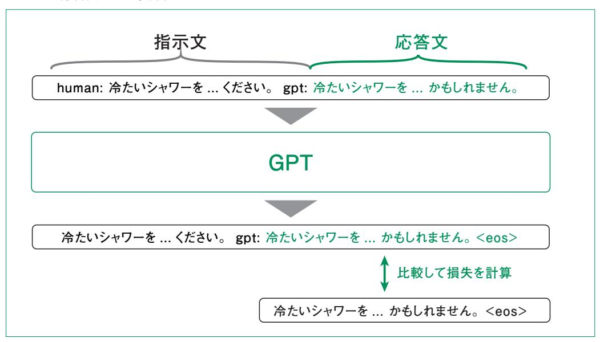

# 5.2 インストラクションチューニング

## 5.2.1 インストラクションチューニングの基礎

 5.1節でも述べた通り、インストラクションチューニング(指示チューニング)は事前学習によって次の トークンを予測できるようになったモデルが、指示通りにタスクを解けるようになるためのファインチュー ニング方法です。インストラクションチューニングは、2021年に Google Researchが提案した手法で、 その論文ではインストラクションチューニング後のモデルを Finetuned LAnguage Netの一部を とって FLANと呼んでいます。FLANの直前に提案された GPT-3ではインストラクションチューニン グを行わず、タスクを解いているサンプルを入力に与える Few-Shotプロンプトによってタスクを解いて いました。これに対して FLANではサンプルを与えない Zero-Shot設定での能力が高かった点が画 期的でした。

 FLANでのインストラクションチューニングでは、データセットは自然言語処理タスクに用いられてい たデータセットから自動で作 成したものでした。一 方、2 0 2 2 年に提 案された O p e n A I の InstructGPTでは、指示・応答例を人手で約15,000組作成して学習しています。

インストラクションチューニングでは、モデルに指示部分として以下のようなテキストを与えます。

**human: こんにちは**

**gpt: こんにちは! 何かお手伝いしましょうか ?**

**human: 3 + 5 を計算してください。**

**gpt:**

これに対して応答例としては以下のようなテキストが与えられ、モデル出力と比較されます。

**3 + 5 = 8 です。**

 データセットとしては、上述のように Human や AIを付与したテキストではなく、より扱いやすい JSONLINES(jsonl)形式で公開されている場合が多いです。

 例えば、LLM-jpが公開している oasst1-21k-jaデータセット**1**では、各レコードが表5.2.1のような fromとvalueをキーに持つ辞書のリストになっています。

**<sup>1</sup>** Apache License 2.0。このデータセットは OpenAssistantsの oasst1データセットを和訳したもの。

第5章

#### 表5.2.1 oasst1-21k-jaデータセットのレコード例

| from  | value                                                                                                                                                                                 |  |
|-------|---------------------------------------------------------------------------------------------------------------------------------------------------------------------------------------|--|
| human | 冷たいシャワーを毎日浴びることの長所と短所について、短いパラグラフを書いてください。                                                                                                                                            |  |
| gpt   | 冷たいシャワーを毎日浴びることのメリットは、注意力を高め、気分を高揚させること、健康全般<br>を改善すること、ガスや電気を使ってお湯を沸かさないので光熱費の節約になることです。一<br>方、冷たいシャワーはあまり歓迎されるものではありません。特に寒い冬には、冷たいシャワーに<br>浸かるという精神的な障壁を超えられず、失敗や失望を考えてしまうかもしれません。 |  |

 また、Databricks 社が公開している databricks-dolly-15kデータセット**2**では指示・応答に加え て、応答に必要なコンテキストもデータとして保持しています。

表5.2.2 databricks-dolly-15kデータセットのレコード例

| instruction                                         | context                                                                                                                                                                                                                                                                                                                                                                                                                                                                                                                                                                       | response                                                                                                                        | category  |
|-----------------------------------------------------|-------------------------------------------------------------------------------------------------------------------------------------------------------------------------------------------------------------------------------------------------------------------------------------------------------------------------------------------------------------------------------------------------------------------------------------------------------------------------------------------------------------------------------------------------------------------------------|---------------------------------------------------------------------------------------------------------------------------------|-----------|
| When did Virgin<br>Australia<br>start<br>operating? | Virgin Australia, the trading<br>name of Virgin Australia Airlines<br>Pty Ltd, is an Australian-based<br>airline. It is the largest airline by<br>fleet size to use the Virgin<br>brand. It commenced services<br>on 31 August 2000 as Virgin<br>Blue, with two aircraft on a<br>single route. It suddenly found<br>itself as a major airline in<br>Australia's domestic market after<br>the collapse of Ansett Australia<br>in September 2001. The airline<br>has since grown to directly<br>serve 32 cities in Australia, from<br>hubs in Brisbane, Melbourne<br>and Sydney | Virgin Australia commenced<br>services on 31 August 2000<br>as<br>Virgin<br>Blue,<br>with<br>two<br>aircraft on a single route. | closed_qa |

 例として oasst-21k-jaデータセットのような形でデータを持っていれば、コード5.2.1に示すコードで レコードを学習用の指示・応答文に変換できます。

#### コード5.2.1 データセットから指示・応答のテキストを作成する例

**data = [{ "from": "human", "value": "冷たいシャワーを毎日浴びることの長所と短所について、短いパ ラグラフを書いてください。" }, { "from": "gpt", "value": "冷たいシャワーを毎日浴びることのメリットは、 注意力を高め、気分を高揚させること、健康全般を改善すること、ガスや電気を使ってお湯を沸かさないので光熱費の 節約になることです。一方、冷たいシャワーはあまり歓迎されるものではありません。特に寒い冬には、冷たいシャワーに 浸かるという精神的な障壁を超えられず、失敗や失望を考えてしまうかもしれません。" }]**

```
prompt_template_example = "{from}: {value}"
instruction_text = ""
for d in data[:-1]:
 instruction_text += prompt_template_example.format(**d)
response_text = prompt_template_example.format(**data[-1])
print("指示部分:")
print(instruction_text)
print("\n応答部分:")
print(response_text)
```

 インストラクションチューニングではこのような指示・応答文を用いてどのように学習するのでしょう か。学習の手法自体は、事前学習と同様で次のトークンを予測し、モデルの予測と実際のテキストを比 較したクロスエントロピー誤差を用います。1点異なるのは、指示文に関しては損失を計算しない(学 習に用いない)点です **<sup>3</sup>**。このイメージを図5.2.1に示します。

#### 図5.2.1 応答文のみで学習する



## 5.2.2 インストラクションチューニングの実装

本項では、databricks-dolly-15kデータセットを用いてインストラクションチューニングを行います。

**<sup>3</sup>** 用いない場合が多いですが、用いたからインストラクションチューニングではないというわけではありません。後述する ライブラリを使った実装でも、用いるか用いないかは指定できます。

まずはデータセットをロードしましょう。Hugging Faceのページ**4**にデータセットがアップロードされて いるので、そちらから読み込んでもよいですが、ここでは **datasets**ライブラリを用いてデータを読み 込みます(コード5.2.2)。

### コード5.2.2 datasetsライブラリを用いたデータのロード

```
from datasets import load_dataset
ds = load_dataset("databricks/databricks-dolly-15k")
print(ds["train"]) 
# Dataset({
# features: ['instruction', 'context', 'response', 'category'],
# num_rows: 15011
# })
```

**print**の下のコメントは出力結果です。カラムとして instruction、context、response、category を持っており、15,011件のデータが含まれることが確認できます。

 今回は簡単のため、補足情報である contextが空のサンプルのみを利用します。**datasets**で ロードされたデータはコード5.2.3のように **filter**メソッドを用いてフィルタリングできます。

#### コード5.2.3 コンテキストが空のデータのみを抽出

```
ds_train = ds["train"].filter(lambda x: x["context"] == "")
print(f"コンテキスト空のデータ: {ds_train.num_rows}") # 10544
```

 結果として 10,544件のデータが残りました。次に、データから学習用のテキストを作成する関数を 実装します。コード5.2.4 では **ai:** や **gpt:** ではなく、**### Question:**と▲コード▲### **Answer:**を用いています。

#### コード5.2.4 学習用テキストを作成する関数

```
prompt_template = """\
### Question: {instruction}
### Answer: {response}{eos_token}"""
def format_input(example):
 """バッチ処理用のフォーマット関数"""
 texts = []
 for instruction, response in zip(example['instruction'],
```

**<sup>4</sup>** https://huggingface.co/datasets/databricks/databricks-dolly-15k

```
example['response']):
 text = prompt_template.format(
 instruction=instruction,
 response=response,
 eos_token=tokenizer.eos_token
 )
 texts.append(text)
 return texts
sample = ds_train[0]
print("サンプルデータ:")
print(f" instruction: {sample['instruction'][:50]}...")
print(f" response: {sample['response'][:50]}...")
# サンプルデータ:
# instruction: Which is a species of fish? Tope or Rope...
# response: Tope...
```

 学習時は、このように作成されたテキストを用いますが、テキストが長いとその分、GPUのメモリも多 く必要になります。そのため、今回は十分多くのデータを含むトークン数を上限としてデータセットをフィ ルタリングします。トークン数を計算するため、コード5.2.5で先に学習済みモデルとトークナイザを読み 込みます。今回のインストラクションチューニングでは、OpenAIの GPT-2 モデルを使用します **<sup>5</sup>**。

### コード5.2.5 学習済みモデルとトークナイザの読み込み

```
from transformers import AutoModelForCausalLM, AutoTokenizer
import torch
model_name = "gpt2"
tokenizer = AutoTokenizer.from_pretrained(model_name)
tokenizer.pad_token = tokenizer.eos_token
model = AutoModelForCausalLM.from_pretrained(
 model_name,
 device_map="auto" if torch.cuda.is_available() else "cpu",
)
print(f"パラメータ数: {sum(p.numel() for p in model.parameters()):,}") 
# パラメータ数: 124,439,808
```

次にコード5.2.6を用いて、トークン数のヒストグラムをプロットします。

**<sup>5</sup>** GPT-2 は約1.24億パラメータを持つ比較的小規模なモデルで、限られた計算リソースでもインストラクションチュー ニングの効果を確認できできます。ここでは Hugging Face で公開されているものを使います( https:// huggingface.co/gpt2)。

### コード5.2.6 トークン数のプロット

```
import matplotlib.pyplot as plt
import japanize_matplotlib
fig, ax = plt.subplots()
lengths = [len(tokenizer.encode(text)) for text in format_input(ds_train)]
ax.hist(lengths, bins=200)
ax.set_xlim(0, 1000)
ax.set_xlabel("トークン数")
ax.set_ylabel("レコード数")
fig.savefig("histogram.png", dpi=300, bbox_inches="tight")
```

プロットした結果を図5.2.2に示します。

#### 図5.2.2 トークン数のヒストグラム


 図5.2.2からほとんどのレコードでトークン数が 500以下であることが分かるので、512トークンを上限 として、それよりトークン数が多いレコードは除外しましょう(コード5.2.7)。アウトプットから、512トークン を超えるレコード数は 100件程度であったことが分かります。

#### コード5.2.7 トークン数によるフィルタ

```
max_length = 512
def token_length_filter(x):
 text = prompt_template.format(
 instruction=x["instruction"],
 response=x["response"],
 eos_token=tokenizer.eos_token
 )
 return len(tokenizer.encode(text)) <= max_length
ds_train = ds_train.filter(token_length_filter)
print(f"トークン数フィルタ後: {ds_train.num_rows}") 
# トークン数フィルタ後: 10400
```

 インストラクションチューニングを行う前に、学習前のモデルがどのように応答するのか確認してみま しょう。推論用の関数をコード5.2.8 に示します。この関数では、生成結果から **response\_ template**として定義した応答の始まりを示すテキストを探し、その後ろから文章の終わりを表す **eos\_token**までを取り出すことで、応答部分のみを返しています。

#### コード5.2.8 推論用の関数

```
prompt_template_infer = """\
### Question: {instruction}
### Answer: """
response_template = "### Answer:"
@torch.inference_mode()
def inference(model, tokenizer, user_input):
 prompt = prompt_template_infer.format(instruction=user_input)
 device = next(model.parameters()).device
 input_ids = tokenizer.encode(prompt, return_tensors="pt").to(device)
 output = model.generate(
 input_ids,
 max_new_tokens=128,
 do_sample=False,
 repetition_penalty=1.1,
 pad_token_id=tokenizer.eos_token_id
 )
 generated_text = tokenizer.decode(output[0], skip_special_tokens=False)
 response_start = generated_text.find(response_template) + len(response_ 
template)
```

```
 response_end = generated_text.find(tokenizer.eos_token, response_start)
 if response_end == -1:
 response_end = len(generated_text)
 response = generated_text[response_start:response_end].strip()
 return response
```

ではコード5.2.9で日本の首都について聞いてみましょう。

#### コード5.2.9 チューニング前のモデルによる推論

```
test_questions = [
 "What is the capital of Japan?"
]
print("チューニング前の応答:")
print("="*80)
before_responses = {}
for question in test_questions:
 response = inference(model, tokenizer, question)
 before_responses[question] = response
 print(f"Q: {question}")
 print(f"A: {response}")
 print("-"*80)
```

 アウトプットは次のようになります。日本については語っているものの、応答文にはなっておらず、続き を生成しただけのように見えます。

**The Japanese government has a long history of using money to finance its own military. The first major example was in 1848 when it used \$1,000 for an army unit and then spent about half that on other expenses such as uniforms and food supplies (see below). In fact, during World War II , this amount had been raised by more than 100% from what would have been needed if there were no war at all . This led to many people believing they could use their savings or even buy some goods with cash instead of having them go into debt because "the Government will not pay you back." However, since most countries do**

インストラクションチューニングの設定をコード5.2.10に示します。

 まず **DataCollatorForCompletionOnlyLM**は 5.2.1項で説明した応答部分のみの損失 を計算するためのクラスです。応答部分を取り出すために、**response\_template**を渡す必要が あります。学習時の詳細な設定は **SFTConfig** で定義します。最後に **SFTTrainer** に **collator**と**config**を渡すことで、学習用の準備は完了です。

#### コード5.2.10 インストラクションチューニングの設定

```
from trl import SFTConfig, SFTTrainer, DataCollatorForCompletionOnlyLM
collator = DataCollatorForCompletionOnlyLM(response_template, 
tokenizer=tokenizer)
config = SFTConfig(
 output_dir='../../output/section2_sft_model', 
 save_strategy="epoch", 
 save_total_limit=1, 
 logging_steps=100,
 max_seq_length=max_length,
 num_train_epochs=3,
 gradient_accumulation_steps=1,
 per_device_train_batch_size=8,
 lr_scheduler_type="constant",
)
trainer = SFTTrainer(
 model,
 args=config,
 train_dataset=ds_train,
 formatting_func=format_input,
 data_collator=collator,
)
```

 以上の準備によってインストラクションチューニングは、コード5.2.11のように **train**メソッドを呼び 出すだけで実行できます。

#### コード5.2.11 インストラクションチューニングの実行

```
save_path = "../../output/section2_sft_model"
trainer.train()
trainer.save_model(save_path)
```

 学習したモデルを用いて、同じ質問について推論してみてください。アウトプットの例は以下のように なります。

**Tokyo, Japan. The capital in Japan is Tokyo and it's capital is Tokyo. It was founded by Emperor Shigeru I in the year 1450 and is still maintained today as one major city in Asia with over 2 million residents. It has a population of around 7 million people which is more than any other country in Europe or North America combined. Its main trading partner is Toyota Motor Co Ltd (TMC) for its Japanese operations. Tokyo also hosts many world famous movie studios like The Hunger Games, Star Wars, and The X-Files. There are also many museums and historical sites that make it**

 回答は完璧とはいえないものの、質問されたことに適切に答えられていることが分かります。他にも 様々な質問をしてみて、どのような応答を示すか確認してみてください。