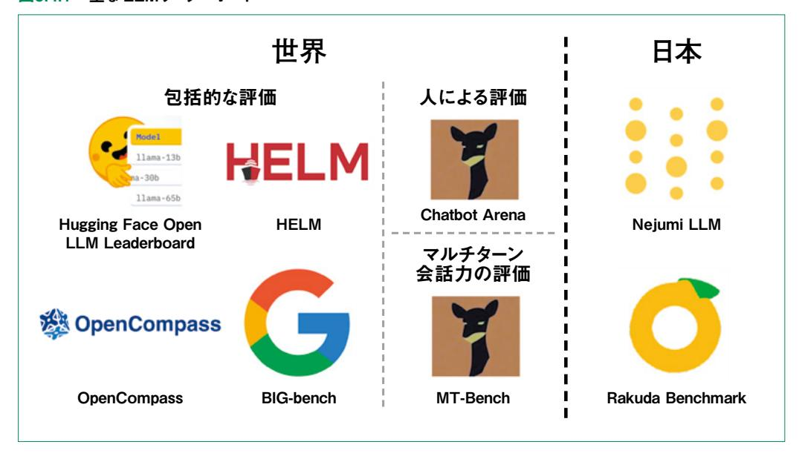

# 5.4 評価

 本節では、言語モデルの評価手法と、性能を客観的に評価するためのベンチマーク、評価結果を 順位付けした一覧表であるリーダーボードについて解説します。

# 5.4.1 言語モデルの評価手法

# 言語モデル評価の 2大アプローチ

 作った LLMを実用化していくには、評価をして改善していく作業が不可欠です。最後に、評価手 法について、まとめておきます。

 大規模言語モデル(LLM)の性能を正確に測定するためには、「手動評価」と「自動評価」という 2つの主要アプローチが存在します。

 手動評価は人間の評価者がモデルの出力を直接判断する方法で、出力の質や文脈適合性など の複雑な側面を評価できます。一方、自動評価はアルゴリズムを用いて効率的かつ定量的にモデル の性能を評価します。両手法には固有の長所と短所があり、評価の目的や状況に応じた使い分けが 重要となります。

#### 手動評価:人間の判断による質的評価

 手動評価では、人間の評価者が LLMの出力を実際の使用文脈で検証し、意味の通じやすさや 適切性などを評価します。この方法は、定量的な指標だけでは捉えきれない複雑な特性を評価する のに適しています。

#### 手動評価のメリット

- ・文脈理解の深さ : 人間は文脈や暗黙の意味を理解し、生成された文章が状況に適している かを総合的に判断できる
- ・微妙なニュアンスの把握: 言語の微妙な表現や文化的背景を考慮した評価が可能
- ・創造性や適切性の評価: 創造的な表現や社会的適切性など、数値化しにくい側面を評価で きる

#### 手動評価のデメリット

- ・時間とコストの負担: 大量のデータを評価するには膨大な時間と人的リソースが必要
- ・評価の主観性: 評価者個人の好みや経験によって判断にばらつきが生じる可能性がある
- ・再現性の課題: 同じ出力に対する評価が評価者や評価時期によって異なる場合がある

#### 自動評価:効率的かつ定量的な性能測定

 自動評価手法は、言語モデルの出力を客観的な指標で測定し、効率的に大規模な評価ができま す。自動評価は主に以下の 2種類に大別されます。

## 1. 統計的指標による自動評価

 従来から使用されている評価指標を用いて、モデル出力と参照テキストの類似度を測定する方法 です。代表的な指標は次の通りです。

- ・BLEU(Bilingual Evaluation Understudy): 主に機械翻訳の評価に使用され、生 成されたテキストと参照テキスト間の N-gram一致度を測定
- ・ROUGE(Recall-Oriented Understudy for Gisting Evaluation): 要約タス クで広く使用され、生成された要約と参照要約間の単語一致度を評価
- ・BERTスコア: 事前学習済み言語モデルの埋め込みを利用して、生成テキストと参照テキ スト間の意味的類似度を計算
- ・METEOR: 同義語や語形変化も考慮した評価指標で、より柔軟な一致を許容

#### 2. LLMを用いた自動評価(LLM-as-a-judge)

 近年注目されている方法で、高性能な言語モデル自体を評価者として活用します。GPT-4などの 大規模言語モデルに評価基準を与え、他のモデルの出力を評価させる手法です。この方法の特徴 は次の通りです。

- ・複雑な評価基準に基づいた総合的な判断が可能
- ・人間の評価に近い多角的な視点での評価ができる
- ・評価の一貫性を維持しながら、大量のデータを処理できる

#### 自動評価のメリット

- ・スケーラビリティ: 大量のテストケースを短時間で評価可能
- ・コスト効率: 一度構築すれば、追加コストなく繰り返し評価できる
- ・評価の一貫性: 評価基準が変動せず、比較に適している

# 自動評価のデメリット

- ・表面的な類似性への依存: 特に従来の指標は単語の一致に依存し、意味的等価性を正確に 評価できない場合がある
- ・創造性の評価困難: 独創的で優れた表現が参照テキストと異なる場合、低く評価される傾 向がある
- ・文脈理解の限界: 広い文脈や背景知識を要する応答の適切性を評価するのが難しい

# 評価事例の分析

#### 手動評価の応用例

#### 1. 法律ドメインでの LLM応用評価

 法律文書の生成や法的助言の提供において、法律専門家が LLMの出力を評価した研究で は、表層的な正確さと深層的な法的妥当性に乖離があることが判明しました。一見適切に見える LLMの回答でも、専門家が評価すると法的原則の適用や判例の解釈に微妙な誤りが見つかる 場合があることが指摘されています。

# 2. 医療分野における LLMの回答品質評価

 医療関連の質問に対する LLMの回答を医療専門家が評価した研究では、情報の正確性、 回答の完全性、有害性の回避など複数の観点から評価が行われました。この評価により、LLM が一般的な医療知識はよく把握している一方で、複雑な診断や治療法の推奨においては臨床 医の判断との間に依然として差があることが明らかになりました。

#### 3. 多言語コンテンツの文化適応性評価

 異なる言語や文化圏向けのコンテンツ生成において、単なる言語的正確性だけでなく、文化的 背景や社会規範への適合性が重要となります。このような評価では、対象文化の専門家による判 断が不可欠であり、特に慣用表現、ユーモア、機微に触れる話題の取り扱いなどが詳細に検証さ れます。

#### 4. 教育コンテンツの学習効果評価

 教育目的で生成されたコンテンツの評価では、教育専門家や学習者による実際の学習効果の 検証が行われます。この評価では、内容の正確性だけでなく、説明の明瞭さ、学習者の理解度向 上、学習意欲の促進などの観点から総合的に判断されます。

#### 自動評価の実践例

#### 1. 多段階翻訳品質評価システム

 最新の翻訳システムでは、BLEUスコアによる初期評価の後、BERTスコアによる意味的評価、 さらに「LLM-as-a-judge」による文脈適合性評価を組み合わせた多段階評価が実施されてい ます。この複合的アプローチにより、単一指標では捉えられない翻訳品質の多面的な側面を評価

できるようになりました。

# 2. 事実検証のための自動評価フレームワーク

 生成された情報の事実性を検証するため、外部知識ベースと連携した自動評価システムが開 発されています。このシステムでは、モデル出力の各文に対して信頼できる情報源との整合性を 自動的に検証し、事実と異なる記述や曖昧な表現を特定します。

# 3. MME(Multimodal Model Evaluation)による多角的評価

 マルチモーダルモデルを評価するための包括的なベンチマークでは、テキスト生成の品質、画 像理解の正確性、クロスモーダル推論能力など、複数の評価軸に基づいた総合評価が行われて います。このような多角的評価により、モデルの強みと弱みをより正確に把握することが可能になり ます。

# 4. ドメイン適応性の自動評価

 特定分野に特化した LLMの評価では、そのドメインの専門用語や知識に関する出力の正確 性を自動的に評価するシステムが開発されています。例えば、科学論文の生成や要約タスクで は、専門用語の使用適切性や最新研究動向との整合性を評価する指標が用いられています。

# 統合アプローチ:手動評価と自動評価の相補的活用

 手動評価と自動評価は、それぞれの長所を生かし短所を補完し合う形で組み合わせることで、より 包括的な評価が可能になります。特に効果的な統合アプローチに次があります。

#### 1. 段階的スクリーニングモデル

 大量のテストケースに対して自動評価を適用し、一定の基準を下回るケースや判断が難しい ケースのみを人間の評価者が詳細に検証するアプローチです。これにより、評価の質を維持しな がら効率化が図れます。

#### 2. 人間フィードバックによる自動評価の調整

 自動評価システムの判断と人間評価者の判断の差異を学習データとして活用し、自動評価ア ルゴリズムを継続的に改善するアプローチです。このフィードバックループにより、自動評価の精度 と人間の判断との一致度を高められます。

#### 3. 多層的評価フレームワーク

 基本的な言語品質や文法的正確性は自動評価で、創造性や文脈適合性などの高次元の側 面は人間評価で分担するなど、評価対象の性質に応じて適切な評価手法を選択する多層的な フレームワークが有効です。

#### 未来への展望:評価手法の進化

言語モデルの技術進化に伴い、その評価手法も急速に発展しています。今後期待される評価手

法の進化の方向性を示します。

#### 1. より高度な自己評価能力を持つモデル

 将来的には、LLM自身が自らの出力の品質や信頼性を評価し、必要に応じて自己修正できる ようになると予想されます。これにより、評価と生成のプロセスがより緊密に統合される可能性があ ります。

# 2. リアルタイムユーザーフィードバックの活用

 実際のユーザーからのリアルタイムフィードバックを大規模に収集・分析し、モデルの評価と改 善に直接反映させるシステムが発展すると考えられます。この「実環境での継続的評価」により、 理論的な評価と実用的な有用性のギャップを埋めることが可能になります。

# 3. 社会的影響を考慮した総合評価

 LLMの出力が社会に与える影響を多角的に評価する枠組みの重要性が増しています。特 に、公平性、透明性、安全性などの社会的側面を評価する指標の開発と標準化が進むでしょう。

#### 4. 文脈適応型評価システム

 使用状況や目的に応じて評価基準を動的に調整する適応型評価システムの開発が進むと予 想されます。例えば、創造的なコンテンツ生成と事実に基づく情報提供では、異なる評価基準が 適用される仕組みです。

# 結論:バランスの取れた評価アプローチ

 言語モデルの真の性能を把握するためには、手動評価と自動評価をバランスよく組み合わせ、多 角的な視点から評価することが不可欠です。技術の進化と共に評価手法も発展していますが、最終 的には「どのような目的で、どのようなユーザーが、どのような状況でモデルを使用するか」という文脈 を考慮した評価アプローチが最も有効であると言えるでしょう。

 言語モデルの評価は単なる技術的課題ではなく、モデルの社会的な影響や価値を測る重要なプ ロセスです。今後も評価手法の研究と開発が進み、より信頼性の高い言語モデルの実現に貢献する ことが期待されます。

# 5.4.2 言語モデル評価のためのベンチマーク

#### ベンチマークの役割と重要性

 LLMの急速な発展に伴い、その性能を客観的に評価するためのベンチマークの重要性が増して います。ベンチマークとは、モデルの能力を測定するための標準化された評価基準とデータセットの 総称であり、LLMの研究開発と実用化において欠かせない役割を果たしています。

 適切なベンチマークの選択と活用は、モデル間の公平な比較を可能にし、技術の進歩を定量的に 把握するとともに、実用面での信頼性向上に貢献します。本項では、LLMベンチマークの概念、活用 方法、種類、そして今後の展望について解説します。

# ベンチマークとリーダーボードの関係性

#### ベンチマークの定義

 ベンチマークは、LLMの性能を様々な角度から測定するためのテストセットと評価手法を提供しま す。具体的には、特定のタスク(質問応答、要約、推論など)に対するモデルの能力を評価するため のデータセットと、その結果を数値化するための指標から構成されています。

# リーダーボードの位置づけ

 リーダーボードは、複数の LLMがベンチマークテストで獲得した結果をランキング形式でまとめた ものです。これにより、研究者や開発者、そしてユーザーは、各モデルの相対的な性能を一目で把握 できます。

リーダーボードの主な役割は次の通りです。

- ・研究コミュニティにおける技術進歩の可視化
- ・新たな研究目標の設定と促進
- ・モデル選択における客観的な判断材料の提供
- ・競争を通じた技術革新の加速

 つまり、ベンチマークが「テスト」であるなら、リーダーボードは「成績表」に相当します。ただし、単一 のリーダーボードだけでモデルの総合的な能力を判断することはできないため、目的に応じた複数の 評価基準を参照することが重要です。

#### ベンチマークの戦略的活用法

 LLMベンチマークは単なる性能評価ツールではなく、様々な戦略的目的のために活用されていま す。以下に、主要な活用シナリオを紹介します。

#### モデル開発の指針としての活用

ベンチマークは、モデル開発者にとって重要な指針となります。特に以下の点で価値を発揮します。

- ・弱点の特定と改善: 特定のタスクやデータタイプでのパフォーマンス低下を分析し、モデル アーキテクチャや学習手法の改善につなげることができます。
- ・進捗の可視化: 開発の各段階でベンチマークスコアを測定することで、改良の効果を定量

的に把握できます。

・アーキテクチャ設計の検証: 異なるモデル構造や学習アプローチの効果を客観的に比較評 価することが可能です。

#### 実用導入における意思決定支援

ビジネスや組織で LLMを導入する際、ベンチマークは以下のような意思決定を支援します。

- ・コスト・パフォーマンス分析: 様々なモデルの性能とコスト(計算資源、利用料金など)を比 較し、最適な選択ができます。
- ・用途適合性の評価: 特定の業務に必要なタスク(例:専門文書の要約、多言語対応など)に 関連するベンチマークに着目することで、用途に最適なモデルを選定できます。
- ・リスク評価: 安全性や偏見に関するベンチマークを参照することで、モデル導入に伴うリス クを事前に評価することが可能です。

# カスタムベンチマークの構築

 公開されているベンチマークだけでは特定のニーズを満たせない場合、組織独自のベンチマーク を構築する選択肢もあります。

- ・ドメイン特化型評価: 特定の業界や専門分野(医療、法律、金融など)に特化したデータセッ トを用いて、モデルの専門知識を評価します。
- ・業務プロセス反映型: 実際の業務フローを模したタスクセットを設計し、実環境での有効性 を予測します。
- ・継続的評価システム: モデルのバージョンアップや外部環境の変化に応じて、定期的に評 価を実施する仕組みを構築します。

 これらの活用法は、ベンチマークをただのランキングツールではなく、LLM導入と活用の全プロセス を支える戦略的資産として捉える視点を提供します。

#### 代表的なベンチマーク体系と評価領域

 LLMベンチマークは多岐にわたりますが、大きく分けて以下のカテゴリに分類できます。それぞれ の領域で代表的なベンチマークを紹介します。よく使われるのは「MMLU」で、論文などのベンチマー クとして広く使われています。特定の用途に向けて作った LLMの場合、その用途に合わせたベンチ マークを使います。

## 基礎言語能力評価

言語の基本的な理解と操作能力を測定するベンチマークです。

- ・文法理解・判断:
  - ・CoLA(Corpus of Linguistic Acceptability): 文の文法性判断タスク
  - ・JCoLA: 日本語版の文法性判断データセット
  - ・BLiMP(Benchmark of Linguistic Minimal Pairs): 言語学的最小対による 評価
- ・語彙・意味理解:
  - ・WiC(Word in Context): 同一単語の文脈依存的な意味の識別能力を評価
  - ・STS(Semantic Textual Similarity): テキスト間の意味的類似性判断

# 推論・知識適用能力評価

より高次の思考能力や知識の応用力を測定するベンチマークです。

- ・常識推論:
  - ・CommonsenseQA: 日常的な常識に基づく質問応答
  - ・HellaSwag: 文脈から次に起こりうる事象を予測するタスク
  - ・JCommonsenseQA: 日本語版常識推論質問応答データセット
- ・専門知識評価:
  - ・MMLU(Massive Multitask Language Understanding): 57の学術・専門 分野にわたる多様な問題集
  - ・JMMLU: 日本語に特化した専門知識評価ベンチマーク
- ・数理論理能力:
  - ・MATH: 高校・大学レベルの数学問題解決能力を評価
  - ・GSM8K: 小学校レベルの算数文章題
  - ・MGSM: 多言語版の数学問題セット

#### 実用タスク評価

実際の応用シーンを想定したタスクに関するベンチマークです。

#### ・文書要約:

- ・CNN/DailyMail: ニュース記事の要約タスク
- ・XSum: 極端な要約(一文要約)タスク
- ・XL-Sum: 多言語対応の要約データセット

# ・質問応答:

・SQuAD(Stanford Question Answering Dataset): 文書内の情報に基づく 質問回答

・JSQuAD: 日本語版質問応答データセット

・TruthfulQA: 事実性を重視した質問応答評価

#### ・対話能力:

・MultiWOZ: タスク指向型対話の評価 ・ConvAI2: 自然な会話維持能力の評価

# 社会的責任・安全性評価

モデルの倫理性や社会的影響を測定するベンチマークです。

・バイアス・公平性:

・BBQ(Bias Benchmark for QA): 質問応答における社会的バイアスの評価

・JBBQ: 日本語版バイアス評価ベンチマーク ・StereoSet: ステレオタイプの検出と測定

・有害性・安全性:

・ToxiGen: 有害コンテンツ生成傾向の評価

・OLID(Offensive Language Identification Dataset): 攻撃的言語の識別

・AdvGLUE: 敵対的例に対する堅牢性評価

・事実性・信頼性:

・FEVER: 事実検証能力の評価

・JTruthfulQA: 日本語での事実性評価

・KnownUnknowns: モデルの不確実性認識能力の評価

 これらのベンチマークを組み合わせることで、LLMの総合的な能力プロファイルを構築し、その強 みと弱みを多角的に把握できます。

#### 効果的なベンチマーク評価の実践方法

 LLMの総合的な評価を行うためには、単にベンチマークを実行するだけでなく、評価プロセス全 体を設計する必要があります。以下に、効果的なベンチマーク評価のアプローチを紹介します。

#### 多層的評価フレームワークの構築

単一のベンチマークだけでなく、複数の視点からモデルを評価する枠組みが重要です。

- 1. 量的評価と質的評価の統合
  - ・量的指標(精度、F1スコアなど)
  - ・質的分析(エラーパターン、回答の説得力など)
- 2. タスク階層に基づく評価
  - ・基礎能力(文法、語彙など)
  - ・中間スキル(論理的推論、文脈理解など)
  - ・応用タスク(要約、対話、創作など)
- 3. 多次元評価マトリックス
  - ・機能性(正確さ、網羅性)
  - ・使いやすさ(応答速度、明瞭さ)
  - ・安全性(バイアス、有害性の回避)
  - ・効率性(計算リソース、トークン効率)

# 評価手法の適切な選択と組み合わせ

様々な評価アプローチを目的に応じて使い分けることが重要です:

- 1. 自動評価
  - ・統計的指標: BLEU、ROUGE、BERTスコアなど
  - ・モデルベース評価: 評価用モデルによるスコアリング
  - ・ヒューリスティック評価: ルールベースのチェック
- 2. 人間評価
  - ・専門家評価: 特定分野の専門知識に基づく判断
  - ・ユーザー評価: 実際のユーザー体験を基にしたフィードバック
  - ・比較評価: 複数のモデル出力を相対的に比較
- 3. LLM-as-Judge アプローチ
  - ・高性能LLMを評価者として活用
  - ・人間評価とのキャリブレーション
  - ・一貫した基準での大規模評価の実現

#### 評価結果の解釈と活用

ベンチマーク結果を有効に活用するためのポイント:

- 1. 文脈を考慮した解釈
  - ・使用目的との関連性を考慮
  - ・スコアの絶対値だけでなく相対的な強みと弱みに注目
  - ・実環境での性能との相関関係を検証

# 2. 改善ポイントの特定

- ・エラー分析と根本原因の追求
- ・特定のデータ分布や問題タイプでの弱点を把握
- ・トレードオフ関係(精度と多様性など)の理解
- 3. 継続的な評価サイクル
  - ・定期的な再評価と進捗の追跡
  - ・新たなベンチマークの追加と陳腐化した指標の見直し
  - ・フィードバックループの確立と最適化

 このような体系的なアプローチにより、単なるスコア比較を超えた、LLMの本質的な能力と限界に ついての理解を深めることができます。

# 日本語LLM評価の特殊性と課題

 LLM評価において、言語固有の特性を考慮することは非常に重要です。特に日本語LLMの評価 においては、言語構造や文化的背景に起因する固有の課題が存在します。

#### 日本語固有の評価課題

- 1. 言語構造の複雑性
  - ・文字種の多様性(漢字、ひらがな、カタカナ、ローマ字)への対応
  - ・助詞・助動詞の適切な使用評価
  - ・敬語表現の正確さと適切性の評価
  - ・語順の柔軟性と曖昧性に対する処理能力
- 2. 文化的・社会的文脈理解
  - ・日本特有の慣用表現や比喩の理解
  - ・「察し」や「含み」などの非明示的コミュニケーションの把握
  - ・季節感や文化的参照の適切な活用
  - ・社会規範や礼儀作法に関する理解
- 3. 応用領域の特殊性
  - ・縦書きテキストや特殊レイアウトの処理
  - ・専門分野(法律、医療など)における日本固有の概念や用語
  - ・ビジネス文書における独特の文体や形式への対応

#### 日本語ベンチマークの現状と発展

 日本語LLM 評価のためのリソースは徐々に充実しつつありますが、英語圏と比較するとまだ発展 途上の段階にあります。

## 1. 既存の日本語ベンチマーク

・JGLUE: 日本語言語理解評価用データセット集

・JCommonsenseQA: 日本語常識推論タスク

・JTruthfulQA: 日本語事実性評価

・JMMLU: 日本語での多分野知識評価

・JNLI: 日本語自然言語推論評価

#### 2. 発展中の取り組み

・クロスリンガル評価(複数言語間での性能比較)

・日本語特有の言語現象に焦点を当てた専用テストセット

・業界別の専門日本語評価(医療日本語、法律日本語など)

・地域方言や話し言葉の評価データセット

# 3. 今後の課題

- ・評価データの多様性と代表性の確保
- ・人間評価者の一貫性と品質管理
- ・日本語文化コンテキストの十分な反映
- ・多言語モデルと日本語特化モデルの公平な比較手法

 日本語LLM 評価の発展は、日本における AI 技術の浸透と活用を促進するために不可欠であり、 研究コミュニティと産業界の協力による継続的な取り組みが期待されています。

## ベンチマークの限界と将来展望

 LLMベンチマークは評価の標準化と技術進歩の指標として重要な役割を果たしていますが、現 状の評価体系にはいくつかの本質的な限界が存在します。また、急速に進化する AI技術に対応す るためには、評価手法自体も進化を続ける必要があります。

#### 現行ベンチマークの限界

- 1. 静的評価の問題
  - ・固定されたデータセットはデータリークのリスクがある
  - ・時間の経過とともに評価基準が陳腐化する
- 2. 多様性と代表性の課題
  - ・特定の文化的背景や価値観に偏ったデータセット
  - ・実世界の複雑性や多様性を十分に反映していない
  - ・長文処理や長期的文脈維持能力の評価不足
- 3. 創造性と革新性の評価困難

- ・既存の「正解」に対する一致度で評価されるため、創造的な回答が適切に評価されない
- ・新規性や有用性といった主観的側面の定量化が難しい
- ・ユニークな問題解決アプローチへの適応性を測れない

# 次世代ベンチマークの発展方向

- 1. 動的・適応型評価システム
  - ・定期的に更新される評価データセット
  - ・モデルの学習状況に適応するチャレンジング問題の生成
  - ・継続的な評価を可能にするフレームワーク(例:CLEVA)
- 2. 複合的・多次元評価への移行
  - ・単一スコアではなく、能力プロファイルの総合評価
  - ・異なる利用シナリオや文脈における性能マッピング
  - ・トレードオフ関係の可視化と最適化支援
- 3. インタラクティブ評価の強化
  - ・対話的な問題解決能力の評価
  - ・フィードバックに基づく学習能力の測定
  - ・ユーザーとの長期的なインタラクションにおける一貫性評価
- 4. メタ評価システムの構築
  - ・評価指標自体の有効性と信頼性の継続的検証
  - ・ベンチマークスコアと実用価値の相関分析
  - ・人間評価とシステム評価の整合性確保

## 学際的アプローチの重要性

 LLMの評価は単なる技術的な課題ではなく、言語学、認知科学、社会学など多分野の知見を組 み合わせた学際的アプローチが求められています。

- ・言語学的視点: 言語の構造や普遍性に基づいた深い理解能力の評価
- ・認知科学的アプローチ: 人間の思考プロセスとの類似性や相違点の分析
- ・社会学的観点: 社会的規範や文化的文脈における適切性の評価
- ・哲学的考察:「理解」や「知性」の本質に関する概念的議論との接続

 これらの多角的な視点を統合することで、単なる性能競争を超えた、より包括的で有意義な LLM 評価体系の構築が可能になります。LLMの進化とともに、その評価手法も絶えず進化を続けるべき であり、技術コミュニティ全体での継続的な対話と協力が不可欠です。

# 5.4.3 言語モデルのリーダーボード

# LLMリーダーボードとは

 LLMリーダーボードは、様々な大規模言語モデルの性能を評価し、その結果を順位付けした一覧 表です。これにより、ユーザーは自分の目的に最適なモデルを効率的に比較・選択することが可能にな ります。研究者や開発者にとっても、モデル選定や技術動向の把握に役立つ重要な指標となっていま す。

# LLMリーダーボードの活用価値

 LLMリーダーボードは単なるランキング表以上の役割を持っています。技術開発においては、リー ダーボード上位を目指す競争が研究を活性化し、革新を促進する効果があります。上位ランクの獲得 はモデルの性能と信頼性の証明となり、開発チームの技術力をアピールする手段にもなっています。

 また、新しいモデルが次々と登場する現在の環境において、リーダーボードは開発者に改良の方向 性を示すとともに、ユーザーが信頼できるモデルを識別するための客観的な指標として機能していま す。各モデルの特性や強みを可視化することで、用途に応じた適切なモデル選択を支援しています。

# LLMリーダーボードの分類と代表例

 LLMのリーダーボードは、評価方法やカバーする能力範囲によって多様化しています。大きく分け ると次のようになります(**図5.4.1**)。

#### 図5.4.1 主なLLMリーダーボード

# 包括的評価を行うリーダーボード

# 1. Hugging Face Open LLM Leaderboard

 多様なデータセット(GPQA、MMLU-Proなど)を用いて様々な言語理解タスクを総合的に評 価しています。尤度選択方式と少数ショット学習(5〜25例)を採用しており、特にチューニング前 の基盤モデルの能力評価に適しています。公開モデルを中心に幅広くカバーしている点も特徴で す。

# 2. HELM

 複数の側面から多角的に LLMを評価し、総合ランキングを提供しています。単一のベンチ マークに依存せず、様々な評価軸を組み合わせることで、より包括的なモデル評価を実現してい ます。特に社会的影響や倫理的側面も考慮した評価設計が特徴的です。

# 3. OpenCompass

 異なる評価軸で LLMを多角的に評価し、総合的なランキングを提供しています。言語理解、 知識活用、推論能力など、細分化された能力別の評価結果を統合することで、モデルの特性をよ り詳細に把握できるようになっています。

#### 4. BIG-bench

 200以上の多様なタスクと複数言語をカバーする大規模ベンチマークです。基本的な言語理 解から複雑な推論、創造的タスクまで幅広い能力を測定し、LLMの総合的な能力を評価します。

# 特定のタスクや分野に特化したリーダーボード

# 1. Chatbot Arena

 対話能力に特化したリーダーボードで、実際の会話シナリオでの性能を評価します。2つのモ デルの応答を人間が直接比較するペアワイズ比較方式を採用しており、実用的な対話性能を実 際のユーザー体験に近い形で評価できます。

#### 2. MT-Bench

 機械翻訳タスクに特化したリーダーボードです。翻訳の正確性や流暢さに加え、倫理的問題や バイアスなども考慮した総合的な評価指標を採用しています。これにより、純粋な翻訳精度だけで なく、実用面での品質も含めたモデル評価が可能になっています。

#### 地域・言語特化型リーダーボード

 LLMリーダーボードは主に英語圏を中心に発展してきましたが、近年では各地域・言語に特化した リーダーボードも登場しています。日本では「Nejumi LLM」や「Rakuda Benchmark」などのリー ダーボードが注目されており、日本語の言語特性や文化的背景を考慮した評価が行われています。こ れらは日本市場向けの LLM選定において貴重な指標となっています。

# リーダーボードの課題と将来展望

 LLMリーダーボードは有用な評価ツールですが、いくつかの課題も抱えています。評価基準やベン チマークの選択によってランキングが変動する可能性があり、結果の解釈には注意が必要です。ま た、評価データが学習データに含まれているリスク(データリーク問題)や、ベンチマークスコアと実用 価値の間に乖離が生じる可能性もあります。

 今後のリーダーボード発展においては、より多様なベンチマークの統合や評価指標の透明性向上 が期待されています。また、特定の産業分野や用途に特化したリーダーボードの充実や、データリーク 問題に対応するための動的評価システムの導入も重要な方向性と考えられています。

 これらの改善により、LLMの能力評価がさらに精緻化され、研究開発と実用化の両面でより適切 なモデル選択が可能になるでしょう。リーダーボードは、急速に進化する LLM技術の理解と活用を支 える基盤として、今後も重要な役割を果たし続けると予想されます。

# 参考文献

[Savelka 2023] Savelka, Jaromir, et al. "Explaining legal concepts with augmented large language models (gpt-4)." arXiv preprint arXiv:2306.09525 (2023).

[Singhal 2023] Singhal, Karan, et al. "Large language models encode clinical knowledge.", Nature 620.7972 (2023): 172-180.

[Thoppilan 2022] Thoppilan, Romal, et al. "Lamda: Language models for dialog applications.", arXiv preprint arXiv:2201.08239, (2022).