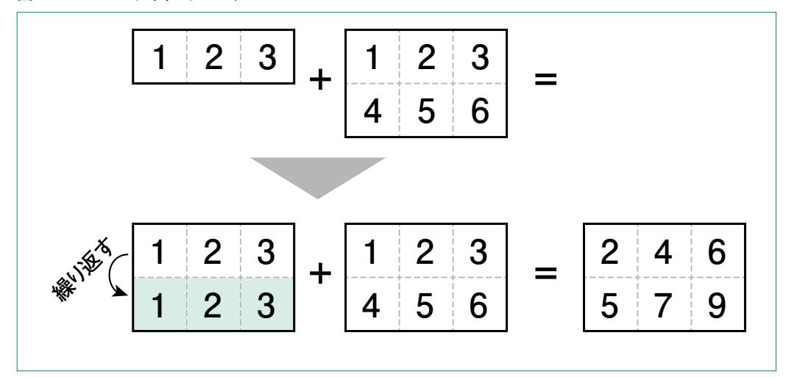
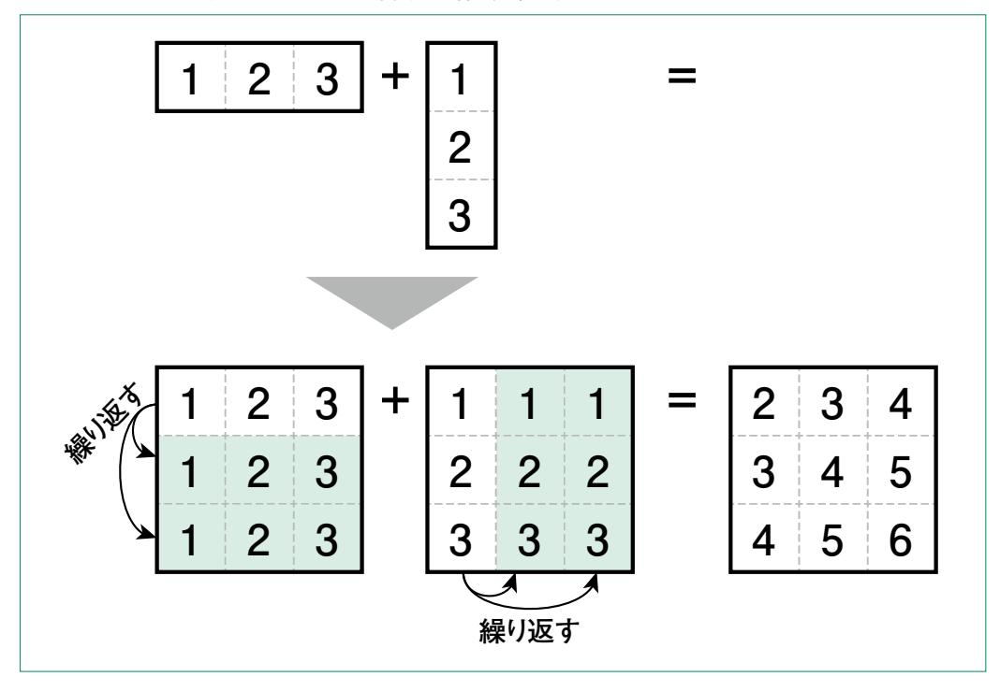
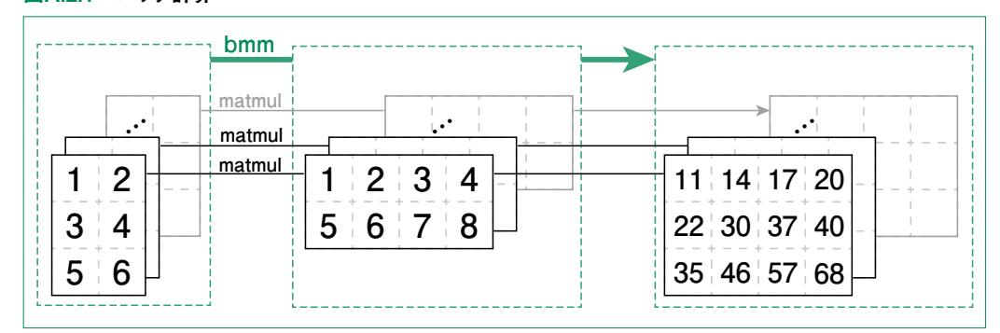

付録

## NumPy、 PyTorch入門

**機械学習やディープラーニングの分野では、大量のデータを用 いたモデルの学習と評価を効率的に行う必要があります。しか し、これを実現するスクリプトを自作すると、膨大な時間がかかっ てしまいます。そのため、本書では NumPyという、数値計算を 行うためのライブラリと、PyTorchというディープラーニングを行 うためのライブラリの 2つを利用しています。ここでは、これらの ライブラリについて、本書を理解するのに最小限の内容を解説 します。**


 NumPyは Pythonの数値計算ライブラリです。本書では特に多次元配列(ndarray)を効率的 に操作するための機能を利用します。

 多くの場合、以下のように npという別名を付けてインポートします。本書でもnpとしてインポートし ていることを前提に説明しています。

```
import numpy as np
```

 以降では、本書を読む上で知っていてほしい最低限の内容をピックアップしています。より詳しく知り たい場合は公式ドキュメント**1**を参照してください。

## A.1.1 numpy.ndarray

 NumPyの中心的なデータ構造は ndarray(N-dimensional array)です。これは同じ種類の データを格納する多次元配列であり、高速な数値計算を可能にします。

例として 1次元配列、2次元配列は以下のように作成できます。

```
array1d = np.array([1, 2, 3, 4])
array2d = np.array([[11, 12, 13], [21, 22, 23]])
```

配列の形状(各次元に対して何要素あるか)は以下のように確認できます。

```
print(array1d.shape) # (4,)
print(array2d.shape) # (2, 3)
```

配列のデータ型は dtypeとして取得できます。

```
a = np.array([1, 2, 3])
print(a.dtype) # dtype('int64')
```

## A.1.2 配列の生成

 NumPyには、配列を生成するための関数がいくつか用意されています。最も簡単なものとして以 下があります。

- np.arange(start, stop, step):startから stopまでの数字をステップ幅stepで並 べた 1次元配列を作成する(stopは含まない )。
- np.linspace(start, stop, num):startから stopまでを num分割した数字を並べ た 1次元配列を作成する(stopを含む )。

```
a = np.arange(1, 10, 2)
print(a) # [1, 3, 5, 7, 9]
b = np.linspace(1, 10, 3)
print(b) # [1., 5.5, 10.]
```

ただし、**np.linspace**は値を浮動小数点数(**dtype('float64')**)で返します。

 上述の関数はいずれも1次元配列を作成するものでした。本書中では例として用いる適当な形状 の配列を生成するために、**np.random.randn**を利用しています。この関数は与えられた形の配 列を、各要素を標準正規分布からサンプリングして生成します。

```
a = np.random.randn(3, 4, 5)
print(a.shape) # (3, 4, 5)
```

## A.1.3 配列の操作

配列の一部を取り出す操作をスライシングといいます。

 例えば 2番目(インデックスが 1)の要素から 3番目の要素を取り出す場合は、以下のようになりま す。

```
a = np.array([1, 2, 3, 4])
print(a[1:3]) # [2, 3]
```

配列は、要素数を変えない範囲で形状を変更できます。

```
array23 = np.array([[1, 2, 3], [4, 5, 6]])
print(array23.shape) # (2, 3)
array32 = array23.reshape((3, 2))
print(array32.shape) # (3, 2)
# array32 = np.array([[1, 2], [3, 4], [5, 6]])
array16 = array23.reshape(1, 6)
print(array16.shape) # (1, 6)
# array25 = array23.reshape(2, 5) はできない。
```

次のようにして、複数の配列を結合することができます。

```
a = np.array([1, 2, 3])
b = np.array([4, 5, 6])
ab = np.concatenate((a, b))
print(ab) # [1, 2, 3, 4, 5, 6]
```

## A.1.4 配列の演算

同じ形状の配列同士で演算を行うと、要素同士の演算になります。

```
a = np.array([1, 2, 3])
b = np.array([4, 5, 6])
print(a + b) # [5, 7, 9]
print(a * b) # [4, 10, 18]
```

 配列の形状が異なる場合は基本的に計算できません。しかし、特殊な場合にはブロードキャストと 呼ばれる方法で配列の形状を変換した後、演算が実行されます。

ブロードキャストが可能になるパターンは 2つあります。

 1つめは、要素数が異なる次元について、どちらかの要素数が 1の場合です。この場合、要素数が 1の方をタイル状に並べて、同じサイズにします。

例えば 2次元配列同士で、以下のような場合です(図A.1.1)。

```
a = np.array([1, 2, 3])
b = np.array([[1, 2, 3], [4, 5, 6]])
print(a.shape) # (1, 3)
print(b.shape) # (2, 3)
print(a + b) # a を (2, 3) にしてから足す
```

#### 図A.1.1 ブロードキャストのパターン1



また、両方の配列がブロードキャストされる場合もあります(図A.1.2)。

```
a = np.array([1, 2, 3])
b = np.array([[1], [2], [3]])
print(a.shape) # (1, 3)
print(b.shape) # (3, 1)
```

#### 図A.1.2 ブロードキャストのパターン1で両方とも繰り返す場合



次元が高くなると想像するのは難しくなりますが、3次元以上でも同じようにブロードキャストされます。

2つめのパターンは、次元が小さい方の先頭に要素数1の次元を加えればパターン1でブロードキャスト可能な場合です。

例として 3次元配列と 2次元配列でブロードキャスト可能な場合を示します。

```
a = np.random.randn(2, 2, 3)
b = np.random.randn(2, 3)
print(a.shape) # (2, 2, 3)
print(b.shape) # (2, 3)
c = a + b
print(c.shape) # (2, 2, 3)
```

この場合、bの先頭に要素1の次元が加えられ、(1, 2, 3)という形状に変換された後、パターン1のように並べることでブロードキャストされます。

以上のようなブロードキャストは後述の Py Torch における Tensor でも行われます。この変換は暗黙的に行われるため、コードを読む際に注意が必要です。

付録

## A.1.5 線形代数

 ndarrayは、線形代数におけるベクトルや行列としての演算にも対応しています。 まず、2つのベクトルの内積は **np.dot**で計算できます。

```
a = np.array([1, 2, 3])
b = np.array([4, 5, 6])
print(np.dot(a, b)) # 1*4 + 2*5 + 3*6 = 32
```

行列積は **np.matmul**で計算できます。

```
a = np.array([[1, 2, 3], [3, 4, 6]]) # a.shape == (2, 3)
b = np.array([[7], [8], [9]]) # b.shape == (3, 1)
c = np.matmul(a, b) # c.shape == (2, 1)
```

## A.1.6 その他の関数

 numpyモジュールには線形代数的な操作の他にも様々な関数が実装されています。本書で扱う 関数を含めた一部を表A.1に示します。

#### 表A.1 numpyモジュールに実装されている関数の例

| 関数     | 機能             |
|--------|----------------|
| np.min | 配列の最小値を求める     |
| np.max | 配列の最大値を求める     |
| np.sum | 配列の要素の合計を求める   |
| np.exp | 配列の各要素の指数を計算する |
| np.log | 配列の各要素の対数を計算する |

 また、これらの関数には axisという引数を渡せる場合が多いです。この引数により、どの次元を対 象とするかを指定できます。例えば、**np.sum**で、ある次元に関してのみ和をとる計算は次のように実 装できます。

```
a = np.array([[1, 2, 3], [4, 5, 6]])
a_sum1 = np.sum(a, axis=0)
print(a_sum1) # [5, 7, 9]
a_sum2 = np.sum(a, axis=1)
print(a_sum2) # [6, 15]
```

入門


# A.2 PyTorchの基礎

 PyTorchは Facebook AI Research(FAIR)**1**によって開発されたオープンソースの機械学習 ライブラリです。深層学習モデルの構築や学習に関する様々な機能が提供されており、様々なプロダ クトに使われています。特に、多くの LLMが公開されている Hugging Faceの transformersライブ ラリにもPyTorchが利用されています。

 本書の 2章では、このライブラリを用いて Transformerを実装しています。ここでは、本書で扱う 範囲の機能について解説します。

 PyTorchのモジュールとしての名称は torchです。本書を通して以下のようにインポートされてい ることを仮定します。

**import torch**

## A.2.1 torch.Tensor

 Tensorは PyTorchにおける基本的なデータ型です。NumPyの ndarrayと似ていますが、 GPUを使用した高速な計算や、後述する勾配情報の保持といった機能が付いています。 次のように作成できます。

```
tensor = torch.tensor([1, 2, 3])
print(tensor) # tensor([1, 2, 3])
```

配列間の演算、ブロードキャスト、形状の取得やデータ型の取得については NumPyと同様です。

**<sup>1</sup>** 現在は Fundamental AI Research。

```
a = torch.tensor([1, 2, 3])
b = torch.tensor([4, 5, 6])
print(a + b) # tensor([5, 7, 9])
c = torch.tensor([[1], [2], [3]])
d = a + c
print(d.shape) # torch.Size([3, 3])
print(d.dtype) # torch.int64
```

#### 特定の型のテンソルを作る方法

 PyTorchでは、様々なデータ型のテンソルを作成するための関数が用意されています。これによ り、特定のデータ型を持つテンソルを簡単に作成できます。以下にいくつかの代表的な例を示します。

torch.IntTensor:32ビット整数型

torch.LongTensor:64ビット整数型

torch.FloatTensor:32ビット浮動小数点数型

torch.DoubleTensor:64ビット浮動小数点数型

違いを見るために、**torch.LongTensor**と**torch.FloatTensor**を使ってみましょう。

```
a = torch.LongTensor([1, 2, 3])
print(a) # tensor([1, 2, 3])
b = torch.FloatTensor([1, 2, 3])
print(b) # tensor([1., 2., 3.])
```

**torch.tensor**は、与えられたリストの要素の型に応じて、自動で型を決定します。整数を渡すと 64ビット整数、小数を渡すと32ビット浮動小数点になります。

## A.2.2 基本的な関数

 NumPy に実装されている **np.sum** や **np.exp**、**torch.randn**といった多くの関数は PyTorchにも実装されています。

```
a = torch.tensor([1, 2, 3])
print(torch.sum(a)) # tensor(6)
```

NumPyと大きく異なる概念として、バッチがあります。バッチは機械学習で現れる概念で、複数の入出力を同時に一括で処理するためのものです。

バッチを利用した演算の1つに torch.bmmがあります。これは、batch matrix multiplication の略で、行列積のバッチ版です。この計算のイメージを図A.2.1に示します。

```
batch_size = 10
a = torch.randn(batch_size, 3, 2)
b = torch.randn(batch_size, 2, 4)
c = torch.bmm(a, b)
print(c.shape) # torch.Size([10, 3, 5])
```

#### 図A.2.1 バッチ計算



### A.2.3 torch.nn

torch.nnはPyTorchで深層学習モデルを構築する際の、構成要素となるレイヤーや、損失関数などが定義されているモジュールです。本書ではこのモジュールを以下のようにインポートします。

from torch import nn

まず、nnモジュールに定義されているいくつかのレイヤーについて説明します。

#### nn.Embeddings

**nn.Embeddings**は埋め込み層を作成するクラスで、整数のインデックスを(高次元の)ベクトル にマッピングします。**nn.Embeddings**では、このベクトル自体が学習されます。本書ではこのクラス を単語IDから単語ベクトルに変換する単語埋め込みに使用します。

例として、0~9の 10個の IDから 3次元ベクトルへの埋め込みを作成してみましょう。

```
embedding = nn.Embedding(10, 3) # 10個の 3次元ベクトル
indices = torch.LongTensor([1, 2])
print(embedding(indices).shape) # torch.Size([2, 3])
```

 サンプルコードでは複数のインデックスから複数のベクトルを同時に取得しています。このように、 **nn.Embeddings**に限らず、**nn**モジュールに定義されているレイヤーや関数は、バッチ処理に対応 しています。バッチ入出力によりベクトルを引き出す様子を図A.2.2に示します。

**0: 2: 1: 9: 1 3 5 3 4 1 2 5 5 1 3 3 埋め込みベクトルの次元 埋め込みベクトルのテーブル tensor([1, 2]) バッチ入力 3 5 4 1 5 5 バッチ出力 1 2**

図A.2.2 nn.Embeddingから埋め込みベクトルを引き出す様子

#### nn.Linear

**nn.Linear**は、線形層(全結合層)を作成するクラスで、入力の次元と出力の次元を受け取りま す。以下の例は、単一の入力の場合と、バッチ入力の場合です。

```
input_dim = 128
output_dim = 64
linear = nn.Linear(input_dim, output_dim)
input_vector = torch.randn(input_dim)
print(linear(input_vector).shape) # torch.Size([64])
batch_size = 10
input_batch = torch.randn(batch_size, input_dim)
print(linear(input_batch).shape) # torch.Size([10, 64])
```

#### nn.Module

**nnモジュール**に定義されているクラスで最も重要なのが **nn.Module**です。**nn.Module**は、上 述の **nn.Embeddings**や **nn.Linear**を含む、パラメータを持つ任意のレイヤーの作成に使われ ます。また、**nn.Module**を基に作られたレイヤーを利用して新たなブロックを作成することも可能で す。PyTorchによる深層学習モデルの構築では、**nn.Module**で作成したレイヤーやブロックを利用 して、モデルの全体を構成します。

コードA.2.1に自作のモデルを定義するクラスを示します。

#### コードA.2.1 カスタムモデル

```
class CustomModel(nn.Module):
 def __init__(self):
 super(CustomModel, self).__init__()
 self.linear1 = nn.Linear(128, 64)
 self.linear2 = nn.Linear(64, 10)
 def forward(self, x):
 x = self.linear1(x)
 x = self.linear2(x)
 return x
```

**nn.Module**を利用したモデル作成では、コンストラクタ(**\_\_init\_\_**)で親クラス(▲コード▲ **nn.Module**)のコンストラクタを呼ぶ必要があります。また、パラメータを持つレイヤーやブロックは全 てコンストラクタで定義する必要があります。

 このモデルを用いた出力の計算は、**forward**メソッドで定義します。サンプルコードでは、コンストラ クタで定義した線形層を順番に通したものを出力としています。

 作成したカスタムモデルを利用して出力を計算してみましょう。出力は、**model.forward(入力)** ではなく、単に **model(入力)**で計算できます。

```
model = CustomModel()
input_dim = 128
input_vector.= torch.randn(input_dim)
print(model(input_vector).shape) # torch.Size([10])
```

**nn.Module**を用いて定義したモデルは、モデルの構成を標準出力で確認できます。

```
print(model)
# CustomModel(
# (linear1): Linear(in_features=128, out_features=64, bias=True)
# (linear2): Linear(in_features=64, out_features=10, bias=True)
# )
```

 また、このクラスを継承して作成した自作のモデルも、他のレイヤーと同様にバッチ処理に対応して います。

#### nn.ModuleList

**nn.ModuleList**は、PyTorchの **nn.Module**を継承したクラスのインスタンスをリストとして格 納するためのコンテナクラスです。Pythonのリストと似ていますが、いくつか重要な違いがあります。 ModuleListを使用することで、リスト内のモジュールが自動的にモデルのパラメータとして認識され、 トレーニングや評価の際に一括で管理されるようになります。

**nn.ModuleList**を使いたい場面として典型的なのは、コードA.2.2に示すように、特定のレイ ヤーやブロックを繰り返す場合です。

#### コードA.2.2 nn.ModuleListを用いたモデル

```
class CustomModel1(nn.Module):
 def __init__(self):
 super(CustomModel1, self).__init__()
 units = [128, 64, 32, 16, 10]
 self.layers = nn.ModuleList(
 [nn.Linear(units[i], units[i + 1]) for i in range(len(units) - 1)]
 )
 def forward(self, x):
 for layer in self.layers:
 x = layer(x)
 return x
```

この場合、標準出力は次のようになります。

```
model1 = CustomModel1()
print(model1)
# CustomModel1(
# (layers): ModuleList(
# (0): Linear(in_features=128, out_features=64, bias=True)
# (1): Linear(in_features=64, out_features=32, bias=True)
# (2): Linear(in_features=32, out_features=16, bias=True)
# (3): Linear(in_features=16, out_features=10, bias=True)
```

一方、Pythonのリストを用いてモデルを構築するとどうなるでしょうか。

```
class CustomModel2(nn.Module):
 def __init__(self):
 super(CustomModel2, self).__init__()
 units = [128, 64, 32, 16, 10]
 self.layers = [nn.Linear(units[i], units[i + 1]) for i in
range(len(units) - 1)]
 def forward(self, x):
 for layer in self.layers:
 x = layer(x)
 return x
```

この場合の標準出力は以下のようになります。

```
model2 = CustomModel2()
print(model2)
# CustomModel2()
```

 出力からわかるように、定義した線形層がレイヤーとして認識されていません。そのため、学習時に はこれらのパラメータは更新されません。

#### nn.functional

**nn.functional**には、**nn** 下に定義されるクラスを、状態やパラメータを持たない関数に変換し たものが格納されています。本書では慣例に従い、このモジュールを以下のようにインポートします。

**import torch.nn.functional as F**

 例えば、活性化関数は以下のように **nn**直下のクラスを使う方法と、**F**を使う方法の 2通りで実装で きます。

```
x = torch.randn(10)
relu_func = nn.ReLU()
y1 = relu_func(x)
y2 = F.relu(x)
print(all(y1 == y2)) # True
```

 モデルで利用する場合、**F**は **forward**メソッドに直接書き、**nn**を用いる場合はコンストラクタ(**\_\_ init\_\_**)で定義し、**forward**メソッドで呼び出します。大きな違いは、**nn**を用いる場合のみ、モデル を標準出力した際にその関数も表示されることです。機能としてはどちらを用いても同じモデルが実 装できます。

## A.2.4 学習時に必要なモジュール

#### 損失関数

 損失関数(Loss Function)は、モデルの予測と実際の値との間の誤差を測定するために使用さ れる関数です。何かを測ること一般にいえることですが、どのような側面を測るのかによって評価され る誤差は様々です。機械学習・深層学習においても、この損失関数の決め方が非常に重要な役割を 果たします。そのため、PyTorchでは様々な損失関数が提供されていますが、ここでは本書で扱うク ロスエントロピー損失の実装のみを示します。

 損失関数は、**nn**モジュールに定義されています。バッチサイズ2で 3クラスに関する確率分布の出 力を受け取る例をコードA.2.3に示します。

付録

#### コードA.2.3 損失関数の例

```
criterion = nn.CrossEntropyLoss()
# モデルの予測値のダミーデータ
predicted = torch.tensor([[0.1, 0.2, 0.7], [0.8, 0.1, 0.1]], requires_grad=True)
# 教師データ
target = torch.tensor([2, 0])
loss = criterion(predicted, target)
```

 モデルの予測と教師データの形状が異なることに気づいたでしょうか。**nn.CrossEntropy**で は、教師データとしてクラス番号を与えられます。そのため、上述の例では教師データを以下のように 与えるのと同じ結果を得られます。

```
target = torch.tensor([[0.0, 0.0, 1.0], [1.0, 0.0, 0.0]])
```

### オプティマイザ

 オプティマイザは、損失関数を最小化するためにモデルのパラメータを更新する役割を果たしま す。多くの場合、モデルのパラメータによる損失関数の微分(勾配)を用います。

 PyTorchにはオプティマイザも複数定義されています。例えば AdamWというオプティマイザを利 用する場合、次のようになります。

```
optimizer = torch.optim.AdamW(model.parameters(), lr=0.001)
```

 オプティマイザに共通するのが、1つめの引数**model.parameters()**です。オプティマイザは パラメータを更新する役割があるため、事前にモデルのパラメータを受け取っておく必要があります。 モデルパラメータの後に、オプティマイザごとの引数を設定します。ここでは引数lrという、各ステップで どれだけ大幅に更新するかを決める学習率を与えています。

#### スケジューラ

 スケジューラは、オプティマイザに設定された学習率を(エポック**1**ごとに)調整するために使用され ます。例えば、一定エポックごと学習率を減少させる StepLRというスケジューラは以下のように作成 できます。

**scheduler = torch.optim.lr\_scheduler.StepLR(optimizer, step\_size=30, gamma=0.1)**

 第1引数にオプティマイザを受け取るのは全スケジューラに共通しています。それ以降の引数はス ケジューラごとに異なります。

#### 学習の流れ

 損失関数、オプティマイザ、スケジューラを用いた典型的な 1エポック分の学習の流れは以下のよう になります。

- 1. エポック内のデータについて a-eを繰り返す
  - a. 勾配情報の初期化
  - b. モデル出力の計算
  - c. 損失関数の計算
  - d. 勾配の計算(誤差逆伝播)
  - e. パラメータの更新
- 2. 検証データに関して損失や精度を計算
- 3. スケジューラの更新

これを指定されたエポック数分繰り返します。

以上を踏まえた実装をコードA.2.4に示します **<sup>2</sup>**。

**<sup>1</sup>** エポック(epoch)とは、データ全体を用いた学習を行う回数のことです。何周目かによって 1エポック目、2エポック 目のようにいいます。

**<sup>2</sup>** データや検証方法を適切に与えていないため、このまま実行はできません。

#### コードA.2.4 学習の流れ

```
n_epochs = 10
# 必要なものの定義
model = CustomModel()
optimizer = torch.optim.AdamW(model.parameters(), lr=0.001)
scheduler = torch.optim.lr_scheduler.StepLR(optimizer, step_size=30, gamma=0.1)
for epoch in range(n_epochs):
 # エポック内のデータについてループする. data_loaderは後述
 for input_data, target in data_loader:
 optimizer.zero_grad() # 勾配情報の初期化
 output = model(input_data) # モデル出力の計算
 loss = criterion(output, target) # 損失関数の計算
 loss.backward() # 勾配の計算(誤差逆伝播)
 optimizer.step() # パラメータの更新
 evaluate(model, eval_data)# 検証データに関して損失や精度を計算
 scheduler.step() # スケジューラの更新
```

## A.2.5 データセット、データローダ

 PyTorchでは、大規模なデータを効率良く扱うために DatasetとDataLoaderという2つの重要 なクラスが提供されています。これらを使用することで、データの読み込み、バッチ処理、シャッフル、お よび並列処理が容易になります。

#### Dataset

 Datasetクラスは、データセット全体を表現するための基本クラスです。独自のデータセットを定義す る際には、Datasetクラスを継承し、\_\_len\_\_メソッドと\_\_getitem\_\_メソッドをオーバーライドします。

- **\_\_len\_\_**:データセットのサンプル数を返す。
- **\_\_getitem\_\_**:指定されたインデックスのサンプルを返す。

以下は、カスタムデータセットの例です。

```
import torch
from torch.utils.data import Dataset
class CustomDataset(Dataset):
 def __init__(self, data, targets):
 self.data = data
 self.targets = targets
 def __len__(self):
 return len(self.data)
 def __getitem__(self, idx):
 return self.data[idx], self.targets[idx]
# ダミーデータの作成
data = torch.randn(100, 3, 32, 32) # 100個の 32x32画像
targets = torch.randint(0, 10, (100,)) # 100個のラベル
dataset = CustomDataset(data, targets)
```

#### DataLoader

 DataLoaderクラスは、データセットからバッチ単位でデータを取り出すために利用されますこのクラ スを使用すると、データのシャッフルやバッチ処理、並列処理が簡単に実装できます。

主な引数は以下の 2つです。

- batch\_size:1回のイテレーションで返されるサンプルの数を指定。
- shuffle:データセットをシャッフルするかどうかを指定。

以下は、DataLoaderの基本的な使用例です。

```
from torch.utils.data import DataLoader
dataloader = DataLoader(dataset, batch_size=4, shuffle=True)
# データローダの使用例
for data, targets in dataloader:
 print(data.shape) # torch.Size([4, 3, 32, 32])
 print(targets.shape) # torch.Size([4])
```